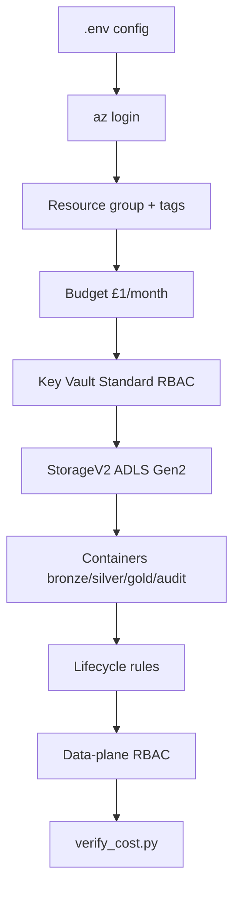
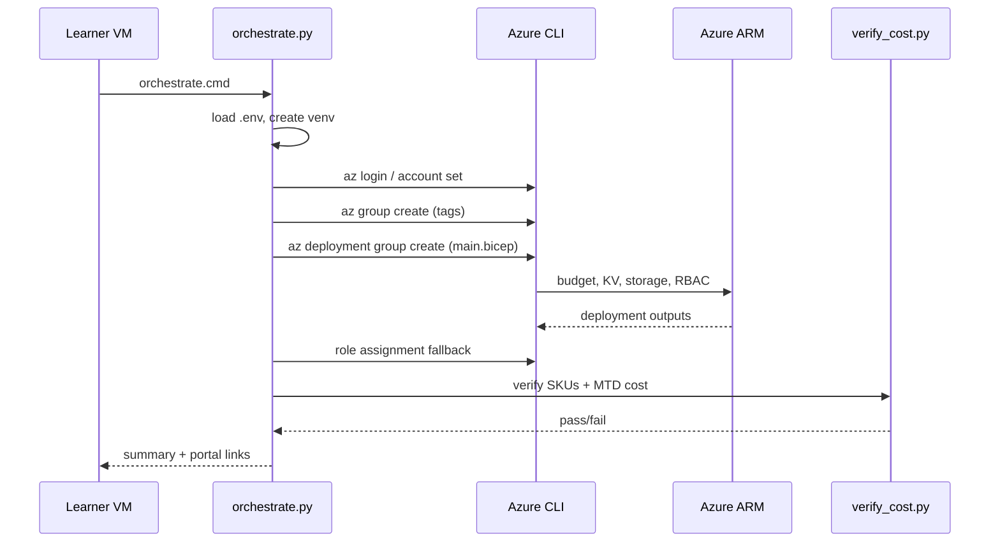

# Workflow & code walkthrough — when to open what

Detailed guide for trainers and learners: **which file to open**, **which portal blade to open**, and **what the code does** at each step.

Companion docs:
- [TRAINER-NOTES.md](TRAINER-NOTES.md) — **master trainer guide** (one orchestrator, demo script, MPN limits)
- [CLASS-GUIDE.md](CLASS-GUIDE.md) — timed classroom blocks with TODOs
- [../README.md](../README.md) — quick start and orchestration commands

---

## 1. Big picture

Class 1 builds a **single resource group** containing a governed, low-cost data landing zone:

```text
Learner laptop / VM
    |
    |  orchestrate.cmd / orchestrate.py
    v
Azure CLI (control plane)  --------->  Azure Resource Manager
    |                                        |
    |  az group create                       |  Resource group + tags
    |  az deployment group create            |  Budget, Key Vault, Storage, RBAC
    v                                        v
Python SDK (verify only)  --------->  Cost Management + Resource APIs
    |
    |  verify_cost.py
    v
Pass/fail: £0 SKU allow-list + MTD cost
```

### Guardrail-first build order (never change this)



**Why this order matters:** the budget is free and scoped to the RG *before* any storage that could incur charges. Identity (Key Vault) comes before the lake. Data-plane RBAC comes last because learners must see that **Owner ≠ blob access**.

---

## 2. Repository file map — open this when teaching that topic

| Open this file | When (class block) | What it teaches |
|----------------|-------------------|-----------------|
| `.env.example` → `.env` | Block 0 | Learner-specific config; no secrets in git |
| `orchestrate.cmd` | Block 0 | One command runs the whole lab |
| `scripts/orchestrate.py` | Block 0–6 | How setup, deploy, RBAC fallback, verify chain together |
| `infra/main.bicep` L1–42 | Block 1 | UK region, parameters, tags, naming |
| `infra/main.bicep` L44–86 | Block 2 | Consumption budget |
| `infra/main.bicep` L88–109 | Block 3 | Key Vault |
| `infra/main.bicep` L111–212 | Block 4 | Storage, medallion, lifecycle |
| `infra/main.bicep` L214–236 | Block 5 | Role assignments |
| `scripts/provision.py` | Optional track | Same estate via Python SDK |
| `scripts/verify_cost.py` | Block 6 | SKU gate + MTD cost query |
| `scripts/teardown.py` | Block 7 | Delete entire RG |

---

## 3. Step-by-step: code + terminal + portal

Use this table during class. **Open the IDE file first**, run the command, **then open the portal blade** to confirm.

### Step 0 — Configure the machine (30 min)

| | |
|---|---|
| **Open in IDE** | `.env.example`, then create `.env` |
| **Run** | `orchestrate.cmd --install-cli` |
| **Open in portal** | [Subscriptions](https://portal.azure.com/#view/Microsoft_Azure_Billing/SubscriptionsBlade) |

**What happens in code (`orchestrate.py`):**

| Function | Lines | Action |
|----------|-------|--------|
| `_ensure_dotenv()` | 163–171 | Copies `.env.example` → `.env` if missing; stops so learner can edit |
| `_merge_config()` | 125–160 | Reads `.env`; SP creds → service principal login; `CLASS_OWNER_EMAIL` fallback |
| `_ensure_venv()` | 187–210 | Creates `.venv`, `pip install -r requirements.txt` |
| `_ensure_azure_cli()` | 273–299 | Finds `az` or installs via winget/apt/brew |
| `_ensure_az_no_wam_broker()` | 319–336 | Windows interactive only: disable WAM broker (skip if already false) |
| `_ensure_az_login()` | 339–390 | `az account show`; else SP login or `az login` (`--use-device-code` optional) |

**Portal — what to show:**

1. **Subscriptions** → copy **Subscription ID** into `.env`
2. Note **Directory** (tenant) for login issues
3. **My role** should be Owner or Contributor

**Learner `.env` (per-learner browser login):**

```env
AZURE_SUBSCRIPTION_ID=a802ddef-155b-481f-9796-fac7318a749f
LEARNER=jinesh
OWNER_EMAIL=v-jinesh@mastekus.onmicrosoft.com
LOCATION=uksouth
```

**Class image `.env` (service principal — learner only sets subscription + LEARNER):**

```env
AZURE_SUBSCRIPTION_ID=<learner-subscription-guid>
LEARNER=jinesh
LOCATION=uksouth
CLASS_OWNER_EMAIL=training@example.com
AZURE_TENANT_ID=<tenant-guid>
AZURE_CLIENT_ID=<app-id>
AZURE_CLIENT_SECRET=<secret>
```

---

### Step 1 — UK residency & governance tags (45 min)

| | |
|---|---|
| **Open in IDE** | `scripts/orchestrate.py` (`_deploy_bicep`), `infra/main.bicep` L7–37 |
| **Run** | Orchestrator continues → `az group create ...` (inside `_deploy_bicep`) |
| **Open in portal** | Resource groups → `rg-<learner>-class1` → **Tags** |

**What happens in code:**

`orchestrate.cmd` / `scripts/orchestrate.py` → `_deploy_bicep()`:

```text
# _merge_config: reject non-UK regions (uksouth / ukwest only)
# _tag_args: seven mandatory tags on az group create
# main.bicep var tags: same keys on every resource in deployment
```

`orchestrate.py` → `_tag_args()` (L339–345): builds the same tag list for `az group create`.

`main.bicep` L28–37: `var tags` — same keys applied to **every resource** inside the deployment.

**Portal — what to show:**

| Blade | Look for |
|-------|----------|
| Resource group → **Overview** | Location = **UK South** or **UK West** |
| Resource group → **Tags** | All 7 tags present |
| Resource group → **Properties** | Subscription link |

**Talking point:** Tags on the RG are inherited by resources created in Bicep via `tags: tags`.

---

### Step 2 — Budget guardrail before spend (45 min)

| | |
|---|---|
| **Open in IDE** | `infra/main.bicep` L44–86 |
| **Run** | Bicep deploy starts (`az deployment group create`) — budget is **first resource** in template |
| **Open in portal** | [Cost Management → Budgets](https://portal.azure.com/#view/Microsoft_Azure_CostManagement/BudgetsBlade) |

**What happens in code (`main.bicep`):**

```bicep
resource budget 'Microsoft.Consumption/budgets@2023-11-01' = {
  name: 'budget-${learner}-class1'
  properties: {
    amount: 1                    // £1/month training cap
    timeGrain: 'Monthly'
    filter: { ... ResourceGroupName ... }   // scoped to THIS rg only
    notifications: { ... 50% actual, 90% forecast ... }
  }
}
```

`orchestrate.py` → `_budget_start_date()` (L334–336): passes `YYYY-MM-01` as `budgetStartDate` param (required by Consumption API).

**Portal — what to show:**

| Blade | Look for |
|-------|----------|
| **Budgets** | `budget-<learner>-class1` |
| Budget → **Details** | Amount **1**, Monthly |
| Budget → **Conditions** | Filter on resource group name |
| Budget → **Alerts** | Email to `ownerEmail`; 50% and 90% thresholds |
| Budget → **Spend (current)** | **0** right after deploy (expected) |

**Talking point:** Budgets are **free**. Storage is **not** free (per GB). That is why budget appears **before** `storageAccount` in Bicep.

---

### Step 3 — Key Vault identity (60 min)

| | |
|---|---|
| **Open in IDE** | `infra/main.bicep` L39–42 (naming), L88–109 (vault) |
| **Run** | Same Bicep deployment — Key Vault created after budget |
| **Open in portal** | Resource groups → `rg-<learner>-class1` → `kv-<learner>-<hash>` |

**What happens in code:**

Naming (L39–42):

```bicep
var nameHash = substring(uniqueString(resourceGroup().id, learner), 0, 6)
var keyVaultName = 'kv-${learner}-${nameHash}'
```

Vault properties (L93–108):

| Property | Value | Why |
|----------|-------|-----|
| `sku.name` | `standard` | No fixed monthly fee |
| `enableRbacAuthorization` | `true` | Modern RBAC, not access policies |
| `enableSoftDelete` | `true` | 7-day recovery without backup SKU |
| `enabledForDeployment` | `false` | VM bootstrapping not needed |

**Portal — what to show:**

| Blade | Look for |
|-------|----------|
| Key Vault → **Overview** | Status = succeeded |
| Key Vault → **Properties** | **Permission model: Azure role-based access control** |
| Key Vault → **Secrets** | Empty (no secrets yet — RBAC in Step 5) |
| Key Vault → **Tags** | Same 7 governance tags |

---

### Step 4 — Medallion lake & lifecycle (75 min)

| | |
|---|---|
| **Open in IDE** | `infra/main.bicep` L111–212 |
| **Run** | Bicep creates storage + child resources |
| **Open in portal** | `st<learner><hash>` storage account |

**What happens in code — storage account (L112–129):**

| Setting | Code | Meaning |
|---------|------|---------|
| `kind` | `StorageV2` | General-purpose v2 |
| `sku.name` | `Standard_LRS` | Cheapest UK redundancy; no GRS premium |
| `isHnsEnabled` | `true` | ADLS Gen2 — data lake paths |
| `accessTier` | `Hot` | Default tier for new blobs |

**Blob service (L131–146):** soft-delete 7 days on blobs and containers. **No versioning** — incompatible with HNS.

**Containers (L148–162):** loop creates `bronze`, `silver`, `gold`, `audit`.

**Lifecycle (L164–212):**

| Rule | Action | Teaching point |
|------|--------|----------------|
| `tier-block-blobs-cool-30d` | Move to Cool after 30 days | Tiering saves money on old data |
| `delete-block-blobs-7d` | Delete after 7 days | Training data self-cleans |

**Portal — what to show (in this order):**

| # | Blade | Look for |
|---|-------|----------|
| 1 | Storage → **Overview** | Performance = Standard, Replication = LRS |
| 2 | Storage → **Configuration** | **Hierarchical namespace: Enabled** |
| 3 | Storage → **Containers** | bronze, silver, gold, audit |
| 4 | Storage → **Lifecycle management** | Both rules enabled |
| 5 | Storage → **Access control (IAM)** | (empty until Step 5) |

**Optional demo:** upload a small `.csv` to `bronze` → discuss 7-day delete rule.

---

### Step 5 — Data-plane RBAC (45 min)

| | |
|---|---|
| **Open in IDE** | `infra/main.bicep` L214–236, `orchestrate.py` `_ensure_rbac()` L424–465 |
| **Run** | Bicep role assignments; orchestrator **fallback** if Bicep fails |
| **Open in portal** | Key Vault + Storage → **Access control (IAM)** |

**What happens in code:**

Bicep assigns two roles to `principalObjectId` (your Azure AD object ID):

| Role | Scope | Data-plane capability |
|------|-------|----------------------|
| Key Vault Secrets Officer | Key Vault resource | Create/read secrets |
| Storage Blob Data Contributor | Storage account | Read/write blobs |

**Important Bicep detail (L222):** role definition ID uses `concat(...)` not string interpolation — GUID contains `586e75` which Bicep can mis-parse as scientific notation.

`orchestrate.py` `_ensure_rbac()`: if assignments missing, runs:

```text
az role assignment create --role "Key Vault Secrets Officer" ...
az role assignment create --role "Storage Blob Data Contributor" ...
```

**Portal — what to show:**

| Blade | Look for |
|-------|----------|
| Storage → **IAM** → Role assignments | **Storage Blob Data Contributor** for your user |
| Key Vault → **IAM** | **Key Vault Secrets Officer** for your user |
| Key Vault → **Secrets** → **+ Generate/Import** | Should work after role propagates (~1–2 min) |

**Live demo:** try blob upload **before** RBAC (fails) vs **after** (succeeds with `az storage blob upload --auth-mode login`).

---

### Step 6 — Verify cost & close the loop (30 min)

| | |
|---|---|
| **Open in IDE** | `scripts/verify_cost.py` |
| **Run** | Automatic at end of `orchestrate.py`, or manually: `python scripts/verify_cost.py --resource-group rg-<learner>-class1` |
| **Open in portal** | [Cost analysis](https://portal.azure.com/#view/Microsoft_Azure_CostManagement/Menu/~/costanalysis) |

**What happens in code (`verify_cost.py`):**

1. **List resources** in RG via `ResourceManagementClient`
2. **SKU allow-list** — only permits:
   - Storage: `StorageV2` + `Standard_LRS` + Hot + HNS on
   - Key Vault: `standard` + RBAC
   - Budgets and role assignments: free types
3. **MTD cost query** via `CostManagementClient` for current month

**Portal — what to show:**

| Blade | Look for | Note |
|-------|----------|------|
| **Cost analysis** | Filter RG = `rg-<learner>-class1` | May show zero first 24–48h |
| **Budgets** | Current spend vs £1 cap | Works immediately |
| Subscription **Overview** cost column | May show `-` or lag | Normal on new subs |

**Expected terminal output:**

```text
Month-to-date actual cost: £0.0000
All resources pass the £0 SKU allow-list.
```

---

### Step 7 — Teardown (15 min)

| | |
|---|---|
| **Open in IDE** | `scripts/teardown.py` |
| **Run** | `python scripts/teardown.py --resource-group rg-<learner>-class1 --yes` |
| **Open in portal** | Resource groups → confirm `rg-<learner>-class1` is gone |

**What happens:** one `resource_groups.begin_delete()` call removes budget, KV, storage, containers, lifecycle, and role assignments together.

---

## 4. `orchestrate.py` — full execution timeline

When you run `.\orchestrate.cmd`, this is the exact sequence:

| # | Step | Function | Azure / local action |
|---|------|----------|---------------------|
| 1 | Load config | `_ensure_dotenv`, `_merge_config` | Read `.env` |
| 2 | Python setup | `_ensure_venv` | `.venv` + pip packages |
| 3 | CLI check | `_ensure_azure_cli` | Find or install `az` |
| 4 | WAM broker + login | `_ensure_az_no_wam_broker`, `_ensure_az_login` | Disable WAM on Windows (idempotent); `az account show` or `az login` |
| 5 | Subscription | `_set_subscription` | `az account set` |
| 6 | Principal ID | `_principal_object_id` | `az ad signed-in-user show` |
| 7 | Resource group | `_deploy_bicep` | `az group create` + tags |
| 8 | Infrastructure | `_deploy_bicep` | `az deployment group create` → `main.bicep` |
| 9 | RBAC fallback | `_ensure_rbac` | `az role assignment create` if needed |
| 10 | Verify | `_verify` | runs `verify_cost.py` |
| 11 | Summary | `_print_summary` | Portal URLs in terminal |



---

## 5. `main.bicep` — section-by-section code explanation

### Parameters (L12–26)

| Param | Source | Used for |
|-------|--------|----------|
| `location` | `.env` `LOCATION` | Every resource region |
| `learner` | `.env` `LEARNER` | Names: `rg-`, `kv-`, `st`, `budget-` |
| `ownerEmail` | `.env` `OWNER_EMAIL` | Tags + budget alert emails |
| `principalObjectId` | `az ad signed-in-user show` | RBAC assignments |
| `budgetStartDate` | 1st of month UTC | Budget `timePeriod.startDate` |

### Naming (L39–42)

`uniqueString(resourceGroup().id, learner)` → deterministic 6-char hash per learner. Same learner + RG always gets same storage/KV names (idempotent redeploy).

### Budget resource (L46–86)

- **Scope:** subscription-level Consumption resource, **filtered** to one RG
- **Amount:** 1 GBP — training guardrail, not expected bill
- **Notifications:** actual > 50%, forecast > 90%

### Key Vault (L89–109)

Control-plane resource for secrets. RBAC mode means even subscription Owner needs an explicit role to read secrets.

### Storage + medallion (L112–162)

- Parent `storageAccount` → child `blobService` → child `containers[]`
- Bicep `[for name in containerNames]` = idempotent loop (safe to redeploy)

### Lifecycle (L165–212)

Policies attach to storage account; apply to all matching block blobs in the account.

### RBAC (L218–236)

`guid(...)` generates stable assignment names. Scoped to **resource** not RG — least privilege.

### Outputs (L238–244)

Returned to `az deployment group show` and printed by orchestrator summary.

---

## 6. Portal cheat sheet — open these blades in order

After a successful `orchestrate.cmd` run, walk the portal in this sequence:

| Order | Portal navigation | Confirms |
|-------|-------------------|----------|
| 1 | Home → **Resource groups** → `rg-<learner>-class1` | RG exists, UK region, tags |
| 2 | RG → **Resources** (list) | KV + Storage (+ hidden budget) |
| 3 | **Cost Management** → **Budgets** → `budget-<learner>-class1` | Guardrail live, spend = 0 |
| 4 | RG → `kv-<learner>-<hash>` → Properties | RBAC mode, Standard SKU |
| 5 | RG → `st<learner><hash>` → Configuration | HNS enabled |
| 6 | Storage → **Containers** | Medallion four-pack |
| 7 | Storage → **Lifecycle management** | 30d Cool, 7d delete |
| 8 | Storage → **Access control (IAM)** | Blob Data Contributor |
| 9 | Key Vault → **Access control (IAM)** | Secrets Officer |
| 10 | **Cost Management** → **Cost analysis** → filter by RG | MTD spend (may lag) |

---

## 7. Two deployment tracks — same estate, different code path

| | Bicep track | Python track |
|---|-------------|--------------|
| **Entry** | `orchestrate.cmd` (default) | `orchestrate.cmd --class1-only` |
| **Deploy mechanism** | `az deployment group create` | `scripts/provision.py` SDK calls |
| **Infra definition** | `infra/main.bicep` | Functions `_ensure_*` in `provision.py` |
| **Verify** | `verify_cost.py` (both) | `verify_cost.py` (both) |
| **Best for** | IaC / GitOps learners | Data engineers / automation |

Build order is identical in both paths:

```text
provision.py Step 1/5 → resource group + tags
provision.py Step 2/5 → budget
provision.py Step 3/5 → Key Vault
provision.py Step 4/5 → storage + containers + lifecycle
provision.py Step 5/5 → RBAC
```

---

## 8. Suggested live-teaching rhythm

For each block (~45–75 min):

1. **5 min** — state learning objective (see [CLASS-GUIDE.md](CLASS-GUIDE.md))
2. **10 min** — open IDE file section; read code aloud
3. **5 min** — run orchestrator (or show it running) for that phase
4. **15 min** — open portal blade; learners find the same settings
5. **10 min** — learner exercise / discussion
6. **5 min** — checkpoint before next block

**Incremental teaching tip:** run full `orchestrate.cmd` once at lunch, then use the afternoon to **only** open portal blades and IDE sections — learners map code lines to live resources.

---

## 9. Quick commands reference

```text
orchestrate.cmd --install-cli
orchestrate.cmd

# Python SDK deploy path (optional)
python scripts/orchestrate.py --method python

# Verify only
.venv\Scripts\python.exe scripts\verify_cost.py --resource-group rg-<learner>-class1

# Teardown
orchestrate.cmd teardown --resource-group rg-<learner>-class1 --yes
```

---

## 10. Troubleshooting — code symptom → open this

| Symptom | Open in code | Open in portal |
|---------|----------------|----------------|
| `LOCATION must be uksouth or ukwest` | `.env` `LOCATION` | N/A |
| `az login` fails | `_ensure_az_no_wam_broker`, `--use-device-code` | Entra ID sign-in logs |
| MDM / `0x80192ee7` on VDI | `_ensure_az_no_wam_broker` (auto); `orchestrate.cmd --use-device-code` | — |
| Bicep RBAC `RoleDefinitionDoesNotExist` | `main.bicep` L222 `concat()` | IAM → manual assign |
| `Versioning is not supported` | `main.bicep` blobService (no versioning with HNS) | — |
| Blob upload forbidden | `main.bicep` L228 storage role | Storage → IAM |
| Cost shows `-` on subscription | `verify_cost.py` MTD query | Budgets blade (works sooner) |
| `verify_cost.py` SKU fail | `verify_cost.py` allow-list constants | Resource → SKU blade |
