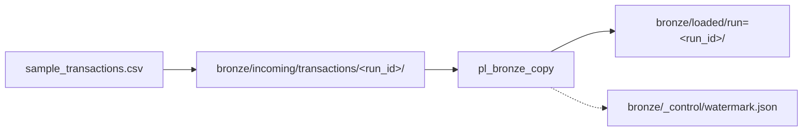

# Session 2 — Student lab guide (trainer + learner)

**One document for the classroom.** Every block is **Read → Do → Verify**.  
**You may do everything in the portal** — scripts are optional shortcuts, not required.

| | |
|---|---|
| **Duration** | 2 hours practical |
| **Audience** | Experienced with SQL/Python/Azure — new to ADF UI |
| **Prerequisite** | Class-1 complete (storage + Data Factory in `rg-<learner>-class1`) |
| **Portal** | [https://portal.azure.com](https://portal.azure.com) |
| **Replace** | `<learner>` = your `.env` value (e.g. `jinesh`) |

---

## Today’s use case (read this first)

### The business story

**FinLedger UK** (fictional bank) sends a **daily transaction file** every morning. Your job as data engineer:

1. **Land** the file in the **bronze** lake (raw, immutable copy).
2. **Promote** it with ADF to a **loaded** path (orchestrated, auditable copy).
3. **Record** a **watermark** so tomorrow’s run knows what was last ingested (foundation for incremental loads).

Today you use **synthetic data** — same shape as production:

| Field | Example |
|---|---|
| `transaction_id` | `TXN-10001` |
| `account_id` | `ACC-8821` |
| `amount_gbp` | `1250.50` |
| `value_date` | `2026-06-01` |
| `channel` | `wire`, `card`, `fps` |
| `status` | `posted`, `pending` |

**File:** [`data/sample_transactions.csv`](data/sample_transactions.csv) — **5 transactions** (one `pending` wire for discussion later).

### What “done” looks like today



| # | Artefact | Path | Row count |
|---|---|---|---|
| 1 | Raw landing | `bronze/incoming/transactions/<run_id>/sample_transactions.csv` | 5 |
| 2 | Promoted copy | `bronze/loaded/run=<run_id>/sample_transactions.csv` | 5 (same data) |
| 3 | Control file | `bronze/_control/watermark.json` | JSON with `last_run_id` |
| 4 | ADF proof | Monitor → pipeline **Succeeded** | Data read/written &gt; 0 |

`<run_id>` = your folder name, e.g. `manual-run` (portal) or `20260622T143052Z` (script timestamp).

> **Reference (case study):** [adf-course/CASE-STUDY.md](adf-course/CASE-STUDY.md) — full FinLedger lake (bronze → silver → gold) over 20 hours.

---

## What we learn today (practical outcomes)

1. **ADF Studio UI** — Home, Author, Manage, Monitor (every pane).
2. **Object model** — linked service, dataset, pipeline, copy activity, IR, trigger.
3. **Hands-on ingest** — upload CSV → build or inspect copy pipeline → **Trigger now** → **Monitor**.
4. **Two ways to work** — **portal (manual)** or **script** — same end state.
5. **Production habits** — watermark, IAM for managed identity, cost guardrails.

**We do not do today:** data flows, Databricks, self-hosted IR, schedules ([adf-course Modules 2–6](adf-course/README.md)).

---

## Choose your path (pick one — same result)

| Block | **Path M — Manual (portal)** | **Path S — Script (terminal)** |
|---|---|---|
| 0 | Sign in to portal | + `az login` if using scripts |
| 1 | **Step 1:** [§A — Find resources](MANUAL-LAB.md#a-find-your-resources-5-min--block-1-step-1)<br>**Step 2:** [§D — Linked service](MANUAL-LAB.md#d-adf--open-studio--linked-service-10-min--block-1-step-2) | Same two steps in portal (inspect only) |
| 2 | [§B — Upload + watermark](MANUAL-LAB.md#b-manual-path--storage-upload-15-min--block-2-path-m-only) | `orchestrate.cmd` then verify with [§C](MANUAL-LAB.md#c-verify-storage-after-orchestratecmd-10-min--block-2-path-s-only) |
| 3 | **Pick one:** [§G — Build pipeline](MANUAL-LAB.md#g-manual-adf--build-copy-pipeline-by-hand-optional-30-min--block-3-path-m-only) (portal-only) **or** [§E — Verify script pipeline](MANUAL-LAB.md#e-adf--datasets--pipeline-15-min--block-3-path-s--path-m-verify) (if script ran) | `adf_pipeline.py` + [§E — Verify in Author](MANUAL-LAB.md#e-adf--datasets--pipeline-15-min--block-3-path-s--path-m-verify) |
| 4 | [§F — Trigger now](MANUAL-LAB.md#f-manual-adf--trigger-pipeline-run-15-min--block-4) | `orchestrate.cmd --run-pipeline` |
| 5 | [§H — Monitor](MANUAL-LAB.md#h-morning-check--script-vs-portal-10-min--block-5) in Studio | `orchestrate.cmd --morning-check` |

**Block 1:** §A then §D — **two steps in order**, not two alternatives.

You can **mix** paths: e.g. Path M for Blocks 2–4, Path S only for `--morning-check` in Block 5.

---

## Document map — references when you need more detail

| Topic | Click for full step-by-step |
|---|---|
| Portal micro-steps | [MANUAL-LAB.md](MANUAL-LAB.md) |
| ADF mental model | [adf-course 00-00](adf-course/module-00-foundations/00-00-overview.md) |
| ADF Studio every icon | [adf-course 00-03](adf-course/module-00-foundations/00-03-studio-tour-every-pane.md) |
| Linked service + MSI | [adf-course 00-05](adf-course/module-00-foundations/00-05-link-adf-to-storage-step-by-step.md) |
| Copy Data wizard | [adf-course 01-01](adf-course/module-01-copy-ingest/01-01-copy-data-tool.md) |
| Manual copy pipeline | [adf-course 01-02](adf-course/module-01-copy-ingest/01-02-copy-activity-manual-pipeline.md) |
| Parameters on datasets | [adf-course 01-03](adf-course/module-01-copy-ingest/01-03-datasets-linked-services-parameters.md) |
| Trainer timing | [GUIDE.md](GUIDE.md) |
| Glossary | [adf-course/GLOSSARY.md](adf-course/GLOSSARY.md) |

---

## Your resources (fill in once)

| Item | Your value |
|---|---|
| Resource group | `rg-<learner>-class1` |
| Storage account | `st<learner>…` |
| Data Factory | `adf-<learner>-…` |
| **Your run_id today** | e.g. `manual-run` or `20260622T143052Z` |
| Linked service | `AdlsBronzeLinkedService` |
| Pipeline | `pl_bronze_copy` (script) or `pl_manual_copy` (hand-built) |
| Sample file on PC | `session-2\data\sample_transactions.csv` |

---

## ADF in 5 minutes (mental model)

| Concept | One line | Today’s example |
|---|---|---|
| **Linked service** | Connection (URL + auth) | `AdlsBronzeLinkedService` |
| **Dataset** | Path + format to data | `ds_bronze_incoming_csv` |
| **Pipeline** | Workflow container | `pl_bronze_copy` |
| **Copy activity** | Moves file A → file B | `CopyIncomingToLoaded` |
| **IR** | Engine that runs copy | `AutoResolveIntegrationRuntime` |
| **Trigger** | Starts a run | **Trigger now** (manual) |
| **Parameter** | Value per run | `incoming_folder`, `loaded_folder` |

> **Reference:** [adf-course 00-04 linked services & IR](adf-course/module-00-foundations/00-04-linked-services-and-integration-runtime.md)

---

## ADF Studio — complete UI map

Open: RG → **Data factory** → **Open Azure Data Factory Studio**.

| Icon | Hub | Use today? |
|---|---|:---:|
| Home | Wizards (Copy Data tool) | Mention |
| **Author** | Pipelines, datasets | **Yes** |
| **Manage** | Linked services, IRs | **Yes** |
| **Monitor** | Runs, row counts | **Yes** |
| Learn | Docs | Optional |

**Author tree:** Pipelines · Datasets · Data flows (do not create — cost) · Templates  

**Toolbar on pipeline:** Validate · **Publish all** · **Add trigger** · **{}** JSON view

> **Reference:** [adf-course 00-03 — every pane, every icon](adf-course/module-00-foundations/00-03-studio-tour-every-pane.md)

---

## Two-hour agenda

| Time | Block | Path M (portal) | Path S (script) |
|---|---|---|---|
| 0:00–0:20 | **1 — ADF anatomy** | §A then §D (find RG → Studio + linked service) | Same |
| 0:20–0:50 | **2 — Bronze ingest** | §B upload + watermark | `orchestrate.cmd` + §C verify |
| 0:50–1:20 | **3 — Pipeline** | §G build **or** §E verify (not both) | `adf_pipeline.py` + §E |
| 1:20–1:45 | **4 — Operate** | §F Trigger now | `--run-pipeline` |
| 1:45–2:00 | **5 — Checkpoint** | §H Monitor + §I checklist | `--morning-check` + §I |

---

## Block 0 — Before class (5 min)

- [ ] `rg-<learner>-class1` has **storage** + **Data factory** (Class-1)
- [ ] Portal login works
- [ ] Repo has `session-2\data\sample_transactions.csv`
- [ ] (Path S only) Terminal: `cd session-2`, `az login`

---

## Block 1 — ADF anatomy (0:00–0:20)

**Objective:** Orient in Studio; test linked service; understand MSI.

### Read

Linked service **≠** dataset. Connection vs file path.

> **Reference:** **Step 1** [MANUAL-LAB §A — find resources](MANUAL-LAB.md#a-find-your-resources-5-min--block-1-step-1) → **Step 2** [MANUAL-LAB §D — linked service](MANUAL-LAB.md#d-adf--open-studio--linked-service-10-min--block-1-step-2)

### Do — Path M (manual, 12 min)

**Step 1 — Find resources ([§A](MANUAL-LAB.md#a-find-your-resources-5-min--block-1-step-1))**

1. Portal → `rg-<learner>-class1` → note storage + factory names.

**Step 2 — ADF Studio + linked service ([§D](MANUAL-LAB.md#d-adf--open-studio--linked-service-10-min--block-1-step-2))**

2. **Data factory** → **Open Azure Data Factory Studio**.
3. Left rail: name **Home**, **Author**, **Manage**, **Monitor**.
4. **Manage** → **Linked services** → **`AdlsBronzeLinkedService`**.
5. Type = **Azure Data Lake Storage Gen2**; URL = `https://st….dfs.core.windows.net`.
6. **Test connection** → **Successful**.
7. **Manage** → **Integration runtimes** → **`AutoResolveIntegrationRuntime`** → **Running**.
8. Portal → storage → **IAM** → ADF managed identity → **Storage Blob Data Contributor**.

### Do — Path S (optional, 2 min)

Inspect the same blades after Class-1 deploy — no script required in Block 1.

### Verify

| # | Check | Pass |
|---|---|:---:|
| 1 | UK South / UK West | [ ] |
| 2 | Studio opens | [ ] |
| 3 | Test connection green | [ ] |
| 4 | AutoResolve **Running** | [ ] |
| 5 | MI has Blob Data Contributor | [ ] |

> **Reference (MSI detail):** [adf-course 00-05](adf-course/module-00-foundations/00-05-link-adf-to-storage-step-by-step.md)

---

## Block 2 — Bronze ingest (0:20–0:50)

**Objective:** Get `sample_transactions.csv` into `bronze/incoming/` and create `watermark.json`.

### Read

- **Bronze** = raw zone. Path: `incoming/transactions/<run_id>/`.
- **Watermark** = audit trail for incremental loads later.

Pick **one path** below.

---

### Path M — Manual portal (recommended) (20 min)

> **Reference:** [MANUAL-LAB §B — storage upload](MANUAL-LAB.md#b-manual-path--storage-upload-15-min--block-2-path-m-only)

**Step 1 — Choose your `run_id`**

Write it down: e.g. **`manual-run`** (used in all steps below).

**Step 2 — Upload transaction file**

1. Portal → **storage account** → **Containers** → **`bronze`**.
2. Click **Upload**.
3. **Browse** → `session-2\data\sample_transactions.csv`.
4. **Advanced** → **Upload to folder:**

   ```text
   incoming/transactions/manual-run
   ```

5. Click **Upload**.
   → Blob: `bronze/incoming/transactions/manual-run/sample_transactions.csv`.

**Step 3 — Preview data**

6. Click the blob → **Preview**.
   → Columns: `transaction_id`, `account_id`, `amount_gbp`, `value_date`, `channel`, `status`.
   → **5 data rows** (plus header). Note `TXN-10003` = `pending`.

**Step 4 — Create watermark file**

7. In container **bronze**, **Upload** again (or **Edit** new blob).
8. **Upload to folder:** `_control`
9. File name: `watermark.json`
10. Content (paste in **Edit** if creating in portal):

```json
{
  "last_run_id": "manual-run",
  "last_loaded_path": "bronze/incoming/transactions/manual-run",
  "updated_utc": "2026-06-22T12:00:00Z",
  "feed": "sample_transactions",
  "note": "created manually in portal"
}
```

11. Save / upload.
    → Path: `bronze/_control/watermark.json`.

> **Reference:** [MANUAL-LAB §B4 — watermark](MANUAL-LAB.md#b4-optional--manual-watermark-file)

---

### Path S — Script (alternative) (5 min + verify 10 min)

```text
cd session-2
orchestrate.cmd
```

Phases: discover → RBAC → upload → ADF deploy → watermark. Note the **run_id** printed (UTC timestamp).

Then verify in portal (same checks as Path M):

1. `bronze/incoming/transactions/<run_id>/sample_transactions.csv`
2. `bronze/_control/watermark.json`

> **Reference:** [MANUAL-LAB §C — after orchestrate](MANUAL-LAB.md#c-verify-storage-after-orchestratecmd-10-min--block-2-path-s-only)

---

### Verify (both paths)

| # | Check | Expected | Pass |
|---|---|---|:---:|
| 1 | Incoming file exists | `…/incoming/transactions/<run_id>/sample_transactions.csv` | [ ] |
| 2 | Row count in Preview | **5** transactions | [ ] |
| 3 | Pending row present | `TXN-10003` status `pending` | [ ] |
| 4 | Watermark exists | `bronze/_control/watermark.json` | [ ] |
| 5 | `last_run_id` in JSON | Matches your `<run_id>` | [ ] |

| Path | What automated this |
|---|---|
| M | Your clicks in Storage |
| S | `bronze_loader.py`, `watermark_store.py` |

---

## Block 3 — Pipeline (0:50–1:20)

**Objective:** Copy activity moves incoming file → `bronze/loaded/run=<run_id>/`.

### Read

- **Source dataset** → incoming path (parameterised).
- **Sink dataset** → loaded path (parameterised).
- **Pipeline** wires one **Copy data** activity.

---

### Path M — Build pipeline in portal (30 min)

Use this if you **did not** run `orchestrate.cmd` OR your trainer assigns portal-only.

> **Reference:** [MANUAL-LAB §G — build copy by hand](MANUAL-LAB.md#g-manual-adf--build-copy-pipeline-by-hand-optional-30-min--block-3-path-m-only)  
> **Deep dive:** [adf-course 01-02 manual copy](adf-course/module-01-copy-ingest/01-02-copy-activity-manual-pipeline.md)

**Prerequisite:** `AdlsBronzeLinkedService` exists (Class-1 or Block 1). If missing, create per [adf-course 00-05](adf-course/module-00-foundations/00-05-link-adf-to-storage-step-by-step.md).

**Step 1 — Source dataset**

1. ADF Studio → **Author** → **Datasets** → **+**.
2. **Azure Data Lake Storage Gen2** → **DelimitedText** → linked service **`AdlsBronzeLinkedService`**.
3. File system: `bronze`. Directory: `incoming/transactions/manual-run` (your path). File: `sample_transactions.csv`.
4. Name: **`ds_manual_incoming`** → **OK**.

**Step 2 — Sink dataset**

5. **+ Dataset** → same linked service.
6. Directory: `loaded/run=manual-run`. File: `sample_transactions.csv`.
7. Name: **`ds_manual_loaded`** → **OK**.

**Step 3 — Pipeline**

8. **Pipelines** → **+** → name **`pl_manual_copy`**.
9. Drag **Copy data** → rename **`Copy_manual`**.
10. **Source** tab → `ds_manual_incoming`.
11. **Sink** tab → `ds_manual_loaded`.
12. **Mapping** → import schema if prompted.
13. **Validate** → **Publish all**.

**Skip to Block 4** using pipeline **`pl_manual_copy`** (fixed paths — no parameters).

---

### Path M-alt — Verify script-deployed pipeline (15 min)

Use this if **`orchestrate.cmd` already ran** — inspect, do not rebuild.

> **Reference:** [MANUAL-LAB §E — datasets & pipeline](MANUAL-LAB.md#e-adf--datasets--pipeline-15-min--block-3-path-s--path-m-verify)

1. **Author** → **Datasets** → open `ds_bronze_incoming_csv`, `ds_bronze_loaded_csv`.
2. Note parameters `incoming_folder`, `loaded_folder`.
3. **Pipelines** → **`pl_bronze_copy`** → activity **`CopyIncomingToLoaded`**.
4. **{}** Code view — inspect JSON.

---

### Path S — Map code to UI (15 min)

Open `scripts/adf_pipeline.py` alongside Studio.

| Code | Portal |
|---|---|
| `AdlsBronzeLinkedService` | Manage → Linked services |
| `ds_bronze_incoming_csv` | Author → Datasets |
| `pl_bronze_copy` | Author → Pipelines |
| `CopyActivity` | Copy on canvas |
| `create_or_update` | Deploy + Publish effect |

> **Reference:** [adf-course 01-03 parameters](adf-course/module-01-copy-ingest/01-03-datasets-linked-services-parameters.md)

---

### Verify

| # | Check | Path M (hand-built) | Path M-alt / S |
|---|---|:---:|:---:|
| 1 | Pipeline exists | `pl_manual_copy` | `pl_bronze_copy` |
| 2 | Two datasets | `ds_manual_*` | `ds_bronze_*` |
| 3 | Copy activity wired | [ ] | [ ] |
| 4 | **Publish** succeeded | [ ] | [ ] |
| 5 | Can explain source vs sink | [ ] | [ ] |

---

## Block 4 — Operate: trigger & monitor (1:20–1:45)

**Objective:** Run copy; confirm **5 rows** in loaded path.

### Read

Success = Monitor **Succeeded** + file in `bronze/loaded/…`.

> **Reference:** [MANUAL-LAB §F — trigger & monitor](MANUAL-LAB.md#f-manual-adf--trigger-pipeline-run-15-min--block-4)

---

### Path M — Trigger in portal (17 min)

**If `pl_manual_copy` (fixed paths):**

1. **Author** → **`pl_manual_copy`** → **Add trigger** → **Trigger now** → **OK** (no parameters).

**If `pl_bronze_copy` (parameters):**

1. **Trigger now** → set:

   | Parameter | Value |
   |---|---|
   | `incoming_folder` | `incoming/transactions/manual-run` |
   | `loaded_folder` | `loaded/run=manual-run` |

2. **OK** → note **Run ID**.

**Monitor (everyone):**

3. **Monitor** → **Pipeline runs** → latest run → **Succeeded**.
4. Open activity → **Output** → **Data read** / **Data written**.
5. Storage → `bronze/loaded/run=manual-run/sample_transactions.csv` → **Preview** → **5 rows**.

> **Deep dive:** [adf-course 01-01 Copy Data tool](adf-course/module-01-copy-ingest/01-01-copy-data-tool.md) (wizard alternative)

---

### Path S — Script trigger (2 min + monitor in portal)

```text
orchestrate.cmd --run-pipeline
```

Then complete **Monitor** steps above in portal.

---

### Verify

| # | Check | Pass |
|---|---|:---:|
| 1 | Pipeline **Succeeded** | [ ] |
| 2 | Data read &gt; 0, written &gt; 0 | [ ] |
| 3 | Loaded CSV exists | [ ] |
| 4 | Loaded = 5 rows, same as incoming | [ ] |
| 5 | Incoming vs loaded Preview match | [ ] |

### If Failed

| Symptom | Fix | Reference |
|---|---|---|
| 403 | IAM: ADF MI → Blob Data Contributor; wait 2 min | [00-05](adf-course/module-00-foundations/00-05-link-adf-to-storage-step-by-step.md) |
| Path not found | Folder names must match exactly | [MANUAL-LAB §F3](MANUAL-LAB.md#f3-if-run-failed--common-fixes) |
| Pipeline missing | Path M: complete [§G](MANUAL-LAB.md#g-manual-adf--build-copy-pipeline-by-hand-optional-30-min--block-3-path-m-only); Path S: run `orchestrate.cmd` | |

---

## Block 5 — Checkpoint (1:45–2:00)

### Monitor run history

**Path M:** **Monitor** → **Pipeline runs** — filter last 24 h.

**Path S:** Run `orchestrate.cmd --morning-check` — compare terminal Phase 6 to Monitor.

> **Reference:** [MANUAL-LAB §H — morning check](MANUAL-LAB.md#h-morning-check--script-vs-portal-10-min--block-5)

| # | Check | Pass |
|---|---|:---:|
| 1 | Pipeline name visible in Monitor | [ ] |
| 2 | Status **Succeeded** | [ ] |
| 3 | Run timestamp today | [ ] |

### Cost

- **Cost Management** → `rg-<learner>-class1` → MTD pennies.
- No data flows, no self-hosted IR.

### End-to-end checklist (must all pass)

**Use case complete**

- [ ] I can explain FinLedger ingest in one sentence (land → copy → watermark).
- [ ] **5** transaction rows in incoming **and** loaded (after pipeline).
- [ ] `watermark.json` documents my `run_id`.

**Storage**

- [ ] `bronze/incoming/transactions/<run_id>/sample_transactions.csv`
- [ ] `bronze/_control/watermark.json`
- [ ] `bronze/loaded/run=<run_id>/sample_transactions.csv`

**ADF**

- [ ] Linked service tests OK
- [ ] Pipeline + datasets published
- [ ] At least one **Succeeded** run in Monitor

> **Full checklist:** [MANUAL-LAB §I](MANUAL-LAB.md#i-end-to-end-verification-checklist--block-5)

---

## Audit — session coverage matrix

| Session goal | Path M (manual) | Path S (script) | Reference lesson |
|---|:---:|:---:|---|
| ADF UI tour | Block 1 | Block 1 | [00-03](adf-course/module-00-foundations/00-03-studio-tour-every-pane.md) |
| Linked service + MSI | Block 1 | Class-1 | [00-05](adf-course/module-00-foundations/00-05-link-adf-to-storage-step-by-step.md) |
| Upload bronze | Block 2 Path M | `bronze_loader.py` | [MANUAL-LAB §B](MANUAL-LAB.md#b-manual-path--storage-upload-15-min--block-2-path-m-only) |
| Watermark | Block 2 Path M | `watermark_store.py` | [MANUAL-LAB §B4](MANUAL-LAB.md#b4-optional--manual-watermark-file) |
| Datasets + pipeline | Block 3 §G or §E | `adf_pipeline.py` | [01-02](adf-course/module-01-copy-ingest/01-02-copy-activity-manual-pipeline.md) |
| Trigger + Monitor | Block 4 | `--run-pipeline` | [MANUAL-LAB §F](MANUAL-LAB.md#f-manual-adf--trigger-pipeline-run-15-min--block-4) |
| Run history | Block 5 | `--morning-check` | [MANUAL-LAB §H](MANUAL-LAB.md#h-morning-check--script-vs-portal-10-min--block-5) |

**Verdict:** Path M alone satisfies the full Session 2 use case without running any terminal commands.

---

## Portal vs script (equivalent steps)

| Goal | Path M — you click | Path S — script |
|---|---|---|
| Upload CSV | Storage → Upload | `bronze_loader.py` |
| Watermark | Edit blob JSON | `watermark_store.py` |
| RBAC for ADF | IAM (or Class-1) | `adf_rbac.py` |
| Linked service + pipeline | Author §G | `adf_pipeline.py` |
| Trigger | **Trigger now** | `orchestrate.cmd --run-pipeline` |
| History | Monitor | `morning_check.py` |

---

## Continue after Session 2

| Goal | Link |
|---|---|
| 20-hour ADF course | [adf-course/README.md](adf-course/README.md) |
| Silver transforms (data flows) | [02-02](adf-course/module-02-data-flows/02-02-code-free-transformation-at-scale.md) |
| Nightly ForEach + triggers | [adf-course Module 3](adf-course/module-03-control-flow-orchestration/03-02-control-flow-foreach-if-until-switch.md) |
| Microsoft Learn | [ADF tutorials](https://learn.microsoft.com/en-us/azure/data-factory/data-factory-tutorials) |

---

## Quick links

| Item | Open |
|---|---|
| Resource group | Portal → `rg-<learner>-class1` |
| ADF Studio | RG → Data factory → **Open Studio** |
| Bronze container | Storage → **bronze** |
| Sample CSV | `session-2\data\sample_transactions.csv` |
| Troubleshooting | [README §G](README.md#g-failures--workarounds) |

---

*Session 2 — Path M (portal) and Path S (script) produce the same FinLedger bronze ingest. Trainer: [GUIDE.md](GUIDE.md).*
