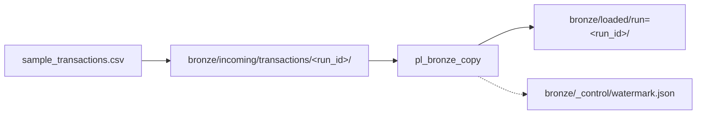

# Session 2 — Student lab guide

**You are a FinLedger UK data engineer.** Today you prove a daily banking file landed safely, was copied by ADF, and is auditable — mostly **in the Azure Portal**, not in a terminal.

| | |
|---|---|
| **Duration** | 2 hours practical |
| **Portal** | [portal.azure.com](https://portal.azure.com) |
| **Replace** | `<learner>` = your id from `.env` (e.g. `santosh`) |

---

## START HERE — normal classroom (script already ran)

> **Most learners:** your trainer ran `orchestrate.cmd` **before class**. You are **not** here to fight the script — you are here to **see, click, verify, and explain** what it built.

### FinLedger morning — your real job today

Every morning FinLedger receives a **transaction file**. Three things must be true before ops stand down:

| # | Business question | Where you prove it |
|---|---|---|
| 1 | Did the raw file land? | Storage → `bronze/incoming/transactions/<run_id>/` |
| 2 | Did ADF copy it to the loaded zone? | Storage → `bronze/loaded/run=<run_id>/` |
| 3 | Is there an audit trail for tomorrow? | Storage → `bronze/_control/watermark.json` |

**Today's file** — open on your PC: [`data/sample_transactions.csv`](./data/sample_transactions.csv)

| transaction_id | amount_gbp | channel | status | Why it matters |
|---|---|---|---|---|
| TXN-10001 | £1,250.50 | wire | posted | Normal wire |
| TXN-10002 | £89.99 | card | posted | Card spend |
| **TXN-10003** | **£50,000.00** | wire | **pending** | **Fraud review** — discuss in class |
| TXN-10004 | £12.40 | card | posted | Small ticket |
| TXN-10005 | £3,400.00 | fps | posted | Faster Payments |

**Your one-sentence goal:** *"I landed 5 transactions in bronze, ADF copied them to loaded, and the watermark records the run."*

Full 20-hour FinLedger story: [`adf-course/CASE-STUDY.md`](./adf-course/CASE-STUDY.md)

---

### What the script already did (homework / pre-class)

`session-2\orchestrate.cmd` is the **backstage crew**. It already:

| Phase | Script file | What appeared in Azure |
|---|---|---|
| 1 | `adf_rbac.py` | ADF can write to your lake (managed identity) |
| 2 | `adf_pipeline.py` | Linked service, datasets, `pl_bronze_copy` |
| 3 | `bronze_loader.py` | CSV in `bronze/incoming/transactions/<run_id>/` |
| 5 | `watermark_store.py` | `bronze/_control/watermark.json` |

Optional: trainer also ran `--run-pipeline` — you may already see a **Succeeded** run in Monitor.

**You do not re-run the script unless the trainer asks.**

---

### What YOU do in class (portal — 2 hours)

| Block | Time | Your job today | Guide |
|---|---|---|---|
| **1** | 20 min | Find RG; open ADF Studio; test linked service | [Block 1](#block-1) |
| **2** | 30 min | **Find** the CSV and watermark the script uploaded | [Block 2](#block-2) · [lab-c](./MANUAL-LAB.md#lab-c) |
| **3** | 30 min | **Inspect** `pl_bronze_copy` — do not rebuild | [Block 3](#block-3) · [lab-e](./MANUAL-LAB.md#lab-e) |
| **4** | 25 min | **You** click **Trigger now**; watch Monitor | [Block 4](#block-4) · [lab-f](./MANUAL-LAB.md#lab-f) |
| **5** | 15 min | Run history + cost + checklist | [Block 5](#block-5) · [lab-i](./MANUAL-LAB.md#lab-i) |

**Extra portal detail:** [`MANUAL-LAB.md`](./MANUAL-LAB.md) — [jump links](./MANUAL-LAB.md#jump-links) (lab-a … lab-i).

---

### Only if script did NOT run before class

| Block | Portal-only | Or run script yourself |
|---|---|---|
| 2 | [lab-b](./MANUAL-LAB.md#lab-b) upload by hand | `orchestrate.cmd` then [lab-c](./MANUAL-LAB.md#lab-c) |
| 3 | [lab-g](./MANUAL-LAB.md#lab-g) build pipeline by hand | [lab-e](./MANUAL-LAB.md#lab-e) verify script pipeline |

---

## What “done” looks like (FinLedger)



| # | Artefact | Path | Row count |
|---|---|---|---|
| 1 | Raw landing | `bronze/incoming/transactions/<run_id>/sample_transactions.csv` | 5 |
| 2 | Promoted copy | `bronze/loaded/run=<run_id>/sample_transactions.csv` | 5 (same data) |
| 3 | Control file | `bronze/_control/watermark.json` | JSON with `last_run_id` |
| 4 | ADF proof | Monitor → pipeline **Succeeded** | Data read/written &gt; 0 |

`<run_id>` = your folder name, e.g. `manual-run` (portal) or `20260622T143052Z` (script timestamp).

> **Case study (full course):** [`adf-course/CASE-STUDY.md`](./adf-course/CASE-STUDY.md)

---

## Your resources (fill in once)

| Item | Your value |
|---|---|
| Resource group | `rg-<learner>-class1` |
| Storage account | `st<learner>…` |
| Data Factory | `adf-<learner>-…` |
| **Your run_id today** | folder name under `incoming/transactions/` (from script or `manual-run`) |
| Linked service | `AdlsBronzeLinkedService` |
| Pipeline | `pl_bronze_copy` |
| Sample file on PC | `session-2\data\sample_transactions.csv` |

---

## ADF in 5 minutes (mental model)

| Concept | One line | Today’s example |
|---|---|---|
| **Linked service** | Connection (URL + auth) | `AdlsBronzeLinkedService` |
| **Dataset** | Path + format to data | `ds_bronze_incoming_csv` |
| **Pipeline** | Workflow container | `pl_bronze_copy` |
| **Copy activity** | Moves file A → file B | `CopyIncomingToLoaded` |
| **IR** | Engine that runs copy | `AutoResolveIntegrationRuntime` |
| **Trigger** | Starts a run | **Trigger now** (manual) |
| **Parameter** | Value per run | `incoming_folder`, `loaded_folder` |

> **Reference:** [adf-course 00-04 linked services & IR](adf-course/module-00-foundations/00-04-linked-services-and-integration-runtime.md)

---

## ADF Studio — complete UI map

Open: RG → **Data factory** → **Open Azure Data Factory Studio**.

| Icon | Hub | Use today? |
|---|---|:---:|
| Home | Wizards (Copy Data tool) | Mention |
| **Author** | Pipelines, datasets | **Yes** |
| **Manage** | Linked services, IRs | **Yes** |
| **Monitor** | Runs, row counts | **Yes** |
| Learn | Docs | Optional |

**Author tree:** Pipelines · Datasets · Data flows (do not create — cost) · Templates  

**Toolbar on pipeline:** Validate · **Publish all** · **Add trigger** · **{}** JSON view

> **Reference:** [adf-course 00-03 — every pane, every icon](adf-course/module-00-foundations/00-03-studio-tour-every-pane.md)

---

## Block 0 — Before class (5 min)

- [ ] Trainer ran `orchestrate.cmd` (and ideally `--run-pipeline`)
- [ ] You can sign in to [portal.azure.com](https://portal.azure.com)
- [ ] You know your `<learner>` id (e.g. `santosh`)
- [ ] Open this file + [`MANUAL-LAB.md`](./MANUAL-LAB.md) in VS Code / browser

---

<a id="block-1"></a>

## Block 1 — ADF anatomy (0:00–0:20)

**Why FinLedger cares:** Before any file moves, you must know *which* factory does the moving and *prove it is allowed* to write to the lake. This block is your "who's who" of the estate.

**Objective:** Orient in ADF Studio; confirm the linked service connects; confirm ADF's managed identity can write to storage.

### Read

- **Linked service ≠ dataset.** A linked service is the *connection* (URL + how to log in). A dataset is a *file path + format* that rides on that connection.
- ADF logs in to storage with its **managed identity** — a passwordless robot account. No keys live in code.

> **Portal steps:** [lab-a](./MANUAL-LAB.md#lab-a) → [lab-d](./MANUAL-LAB.md#lab-d)

### Do (classroom — 12 min)

**Step 1 — Find resources** ([lab-a](./MANUAL-LAB.md#lab-a))

1. Portal → `rg-<learner>-class1` → note storage + factory names.

**Step 2 — ADF Studio + linked service** ([lab-d](./MANUAL-LAB.md#lab-d))

2. **Data factory** → **Open Azure Data Factory Studio**.
3. Left rail: name **Home**, **Author**, **Manage**, **Monitor**.
4. **Manage** → **Linked services** → **`AdlsBronzeLinkedService`**.
5. Type = **Azure Data Lake Storage Gen2**; URL = `https://st….dfs.core.windows.net`.
6. **Test connection** → **Successful**.
7. **Manage** → **Integration runtimes** → **`AutoResolveIntegrationRuntime`** → **Running**.
8. Portal → storage → **IAM** → ADF managed identity → **Storage Blob Data Contributor**.

> **Trainer may show** `scripts/adf_rbac.py` — that is the code that granted the role you just saw in step 8.

### Verify

| # | Check | Pass |
|---|---|:---:|
| 1 | UK South / UK West | [ ] |
| 2 | Studio opens | [ ] |
| 3 | Test connection green | [ ] |
| 4 | AutoResolve **Running** | [ ] |
| 5 | MI has Blob Data Contributor | [ ] |

> **Next →** You know the factory and it can write. Now go find the file it received this morning → **Block 2**.

<a id="block-2"></a>

## Block 2 — Bronze ingest (0:20–0:50)

**Why FinLedger cares:** "Did this morning's file actually land?" is the first question ops asks. A raw, untouched copy in **bronze** is your evidence — and the **watermark** is the note that says *which* run you trust.

**Objective:** Prove the script landed `sample_transactions.csv` in bronze and wrote the watermark.

### Read

- **Bronze = raw landing zone.** Files arrive here untouched, named by `<run_id>` so two mornings never collide.
- **Watermark = the audit note.** `bronze/_control/watermark.json` records the last good run so tomorrow's load knows where it left off.
- The script already uploaded to `bronze/incoming/transactions/<run_id>/`. **Your job:** find it and preview the **5 rows** (including the £50k pending wire, TXN-10003).

### Do — classroom (verify only, 20 min)

Follow [lab-c](./MANUAL-LAB.md#lab-c):

1. Storage → **bronze** → `incoming` → `transactions` → **your run_id folder**.
2. Open `sample_transactions.csv` → **Preview** → confirm **5 rows**.
3. Open `bronze/_control/watermark.json` → `last_run_id` matches folder name.

**Write your run_id here:** `________________________`

> **Discuss:** TXN-10003 — £50k pending wire — would silver layer filter this later?

---

### Alternate — script did NOT run (portal upload)

Follow [lab-b](./MANUAL-LAB.md#lab-b) — upload with `run_id` = `manual-run`, then create watermark.

---

### Alternate — run script yourself

```text
cd session-2
orchestrate.cmd
```

Phases: discover → RBAC → upload → ADF deploy → watermark. Note the **run_id** printed (UTC timestamp).

Then verify in portal (same checks as the classroom flow above):

1. `bronze/incoming/transactions/<run_id>/sample_transactions.csv`
2. `bronze/_control/watermark.json`

> **Portal:** [lab-c](./MANUAL-LAB.md#lab-c)

---

### Verify

| # | Check | Expected | Pass |
|---|---|---|:---:|
| 1 | Incoming file exists | `…/incoming/transactions/<run_id>/sample_transactions.csv` | [ ] |
| 2 | Row count in Preview | **5** transactions | [ ] |
| 3 | Pending row present | `TXN-10003` status `pending` | [ ] |
| 4 | Watermark exists | `bronze/_control/watermark.json` | [ ] |
| 5 | `last_run_id` in JSON | Matches your `<run_id>` | [ ] |

| Who uploaded? | How |
|---|---|
| Script (normal class) | `bronze_loader.py` + `watermark_store.py` |
| You (no pre-run) | [lab-b](./MANUAL-LAB.md#lab-b) portal upload |

> **Next →** The raw file is in bronze. But raw isn't "processed". Next, meet the pipeline that promotes it to the **loaded** zone → **Block 3**.

---

<a id="block-3"></a>

## Block 3 — Pipeline (0:50–1:20)

**Why FinLedger cares:** Landing a file isn't enough — ops needs an *orchestrated, repeatable* step that promotes raw data into a clean, dated **loaded** zone. That repeatable step is the pipeline `pl_bronze_copy`. Today you read it; you don't rebuild it.

**Objective:** Understand how `pl_bronze_copy` copies incoming → loaded, and why its paths are parameters.

### Read

- **Source dataset** = where to read (incoming path) — a **parameter**, so one pipeline serves every run_id.
- **Sink dataset** = where to write (loaded path) — also a parameter.
- **Pipeline** = the container that wires one **Copy data** activity from source to sink.
- **Why parameters?** FinLedger gets a new file every morning. Parameters mean *one* pipeline handles all of them — no copy-paste per day.

### Do — classroom (inspect script pipeline, 20 min)

Follow [lab-e](./MANUAL-LAB.md#lab-e):

1. **Author** → **Datasets** → open `ds_bronze_incoming_csv`, `ds_bronze_loaded_csv`.
2. Note parameters `incoming_folder`, `loaded_folder`.
3. **Pipelines** → **`pl_bronze_copy`** → activity **`CopyIncomingToLoaded`**.
4. **{}** Code view — inspect JSON.

Trainer may open `scripts/adf_pipeline.py` beside Studio — same objects, different view.

### Alternate — build pipeline by hand (no script)

Follow [lab-g](./MANUAL-LAB.md#lab-g) — creates `pl_manual_copy` with fixed paths.

### Verify

| # | Check | Pass |
|---|---|:---:|
| 1 | Pipeline `pl_bronze_copy` exists | [ ] |
| 2 | Two datasets `ds_bronze_*` | [ ] |
| 3 | Copy activity wired | [ ] |
| 4 | Can explain source vs sink | [ ] |

> **Next →** You understand the pipeline. Now *you* press the button and watch it run live → **Block 4**.

---

<a id="block-4"></a>

## Block 4 — Operate: trigger & monitor (1:20–1:45)

**Why FinLedger cares:** This is the daily ops moment — run the load and *prove* it succeeded. A green **Succeeded** in Monitor with bytes read/written is the evidence ops signs off on each morning.

**Objective:** Trigger `pl_bronze_copy` yourself; confirm **5 rows** land in the loaded path.

### Read

- A **trigger** starts a run. Today you use **Trigger now** (manual); production uses a schedule.
- **Success = two things:** Monitor shows **Succeeded** *and* the file appears in `bronze/loaded/…` with bytes read/written &gt; 0.

> **Portal:** [lab-f](./MANUAL-LAB.md#lab-f)

### Do — classroom (you trigger, 17 min)

**`pl_bronze_copy`** (normal class):

1. **Author** → **`pl_bronze_copy`** → **Add trigger** → **Trigger now**.
2. Parameters (use **your run_id** from Block 2):

   | Parameter | Example |
   |---|---|
   | `incoming_folder` | `incoming/transactions/20260625T124511Z` |
   | `loaded_folder` | `loaded/run=20260625T124511Z` |

3. **OK** → note **Run ID**.
4. **Monitor** → **Pipeline runs** → **Succeeded**.
5. Activity **Output** → Data read / written &gt; 0.
6. Storage → `bronze/loaded/run=<run_id>/sample_transactions.csv` → **Preview** → **5 rows**.

### Alternate — `pl_manual_copy` (if you built in lab-g)

**Trigger now** with no parameters.

### Alternate — script trigger

```text
orchestrate.cmd --run-pipeline
```

Then complete **Monitor** steps above in portal.

---

### Verify

| # | Check | Pass |
|---|---|:---:|
| 1 | Pipeline **Succeeded** | [ ] |
| 2 | Data read &gt; 0, written &gt; 0 | [ ] |
| 3 | Loaded CSV exists | [ ] |
| 4 | Loaded = 5 rows, same as incoming | [ ] |
| 5 | Incoming vs loaded Preview match | [ ] |

### If Failed

| Symptom | Fix | Reference |
|---|---|---|
| 403 | IAM: ADF MI → Blob Data Contributor; wait 2 min | [00-05](adf-course/module-00-foundations/00-05-link-adf-to-storage-step-by-step.md) |
| Path not found | Folder names must match exactly | [lab-f3](./MANUAL-LAB.md#lab-f3) |
| Pipeline missing | Complete [lab-g](./MANUAL-LAB.md#lab-g) or ask trainer to run `orchestrate.cmd` | |

> **Next →** The load succeeded. Last step: answer "did last night go fine?" the way a real data engineer does — from run history — and confirm you spent nothing → **Block 5**.

---

<a id="block-5"></a>

## Block 5 — Checkpoint (1:45–2:00)

**Why FinLedger cares:** Every morning the on-call engineer asks one question — *"did last night's loads succeed?"* — and answers it from **run history**, not by re-reading every file. You also confirm the lab cost stayed near £0.

### Monitor run history

**Classroom:** **Monitor** → **Pipeline runs** — filter last 24 h ([lab-h](./MANUAL-LAB.md#lab-h)).

Optional: `orchestrate.cmd --morning-check` — the same answer from the terminal, side by side with Monitor.

| # | Check | Pass |
|---|---|:---:|
| 1 | Pipeline name visible in Monitor | [ ] |
| 2 | Status **Succeeded** | [ ] |
| 3 | Run timestamp today | [ ] |

### Cost

- **Cost Management** → `rg-<learner>-class1` → MTD pennies.
- No data flows, no self-hosted IR.

### End-to-end checklist (must all pass)

**Use case complete**

- [ ] I can explain FinLedger ingest in one sentence (land → copy → watermark).
- [ ] **5** transaction rows in incoming **and** loaded (after pipeline).
- [ ] `watermark.json` documents my `run_id`.

**Storage**

- [ ] `bronze/incoming/transactions/<run_id>/sample_transactions.csv`
- [ ] `bronze/_control/watermark.json`
- [ ] `bronze/loaded/run=<run_id>/sample_transactions.csv`

**ADF**

- [ ] Linked service tests OK
- [ ] Pipeline + datasets published
- [ ] At least one **Succeeded** run in Monitor

> **Full checklist:** [lab-i](./MANUAL-LAB.md#lab-i)

---

## Audit — session coverage matrix

| Session goal | You do in portal | Script (pre-class) | Lesson |
|---|:---:|:---:|---|
| ADF UI tour | Block 1 | — | [00-03](./adf-course/module-00-foundations/00-03-studio-tour-every-pane.md) |
| Linked service + MSI | Block 1 | Class-1 + `adf_rbac.py` | [00-05](./adf-course/module-00-foundations/00-05-link-adf-to-storage-step-by-step.md) |
| Upload bronze | Block 2 verify | `bronze_loader.py` | [lab-c](./MANUAL-LAB.md#lab-c) |
| Watermark | Block 2 verify | `watermark_store.py` | [lab-c](./MANUAL-LAB.md#lab-c) |
| Datasets + pipeline | Block 3 inspect | `adf_pipeline.py` | [lab-e](./MANUAL-LAB.md#lab-e) |
| Trigger + Monitor | Block 4 **your click** | optional `--run-pipeline` | [lab-f](./MANUAL-LAB.md#lab-f) |
| Run history | Block 5 | optional `--morning-check` | [lab-h](./MANUAL-LAB.md#lab-h) |

---

## Portal vs script (who does what)

| Goal | **You in class (portal)** | **Script before class** |
|---|---|---|
| Upload CSV | Verify in Storage | `bronze_loader.py` |
| Watermark | Verify JSON | `watermark_store.py` |
| RBAC for ADF | See IAM blade | `adf_rbac.py` |
| Pipeline | Inspect + **Trigger now** | `adf_pipeline.py` |
| Run proof | Monitor blade | optional `--run-pipeline` |

---

## Continue after Session 2

| Goal | Link |
|---|---|
| 20-hour ADF course | [adf-course/README.md](adf-course/README.md) |
| Silver transforms (data flows) | [02-02](adf-course/module-02-data-flows/02-02-code-free-transformation-at-scale.md) |
| Nightly ForEach + triggers | [adf-course Module 3](adf-course/module-03-control-flow-orchestration/03-02-control-flow-foreach-if-until-switch.md) |
| Microsoft Learn | [ADF tutorials](https://learn.microsoft.com/en-us/azure/data-factory/data-factory-tutorials) |

---

## Reference (optional reading)

| Topic | File |
|---|---|
| **Continue across classes (20+ h)** | [`adf-course/STUDENT-GUIDE.md`](./adf-course/STUDENT-GUIDE.md) — the one doc you open every class (Session 2 is Class 1) |
| Portal micro-steps | [`MANUAL-LAB.md`](./MANUAL-LAB.md) |
| Trainer timing | [`GUIDE.md`](./GUIDE.md) |
| ADF Studio tour | [`adf-course 00-03`](./adf-course/module-00-foundations/00-03-studio-tour-every-pane.md) |
| Linked service + MSI | [`adf-course 00-05`](./adf-course/module-00-foundations/00-05-link-adf-to-storage-step-by-step.md) |
| Glossary | [`adf-course/GLOSSARY.md`](./adf-course/GLOSSARY.md) |

---

## Quick links

| Item | Open |
|---|---|
| Resource group | Portal → `rg-<learner>-class1` |
| ADF Studio | RG → Data factory → **Open Studio** |
| Bronze container | Storage → **bronze** |
| Sample CSV | `session-2\data\sample_transactions.csv` |
| Troubleshooting | [README §G](./README.md#g-failures--workarounds) |

---

*Session 2 — FinLedger bronze ingest. Trainer: [`GUIDE.md`](./GUIDE.md).*
