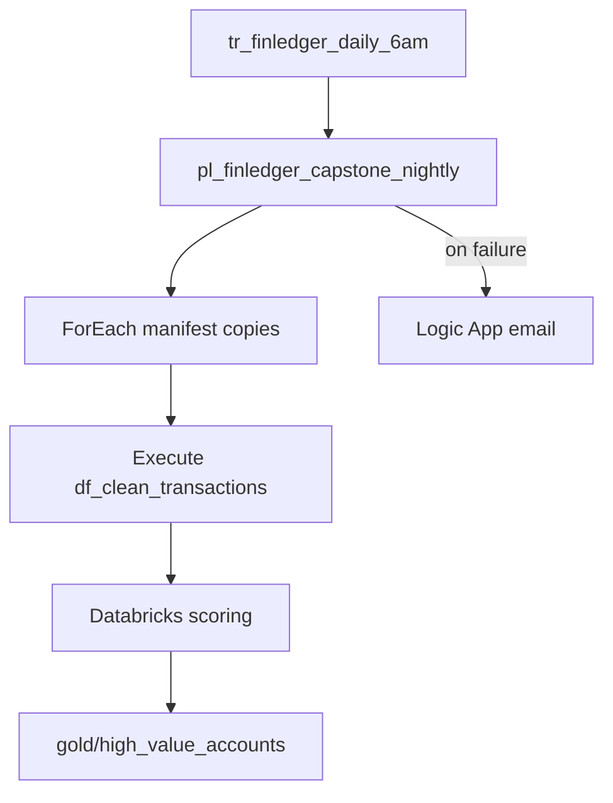

# FinLedger UK — Capstone project

> Time budget: 40 min reading + open-ended build (4–8 hours hands-on)
> Prereqs: Modules 0–6 complete

## Mission

Build **`pl_finledger_capstone_nightly`** — one orchestrated pipeline FinLedger ops can run unattended:

1. **Ingest** (Module 1) — ForEach over `file_manifest.json` enabled entities
2. **Transform** (Module 2) — Execute `df_clean_transactions` to silver
3. **Orchestrate** (Module 3) — If/Set Variable on failure; parameters `run_id`
4. **Score** (Module 4) — Databricks notebook to gold (or skip if no quota)
5. **Secure** (Module 5) — Key Vault linked services; copy via managed VNet if enabled
6. **Govern** (Module 6) — Git-published JSON; budget alert active

## Architecture

## Acceptance criteria (verification + validation)

### Verification (did it run?)

- [ ] Schedule trigger **Started** with next run visible
- [ ] Manual capstone run **Succeeded** end-to-end
- [ ] Monitor shows all activities green (or expected controlled failure test)
- [ ] `bronze/loaded/`, `silver/transactions/cleansed/`, `gold/` contain expected files
- [ ] Git repo has published ARM / pipeline JSON
- [ ] Budget alert configured on resource group

### Validation (correct business outcome?)

- [ ] Transaction row counts: **12** source → **10** posted in silver (`pending` + `failed` excluded)
- [ ] **3** manifest entities copied (stores still skipped)
- [ ] High-value account output includes premium / high-spend accounts from `scoring_input.csv`
- [ ] Failure test sends email to `owner_email` from config
- [ ] No secrets in Git — Key Vault references only
- [ ] Tear-down runbook documented and tested on non-prod RG

## Suggested build order

| Phase | Task | Module ref |
|---|---|---|
| 1 | Wire ForEach ingest + run_id paths | 03-02, 03-03 |
| 2 | Chain Execute Data Flow after copies | 02-02 |
| 3 | Add Databricks branch (optional) | 04-01 |
| 4 | Failure Web → Logic App | 03-05 |
| 5 | Publish to Git + ARM export | 06-01, 06-02 |
| 6 | Schedule trigger 06:00 UK | 03-04 |

## Sample capstone pipeline skeleton

`pipeline/pl_finledger_capstone_nightly.json` — combine activities from:

- `pl_finledger_nightly_foreach`
- `pl_silver_transactions`
- `pl_databricks_scoring` (optional)
- `Notify_failure` Web activity

Use **Execute Pipeline** activities for modularity or single pipeline with dependencies.

## Cost guardrails

- Run capstone on **schedule** only after successful manual test
- Delete external compute clusters after validation
- Keep budget at £25 MTD per [SETUP.md](SETUP.md)

## Trainer sign-off

| Learner | Date | Capstone pass (V&V) | Trainer |
|---|---|---|---|
| | | | |

## Course complete

Return to [README.md](README.md) — **1,260 minutes** course map. Use [VERIFICATION-CHECKLIST](docs/VERIFICATION-CHECKLIST.md) for final audit.

## Phase Final audit notes

Lessons marked **done** in [manifest.json](manifest.json) should be spot-checked for:

- Parts A–D present
- FinLedger sample data paths and row counts
- Tear-down on billable resources
- Expand shorter lessons (01-06+, Module 2–6) to full word budget if required

---

*Congratulations — you have walked every major ADF pane, pipeline JSON path, and FinLedger lake zone from bronze to gold.*
