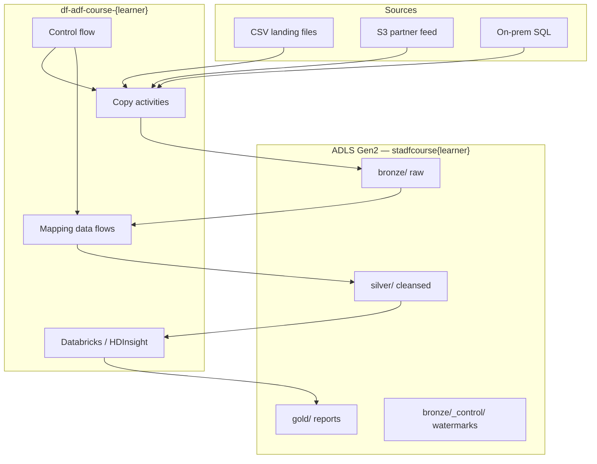

# FinLedger UK — Course case study

Every module in this course builds the **same fictional business story** so learners see how ADF pieces connect in production, not isolated tutorials.

**Company:** FinLedger UK — a mid-size UK retailer with stores, e-commerce, and a small business banking arm.  
**Problem:** Sales, returns, and customer data live in files, SaaS exports, and (later) on-prem SQL. Leadership wants a **medallion lake** in ADLS Gen2 and reliable nightly pipelines.  
**Your role:** Data engineer onboarding onto their Azure estate in **UK South**.

---

## Architecture we build (end state)

---

## Lake layout (canonical paths)

All lessons use these paths. Sample files to upload live under [`data/`](data/README.md).

| Zone | Path | Contents |
|---|---|---|
| Bronze incoming | `bronze/incoming/transactions/daily/` | `transactions_daily.csv` |
| Bronze incoming | `bronze/incoming/customers/` | Incremental customer batches |
| Bronze incoming | `bronze/incoming/products/` | Product catalogue CSV |
| Bronze incoming | `bronze/incoming/stores/` | Store locations |
| Bronze loaded | `bronze/loaded/<entity>/<run_id>/` | Post-copy confirmation |
| Bronze control | `bronze/_control/watermark.json` | High-water marks |
| Silver | `silver/transactions/`, `silver/customers/` | Data flow outputs |
| Gold | `gold/daily_sales_summary/` | Aggregates for BI |

---

## Module-by-module story arc

| Module | Business milestone | Primary ADF activities | Sample data folder |
|---|---|---|---|
| **0** | Stand up lake + factory + first linked service | Portal setup, linked service test | [`data/module-00-foundations/`](data/module-00-foundations/) |
| **1** | Ingest daily sales & master data | Copy Data tool, Copy activity, incremental copy, S3 copy, error handling | [`data/module-01-copy-ingest/`](data/module-01-copy-ingest/) |
| **2** | Cleanse transactions & returns | Mapping data flow, derived columns, Delta sink, Power Query wrangling | [`data/module-02-data-flows/`](data/module-02-data-flows/) |
| **3** | Orchestrate multi-file loads | Lookup, ForEach, If, Set Variable, triggers, Monitor | [`data/module-03-control-flow/`](data/module-03-control-flow/) |
| **4** | Score high-value customers | Databricks notebook, HDInsight Spark, Hive | [`data/module-04-external-compute/`](data/module-04-external-compute/) |
| **5** | Secure on-prem SQL path | Managed VNet, private endpoint, Key Vault secrets | *(concepts — no local files)* |
| **6** | Ship to prod safely | Git publish, ARM CI/CD, Purview lineage, cost alerts | [`data/module-06-governance/`](data/module-06-governance/) |
| **Capstone** | Nightly FinLedger pipeline end-to-end | All of the above | All folders |

---

## Activity variety (one primary type per module)

Learners **repeat the read → do → verify pattern** but touch a **different activity family** each module:

| Module | You will hands-on these activity types |
|---|---|
| 0 | *(none yet)* — linked services, IR concepts |
| 1 | **Copy** (movement) |
| 2 | **Execute Data Flow** (transformation) |
| 3 | **Lookup**, **ForEach**, **If Condition**, **Set Variable**, **Web** (control) |
| 4 | **Databricks Notebook**, **HDInsight Spark**, **HDInsight Hive** (external) |
| 5 | Copy + data flow **inside managed VNet**; Key Vault linked service |
| 6 | Git publish, ARM deploy — no new activity types |

---

## Microsoft Learn alignment

Each lesson lists a `source_url` in [`manifest.json`](manifest.json). The case study **extends** the official tutorial flow with FinLedger paths and verification tables — it does not replace Microsoft documentation.

**Index:** [ADF tutorials](https://learn.microsoft.com/en-us/azure/data-factory/data-factory-tutorials)

---

## Naming alignment with Session 2 lab

If learners completed Class-1 / `session-2/orchestrate.cmd`, map FinLedger paths onto the existing `bronze` container and `pl_bronze_copy` pipeline. The case study uses the same medallion idea; course names (`df-adf-course-{learner}`) may differ from Bicep names (`adf-{learner}-*`).

| Course artifact | Session 2 / Class-1 equivalent |
|---|---|
| `ls_adls_main` | `AdlsBronzeLinkedService` |
| `pl_bronze_copy` | `pl_bronze_copy` |
| `transactions_daily.csv` | `sample_transactions.csv` (same schema, extended rows) |

---

## Trainer pointer

Facilitation timing, verify boxes, and common blockers: [`TRAINER-GUIDE.md`](TRAINER-GUIDE.md)  
Master learner checklist: [`docs/VERIFICATION-CHECKLIST.md`](docs/VERIFICATION-CHECKLIST.md)
