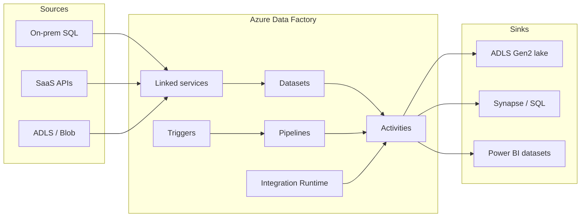

# 00-00 · ADF mental model

```mermaid
flowchart LR
    subgraph Sources
        S1[On-prem SQL]
        S2[SaaS APIs]
        S3[ADLS / Blob]
    end

    subgraph ADF["Azure Data Factory"]
        LS[Linked services]
        DS[Datasets]
        PL[Pipelines]
        ACT[Activities]
        IR[Integration Runtime]
        TR[Triggers]
    end

    subgraph Sinks
        K1[ADLS Gen2 lake]
        K2[Synapse / SQL]
        K3[Power BI datasets]
    end

    S1 --> LS
    S2 --> LS
    S3 --> LS
    LS --> DS
    DS --> ACT
    PL --> ACT
    IR --> ACT
    TR --> PL
    ACT --> K1
    ACT --> K2
    ACT --> K3
```

**Lesson:** [00-00-overview.md](../../module-00-foundations/00-00-overview.md)
