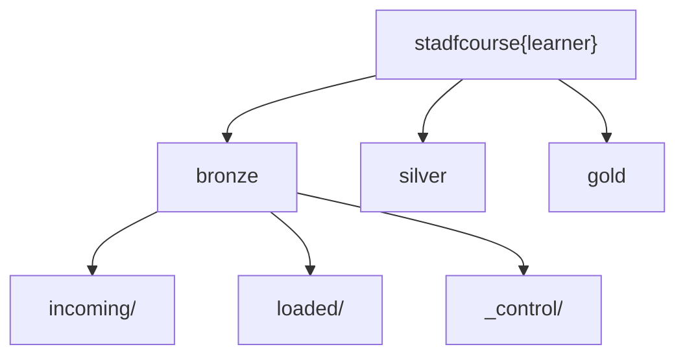

# ADLS Gen2 lake layout — FinLedger

```mermaid
flowchart TB
    SA["stadfcourse{learner}"]
    SA --> B[bronze]
    SA --> S[silver]
    SA --> G[gold]
    B --> BI[incoming/]
    B --> BL[loaded/]
    B --> BC[_control/]
```

**Lesson:** [00-01-create-storage-adls-gen2.md](../../module-00-foundations/00-01-create-storage-adls-gen2.md)
