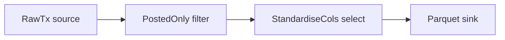

# FinLedger silver cleanse — data flow

```mermaid
flowchart LR
    SRC[RawTx source]
    F[PostedOnly filter]
    S[StandardiseCols select]
    SNK[Parquet sink]
    SRC --> F --> S --> SNK
```

**Lesson:** [02-02-code-free-transformation-at-scale.md](../../module-02-data-flows/02-02-code-free-transformation-at-scale.md)
