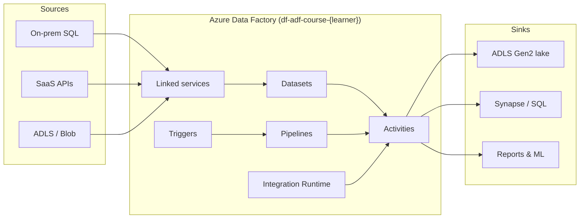

# 00-00 · Overview & mental model of ADF

> Module 0 · Time budget: 15 min · Source: [What is Azure Data Factory?](https://learn.microsoft.com/en-us/azure/data-factory/introduction)
> Prereqs: [SETUP.md](../SETUP.md) read once · Skim [CASE-STUDY.md](../CASE-STUDY.md) (FinLedger UK)

## What you'll build in this lesson

You will not deploy pipelines yet. By the end you will have (a) a clear mental model of how ADF components fit together for the **FinLedger UK** case study, (b) your Azure portal oriented so you know where Data Factory lives, and (c) a skeletal pipeline JSON plus a Python listing script you will reuse in later lessons. No billable ADF runs are started in this lesson.

## Why this matters (the concept)

Raw data sitting in databases, files, and SaaS tools has little value until it is **moved**, **cleansed**, **joined**, and **delivered** on a reliable schedule. Teams that do this by hand — cron jobs on a VM, one-off scripts, emailed CSV exports — eventually lose track of what ran, what failed, and what version of the logic produced last month's report.

**Azure Data Factory (ADF)** is Microsoft's managed **orchestration** service for data integration. It is not a database and not a Spark cluster by default. Think of it as an **air-traffic control tower** for data: it does not store passenger luggage long-term (that is your lake or warehouse), but it tells each plane when to take off, which runway to use, and what to do if weather changes.

ADF solves three problems at once:

1. **Connect** — Linked services hold connection details to hundreds of sources (SQL, Blob, S3, Salesforce, on-prem files).
2. **Transform & move** — Pipelines group **activities** (copy rows, run a data flow, call Databricks, send email on failure).
3. **Operate** — Triggers schedule runs; Monitor shows success, duration, and row counts; Git and ARM templates promote the same JSON from dev to prod.

Modern teams rarely click through the portal for every change. They commit pipeline JSON to Git and deploy via CI/CD — but you must understand the portal model first, because every JSON property maps to a blade you will see in ADF Studio. This course teaches both, click by click.

> ℹ️ NOTE: Microsoft also offers **Data Factory in Fabric**, a newer product line. This course targets **Azure Data Factory** (standalone), which remains the dominant integration layer in enterprise Azure estates and maps directly to the Microsoft Learn tutorials we follow.

## Key terms (first appearance)

| Term | Meaning in one line | Linked in GLOSSARY |
|---|---|---|
| ADF | Managed cloud service for ETL/ELT orchestration | [ADF](../GLOSSARY.md#adf-azure-data-factory) |
| Pipeline | Logical group of activities that perform one workflow | [Pipeline](../GLOSSARY.md#pipeline) |
| Activity | Single processing step inside a pipeline (copy, transform, control) | [Activity](../GLOSSARY.md#activity) |
| Dataset | Named description of data location/structure; points at a linked service | [Dataset](../GLOSSARY.md#dataset) |
| Linked service | Connection definition — "how to reach" a store or compute resource | [Linked service](../GLOSSARY.md#linked-service) |
| Integration Runtime (IR) | Compute bridge that executes activities close to data, securely | [IR](../GLOSSARY.md#integration-runtime-ir) |
| Trigger | Mechanism that starts a pipeline run on a schedule or event | [Trigger](../GLOSSARY.md#trigger) |
| Pipeline run | One execution instance of a pipeline | *(see recap)* |

## Architecture at a glance



Diagram source: [assets/diagrams/00-00-adf-mental-model.md](../assets/diagrams/00-00-adf-mental-model.md)

**Data flow in one sentence:** A **trigger** (or your hand) starts a **pipeline run** → **activities** execute on an **integration runtime** → they read **datasets** backed by **linked services** → outputs land in sink datasets.

## Part A — Do it in the UI (click by click)

This lesson orients you in the **Azure portal** before you create resources in 00-01 and 00-02. You need a browser and subscription access from [SETUP.md](../SETUP.md).

### A1 — Sign in and open the portal home

1. Open a browser (Edge or Chrome).
   → Blank tab or your homepage appears.
2. Navigate to `https://portal.azure.com`.
   → The Microsoft sign-in page appears if you are not already authenticated.
3. Enter your work or personal Microsoft account email, click **Next**, complete password and MFA.
   → The Azure portal home dashboard loads. The top bar shows a search box labelled **Search resources, services, and docs**.

### A2 — Locate Data Factory in the portal

4. In the top search box, type `Data Factory` (no quotes).
   → A dropdown lists matches; **Data factories** appears under **Services** with a factory icon.
5. Click **Data factories** under **Services** (not Marketplace).
   → The **Data factories** list blade opens. Title bar reads **Data factories**. You may see an empty list, existing factories from Class-1, or course factories from a prior attempt.
6. If the list is empty, read the centre message — typically **No data factories to display** with a **+ Create** button. That is expected before lesson 00-02.
   → You confirm where factories will appear after creation.

### A3 — Preview the Create experience (do not deploy yet)

7. Click **+ Create** (top-left of the list blade).
   → The **Create Data Factory** form opens. Sections include **Basics**, **Git configuration**, **Networking**, **Tags**, **Review + create**.
8. On **Basics**, read each field label without submitting:
   - **Subscription** — which billing boundary owns the factory.
   - **Resource group** — you will use `rg-adf-course-{learner}` (created in 00-01).
   - **Region** — must be **UK South** (`uksouth`) per course guardrails.
   - **Name** — globally unique; course convention `df-adf-course-{learner}`.
   - **Version** — leave **V2** (only option for new factories).
   → You see the exact fields lesson 00-02 will fill in.
9. Click **Previous** or the **X** (top-right of the blade) to close without creating.
   → You return to the Data factories list. No resource was billed.

### A4 — Open Microsoft Learn from the portal

10. In the top search box, type `Data Factory documentation`.
    → **Data Factory documentation** appears under **Documentation** or **Microsoft Learn**.
11. Click **Data Factory documentation**.
    → A Learn panel or new tab opens on the ADF docs hub.
12. In the left Learn TOC, expand **Overview**, click **What is Azure Data Factory?**
    → The introduction article loads — the conceptual source for this lesson.

### A5 — Optional: open an existing factory (Class-1 learners only)

Skip if you have no factory yet.

13. Return to **Data factories** list (search `Data factories` again).
14. Click the name of your existing factory (e.g. from Class-1 deployment).
    → The factory **Overview** blade opens with **Resource group**, **Location**, **JSON View**, and **Open Azure Data Factory Studio** (or **Launch studio**).
15. Click **Open Azure Data Factory Studio** (wording may vary).
    → ADF Studio opens in a new tab with left rail icons: **Home**, **Author**, **Manage**, **Monitor**. You will tour every pane in lesson 00-03. Do not change anything; close the tab.

> 🧪 LAB CHECK: You can find **Data factories** in the portal, preview the Create form fields, and name the six core components (linked service, dataset, pipeline, activity, IR, trigger) without looking at notes.

## Part B — The JSON behind it

You do not have a live factory yet, so this is a **reference skeleton** — the shape every pipeline in this course will extend. Filename follows ADF Git integration layout.

`pipeline/pl_hello_overview.json`

```json
{
  "name": "pl_hello_overview",
  "properties": {
    "description": "Skeletal pipeline for lesson 00-00 — replaced by real copy pipelines in Module 1",
    "parameters": {
      "learnerId": {
        "type": "String",
        "defaultValue": "demo"
      }
    },
    "variables": {
      "runNote": {
        "type": "String"
      }
    },
    "activities": [
      {
        "name": "Set_run_note",
        "type": "SetVariable",
        "dependsOn": [],
        "policy": {
          "timeout": "0.00:05:00",
          "retry": 0
        },
        "userProperties": [],
        "typeProperties": {
          "variableName": "runNote",
          "value": {
            "value": "@concat('ADF course overview run for learner ', pipeline().parameters.learnerId)",
            "type": "Expression"
          }
        }
      }
    ],
    "annotations": [
      "module-00",
      "overview-only"
    ]
  }
}
```

This pipeline contains one **Set Variable** control activity — the smallest activity that proves orchestration works without copying data or incurring copy charges. Lesson 03-01 covers control activities in depth.

## Part C — Do it in code (Python / REST / ARM)

**Chosen approach:** Python with `azure-identity` + `azure-mgmt-datafactory` — lists factories in your subscription so you can verify what exists before lessons 00-01 and 00-02.

**When engineers prefer code over portal:** Inventory scripts, CI/CD gates ("factory must exist before deploy"), and automated health checks — the same pattern as `session-2/scripts/morning_check.py` in this repo.

```python
"""
List Azure Data Factory instances in the subscription.
Lesson 00-00 — overview inventory (no pipeline runs started).
"""
from azure.identity import DefaultAzureCredential
from azure.mgmt.datafactory import DataFactoryManagementClient

# Replace with your values from SETUP.md
SUBSCRIPTION_ID = "00000000-0000-0000-0000-000000000000"  # your GUID
RESOURCE_GROUP = "rg-adf-course-jinesh"  # or rg-{learner}-class1 if reusing Class-1

credential = DefaultAzureCredential()
client = DataFactoryManagementClient(credential, SUBSCRIPTION_ID)

print(f"Data factories in resource group: {RESOURCE_GROUP}")
factories = client.factories.list_by_resource_group(RESOURCE_GROUP)
count = 0
for factory in factories:
    count += 1
    print(f"  - {factory.name}  location={factory.location}")

if count == 0:
    print("  (none yet — expected before lesson 00-02)")
else:
    print(f"Total: {count}")
```

Run after `az login` (or Azure CLI credentials picked up by `DefaultAzureCredential`):

```text
pip install azure-identity azure-mgmt-datafactory
python list_factories.py
```

**REST equivalent (read-only):** `GET https://management.azure.com/subscriptions/{subscriptionId}/resourceGroups/{resourceGroupName}/providers/Microsoft.DataFactory/factories?api-version=2018-06-01` with a Bearer token from `az account get-access-token --resource https://management.azure.com/`. Use when Python SDK is not available on a jump box.

**ARM/Bicep:** The factory resource is declared in infrastructure-as-code in lesson 00-02 and Module 6; not needed for this overview.

## Part D — Run, validate, and read the output

This lesson has **no pipeline run**. Validation is orientation-only.

| Check | How | Success |
|---|---|---|
| Portal navigation | You reached **Data factories** list and previewed **Create** | Fields match SETUP.md naming |
| Mental model | Explain linked service vs dataset to a colleague | "Connection" vs "path/shape of data" |
| JSON literacy | Open `pl_hello_overview.json` in a text editor | You see `activities`, `parameters`, `variables` |
| Python inventory | Run listing script | Prints factory names or "(none yet)" without error |

**Verification vs validation**

- **Verification:** Did the portal, script, and JSON structure behave as documented?
- **Validation:** Can you articulate *why* ADF separates linked services from datasets, and *when* you would add a trigger vs run manually? If yes, the lesson goal is met.

## Common errors & fixes

| Symptom | Likely cause | Fix |
|---|---|---|
| Search shows only Marketplace offers, not **Data factories** | Clicked wrong search result | Choose **Services → Data factories**, not **Marketplace** |
| **Create** fails immediately on Review | Name not globally unique or region unsupported | Use `df-adf-course-{learner}`; region **UK South** only |
| Python `DefaultAzureCredential` fails | Not logged in to Azure CLI | Run `az login` and `az account set --subscription <id>` |
| `ResourceGroupNotFound` in Python | Resource group not created yet | Expected before 00-01; create group in next lesson or reuse Class-1 `rg-{learner}-class1` |
| Opened **Synapse** workspace by mistake | Similar branding in search | Confirm blade title is **Data factories**, icon matches Data Factory (not Synapse) |

## Cost & tear-down

**Cost while studying this lesson:** £0.00. You only browsed the portal and optionally ran a read-only management API call. No Data Factory instance, pipeline run, or storage transaction is required.

**Tear-down:** Nothing to delete. If you accidentally created a factory during exploration, delete it: **Data factories** → select factory → **Delete** → type name → confirm. Lesson 00-02 will create it properly.

## Recap & self-check

- ADF **orchestrates** data movement and transformation; it is not your primary data store.
- **Linked services** = connections; **datasets** = data locations/shapes; **pipelines** group **activities**; **IR** executes work; **triggers** start runs.
- Portal path: search **Data factories** → list / create / open Studio.
- Every UI artifact has a JSON twin you can commit to Git — you previewed `pl_hello_overview.json`.
- Python management SDK can inventory factories before you build pipelines.

**Self-check questions**

1. What is the difference between a linked service and a dataset?
2. Name three activity categories ADF supports (movement, transformation, control).
3. Why does this course insist on UK South for the factory region?

<details>
<summary>Answers</summary>

1. A **linked service** stores connection/auth information to an external system. A **dataset** describes which slice of that system (path, table, file pattern, schema) an activity reads or writes.
2. **Data movement** (e.g. Copy), **data transformation** (e.g. Mapping data flow, Databricks), **control** (e.g. If, ForEach, Set Variable, Web).
3. Course and repo guardrails standardise on **uksouth** primary (and **ukwest** failover) for cost predictability, data residency alignment, and consistency with Bicep deployments in this training repo.

</details>

## Next

[00-01 · Create the ADLS Gen2 storage account](00-01-create-storage-adls-gen2.md)

---

## Case study & trainer resources

- **Story:** [CASE-STUDY.md](../CASE-STUDY.md) — FinLedger UK lake layout
- **Verify:** [docs/VERIFICATION-CHECKLIST.md](../docs/VERIFICATION-CHECKLIST.md) — Module 0 tick boxes
- **Trainer:** [TRAINER-GUIDE.md](../TRAINER-GUIDE.md) — facilitation notes
- **Data (next lesson):** [`data/module-00-foundations/upload_manifest.txt`](../data/module-00-foundations/upload_manifest.txt) — upload in 00-01
