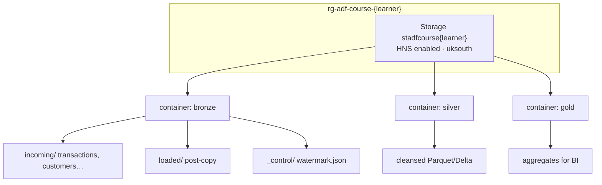

# 00-01 · Create ADLS Gen2 storage

> Module 0 · Time budget: 30 min · Source: [Create a storage account for Azure Data Lake Storage](https://learn.microsoft.com/en-us/azure/storage/blobs/create-data-lake-storage-account)
> Prereqs: [00-00 · Overview](00-00-overview.md), [SETUP.md](../SETUP.md), [CASE-STUDY.md](../CASE-STUDY.md)

## What you'll build in this lesson

You will create the **FinLedger UK** lake foundation: resource group `rg-adf-course-{learner}`, ADLS Gen2 storage account `stadfcourse{learner}` in **UK South** with hierarchical namespace enabled, and three containers — `bronze`, `silver`, `gold`. You will upload the seed file from [`data/module-00-foundations/upload_manifest.txt`](../data/module-00-foundations/upload_manifest.txt) to prove folder paths work. At the end, storage is ready for Data Factory in lesson 00-02.

## Why this matters (the concept)

Azure Data Lake Storage Gen2 is standard Azure Blob storage plus a **hierarchical namespace** (real directories, not just slash characters in blob names). ADF, Databricks, and Synapse expect this model for medallion architectures: **bronze** (raw), **silver** (cleansed), **gold** (business-ready).

Without ADLS Gen2 you can still store files in Blob, but directory operations, ACL inheritance, and many analytics tools behave differently. For FinLedger, every pipeline in Modules 1–6 reads and writes paths like `bronze/incoming/transactions/daily/` — that path must exist as a folder hierarchy you can browse in the portal.

**Analogy:** A warehouse with labelled aisles (containers) and shelf sections (folders). ADF delivery trucks (copy activities) need addresses, not "somewhere in the building."

This lesson is infrastructure only — no ADF charges yet. Storage cost is fractions of a penny for our sample files on the cheapest LRS tier.

## Key terms (first appearance)

| Term | Meaning in one line | Linked in GLOSSARY |
|---|---|---|
| ADLS Gen2 | Blob storage + hierarchical namespace for analytics lakes | [ADLS Gen2](../GLOSSARY.md#adls-gen2-azure-data-lake-storage-gen2) |
| Hierarchical namespace | Enables folders and POSIX-style paths on blob storage | *(this lesson)* |
| Container | Top-level partition in a storage account (like a drive letter) | *(this lesson)* |
| Medallion architecture | bronze / silver / gold data quality zones | [CASE-STUDY](../CASE-STUDY.md) |
| LRS | Locally redundant storage — cheapest replication SKU | *(this lesson)* |

## Architecture at a glance



Diagram source: [assets/diagrams/00-01-adls-lake-layout.md](../assets/diagrams/00-01-adls-lake-layout.md)

## Part A — Do it in the UI (click by click)

Replace `{learner}` with your ID (e.g. `jinesh`). Example storage name: `stadfcoursejinesh`.

### A1 — Create the resource group

1. Open `https://portal.azure.com` and sign in.
   → Portal home loads.
2. In the top search box, type `Resource groups`.
   → Dropdown shows **Resource groups** under Services.
3. Click **Resource groups**.
   → List blade titled **Resource groups**.
4. Click **+ Create** (top-left).
   → **Create a resource group** form opens.
5. On the **Basics** tab, set **Subscription** to your training subscription.
6. In **Resource group name**, type `rg-adf-course-{learner}`.
7. In **Region**, select **UK South**.
   → Region field shows `UK South`.
8. Click **Review + create** (bottom).
   → Validation passes with a green banner.
9. Click **Create**.
   → Deployment completes in seconds; click **Go to resource group**.
   → Blade shows empty resource group (or only resources from a prior attempt).

### A2 — Create the ADLS Gen2 storage account

10. Inside `rg-adf-course-{learner}`, click **+ Create** (top of resource list).
    → **Create a resource** marketplace view opens.
11. In the marketplace search box, type `Storage account`.
    → **Storage account** tile appears (Microsoft).
12. Click **Storage account**, then click **Create**.
    → **Create a storage account** wizard — **Basics** tab.
13. **Subscription:** same as above.
14. **Resource group:** click **Use existing** → select `rg-adf-course-{learner}`.
15. **Storage account name:** type `stadfcourse{learner}` (lowercase, no hyphens; 3–24 chars, globally unique).
    → Green checkmark if name available; red if taken — append a digit only if required.
16. **Region:** **UK South**.
17. **Performance:** **Standard**.
18. **Redundancy:** **Locally-redundant storage (LRS)** — cheapest tier for labs.
19. Click **Next: Advanced** (bottom).
    → **Advanced** tab opens.
20. Under **Security**, leave **Require secure transfer** enabled.
21. Under **Data Lake Storage Gen2**, set **Enable hierarchical namespace** to **On**.
    → This is the switch that makes the account ADLS Gen2. If Off, stop and turn On.
22. Click **Next** through **Networking**, **Data protection**, **Encryption** — leave defaults (public endpoint enabled is fine for Module 0–1).
23. Click **Review + create**, then **Create**.
    → Deployment runs 1–2 minutes. Click **Go to resource** when finished.
    → Storage account **Overview** blade shows **Status: Active**.

### A3 — Verify hierarchical namespace

24. On the storage account blade, left menu → **Data management** → **Data Lake Gen2** (or search settings for hierarchical namespace).
    → **Hierarchical namespace** shows **Enabled**.
    > ⚠️ VERIFY: If your portal shows this under **Configuration** → **Advanced settings** instead, confirm **Hierarchical namespace** = **Enabled** there.

### A4 — Create containers bronze, silver, gold

25. Left menu → **Data storage** → **Containers**.
    → **Containers** list (may be empty).
26. Click **+ Container** (top).
    → **New container** pane slides in from the right.
27. **Name:** `bronze`. **Public access level:** **Private (no anonymous access)**. Click **Create**.
    → `bronze` appears in the list.
28. Repeat step 26–27 for container name `silver`.
    → `silver` appears.
29. Repeat for container name `gold`.
    → Three containers listed: `bronze`, `silver`, `gold`.

### A5 — Upload FinLedger seed file (prove folder paths)

30. Click container **`bronze`**.
    → Container blade opens; blob list empty or shows prior blobs.
31. Click **Upload** (top).
    → **Upload** blade opens.
32. Click **Browse for files** → select from your repo clone:
    `session-2\adf-course\data\module-00-foundations\upload_manifest.txt`
33. Expand **Advanced** (if collapsed).
34. In **Upload to folder**, type exactly:
    `incoming/_seed`
    → Do not include `bronze/` — you are already inside the bronze container.
35. Click **Upload** (bottom of blade).
    → Progress completes; file appears at path `incoming` → `_seed` → `upload_manifest.txt`.
36. Click the blob `upload_manifest.txt`.
    → Blob detail blade opens.
37. Click **Preview** (or **Edit**).
    → Text shows the manifest checklist from the repo file.

### A6 — Create empty folder placeholders (optional but recommended)

38. Back in container **bronze**, click **Upload**.
39. Use **Upload to folder** `incoming/transactions/daily` — cancel file selection if you only want the folder, OR upload `transactions_daily.csv` now from `data/module-01-copy-ingest/` (used in lesson 01-01).
    → Folder path exists for Module 1 copy labs.
40. Create folder path `bronze/_control` by uploading a zero-byte placeholder or wait until lesson 01-07 creates `watermark.json`.
    → FinLedger control path reserved per [CASE-STUDY.md](../CASE-STUDY.md).

> 🧪 LAB CHECK: In **bronze**, navigate `incoming` → `_seed` → open **Preview** on `upload_manifest.txt`.

## Part B — The JSON behind it

Infrastructure is normally ARM/Bicep, not ADF pipeline JSON. This template matches the portal choices above.

`infra/arm/storage-adls-finledger.json`

```json
{
  "$schema": "https://schema.management.azure.com/schemas/2019-04-01/deploymentTemplate.json#",
  "contentVersion": "1.0.0.0",
  "parameters": {
    "storageAccountName": {
      "type": "string",
      "metadata": { "description": "e.g. stadfcoursejinesh" }
    },
    "location": {
      "type": "string",
      "defaultValue": "uksouth"
    }
  },
  "resources": [
    {
      "type": "Microsoft.Storage/storageAccounts",
      "apiVersion": "2023-01-01",
      "name": "[parameters('storageAccountName')]",
      "location": "[parameters('location')]",
      "sku": { "name": "Standard_LRS" },
      "kind": "StorageV2",
      "properties": {
        "accessTier": "Hot",
        "supportsHttpsTrafficOnly": true,
        "isHnsEnabled": true,
        "minimumTlsVersion": "TLS1_2"
      }
    },
    {
      "type": "Microsoft.Storage/storageAccounts/blobServices/containers",
      "apiVersion": "2023-01-01",
      "name": "[concat(parameters('storageAccountName'), '/default/bronze')]",
      "dependsOn": [
        "[resourceId('Microsoft.Storage/storageAccounts', parameters('storageAccountName'))]"
      ],
      "properties": {
        "publicAccess": "None"
      }
    },
    {
      "type": "Microsoft.Storage/storageAccounts/blobServices/containers",
      "apiVersion": "2023-01-01",
      "name": "[concat(parameters('storageAccountName'), '/default/silver')]",
      "dependsOn": [
        "[resourceId('Microsoft.Storage/storageAccounts', parameters('storageAccountName'))]"
      ],
      "properties": { "publicAccess": "None" }
    },
    {
      "type": "Microsoft.Storage/storageAccounts/blobServices/containers",
      "apiVersion": "2023-01-01",
      "name": "[concat(parameters('storageAccountName'), '/default/gold')]",
      "dependsOn": [
        "[resourceId('Microsoft.Storage/storageAccounts', parameters('storageAccountName'))]"
      ],
      "properties": { "publicAccess": "None" }
    }
  ],
  "outputs": {
    "dfsEndpoint": {
      "type": "string",
      "value": "[reference(resourceId('Microsoft.Storage/storageAccounts', parameters('storageAccountName'))).primaryEndpoints.dfs]"
    }
  }
}
```

`isHnsEnabled: true` is the critical property — equivalent to **Enable hierarchical namespace** in the portal.

## Part C — Do it in code (Python / REST / ARM)

**Chosen approach:** Azure CLI (idempotent create) + Python upload — matches how engineers bootstrap labs on Windows without clicking.

**When to prefer code:** Repeatable cohort setup, CI/CD for sandboxes, or re-run after teardown.

### Azure CLI (Windows `cmd`)

```text
set LEARNER=jinesh
set RG=rg-adf-course-%LEARNER%
set SA=stadfcourse%LEARNER%
set LOC=uksouth

az group create --name %RG% --location %LOC%

az storage account create ^
  --name %SA% ^
  --resource-group %RG% ^
  --location %LOC% ^
  --sku Standard_LRS ^
  --kind StorageV2 ^
  --hns true ^
  --allow-blob-public-access false

az storage container create --account-name %SA% --name bronze --auth-mode login
az storage container create --account-name %SA% --name silver --auth-mode login
az storage container create --account-name %SA% --name gold --auth-mode login

az storage blob upload ^
  --account-name %SA% ^
  --container-name bronze ^
  --name incoming/_seed/upload_manifest.txt ^
  --file session-2\adf-course\data\module-00-foundations\upload_manifest.txt ^
  --auth-mode login ^
  --overwrite
```

Run from repo root after `az login`. Re-run is safe: create commands update in place or report existing.

### Python (upload seed file)

```python
"""Upload FinLedger seed manifest to bronze/incoming/_seed/ — lesson 00-01."""
from pathlib import Path
from azure.identity import DefaultAzureCredential
from azure.storage.filedatalake import DataLakeServiceClient

LEARNER = "jinesh"
STORAGE_ACCOUNT = f"stadfcourse{LEARNER}"
CONTAINER = "bronze"
BLOB_PATH = "incoming/_seed/upload_manifest.txt"
LOCAL_FILE = Path(__file__).resolve().parent / "data/module-00-foundations/upload_manifest.txt"

account_url = f"https://{STORAGE_ACCOUNT}.dfs.core.windows.net"
service = DataLakeServiceClient(account_url, credential=DefaultAzureCredential())
fs = service.get_file_system_client(CONTAINER)
file_client = fs.get_file_client(BLOB_PATH)

data = LOCAL_FILE.read_bytes()
file_client.upload_data(data, overwrite=True)
print(f"Uploaded {LOCAL_FILE.name} -> {CONTAINER}/{BLOB_PATH}")
```

```text
pip install azure-identity azure-storage-file-datalake
python upload_seed.py
```

Requires your user account to have **Storage Blob Data Contributor** on the account (or Owner on RG).

## Part D — Run, validate, and read the output

No ADF pipeline in this lesson. Validation is **portal + storage path**.

### Verify table (tick each box)

| # | Check | Where in portal | Expected |
|---|---|---|---|
| 1 | Resource group exists | Resource groups → `rg-adf-course-{learner}` | Region **UK South** |
| 2 | Storage account active | RG → `stadfcourse{learner}` | Status **Active** |
| 3 | HNS enabled | Data Lake Gen2 / Configuration | **Enabled** |
| 4 | SKU | Overview → Performance/Replication | **Standard LRS** |
| 5 | Containers | Data storage → Containers | `bronze`, `silver`, `gold` |
| 6 | Seed blob | bronze → `incoming/_seed/upload_manifest.txt` | Preview shows checklist text |
| 7 | DFS endpoint | Overview → Endpoints | `https://stadfcourse{learner}.dfs.core.windows.net` |

Also tick **Module 0** items in [docs/VERIFICATION-CHECKLIST.md](../docs/VERIFICATION-CHECKLIST.md#00-01-adls-gen2).

**Verification:** All seven rows pass.  
**Validation:** You can explain which FinLedger paths will use `bronze/incoming/` vs `silver/` per [CASE-STUDY.md](../CASE-STUDY.md).

### Optional CLI proof

```text
az storage blob list --account-name stadfcourse{learner} --container-name bronze --prefix incoming/_seed/ --auth-mode login -o table
```

→ Lists `upload_manifest.txt`.

## Common errors & fixes

| Symptom | Likely cause | Fix |
|---|---|---|
| Storage name unavailable | Global name taken | Try `stadfcourse{learner}2` — update SETUP notes for your cohort |
| **Hierarchical namespace** greyed out after create | Cannot enable HNS on existing non-HNS account | Delete account and recreate with HNS **On** at creation |
| Upload fails 403 | RBAC not granted to your user | RG → Storage account → **Access control (IAM)** → add **Storage Blob Data Contributor** for your user |
| Folder path wrong in portal | Uploaded to container root | Re-upload with **Upload to folder** = `incoming/_seed` |
| Created in East US | Wrong region selected | Delete RG and recreate in **UK South** per course guardrails |
| Cannot find **Data Lake Gen2** menu | Portal layout variant | Use **Configuration** → confirm HNS, or Azure Storage Explorer |

## Cost & tear-down

**Cost:** Standard LRS hot storage for &lt; 1 MB of sample data — negligible (pence per month). No compute.

**Tear-down (end of course or sandbox reset):**

1. Portal → **Resource groups** → `rg-adf-course-{learner}`.
2. Click **Delete resource group**.
3. Type the resource group name to confirm → **Delete**.
   → All storage and later ADF resources in that RG are removed.

> ⚠️ WARNING: Deleting the resource group is irreversible. Export anything you need before delete.

## Recap & self-check

- ADLS Gen2 = StorageV2 + **hierarchical namespace** (`isHnsEnabled` / portal toggle).
- FinLedger uses containers **bronze**, **silver**, **gold** in `stadfcourse{learner}`.
- Seed file proves path `bronze/incoming/_seed/upload_manifest.txt` works.
- DFS endpoint `https://<account>.dfs.core.windows.net` is what ADF linked services use in 00-05.
- CLI/Python twins let you rebuild the lake idempotently.

**Self-check questions**

1. What portal setting differentiates ADLS Gen2 from plain Blob storage?
2. Why do we create `silver` and `gold` empty now?
3. What is the full path to the seed file you uploaded?

<details>
<summary>Answers</summary>

1. **Enable hierarchical namespace** (HNS) — ARM property `isHnsEnabled: true`.
2. So Module 2–6 pipelines have sink containers ready; naming is fixed in the case study from day one.
3. `bronze/incoming/_seed/upload_manifest.txt` (container `bronze`, blob path `incoming/_seed/upload_manifest.txt`).

</details>

## Next

[00-02 · Create the Data Factory instance](00-02-create-data-factory.md)

---

## Case study & trainer resources

- **Lake layout:** [CASE-STUDY.md](../CASE-STUDY.md)
- **Trainer:** [TRAINER-GUIDE.md](../TRAINER-GUIDE.md) — Module 0 table
- **Data:** [data/module-00-foundations/](../data/module-00-foundations/)
- **Checklist:** [VERIFICATION-CHECKLIST §00-01](../docs/VERIFICATION-CHECKLIST.md#00-01-adls-gen2)
