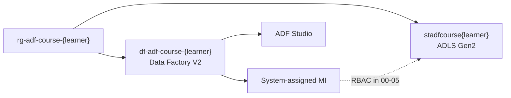

# 00-02 · Create the Data Factory instance

> Module 0 · Time budget: 20 min · Source: [Quickstart: Create a data factory](https://learn.microsoft.com/en-us/azure/data-factory/quickstart-create-data-factory)
> Prereqs: [00-01 · ADLS Gen2](00-01-create-storage-adls-gen2.md)

## What you'll build in this lesson

You will create **Azure Data Factory V2** instance `df-adf-course-{learner}` in resource group `rg-adf-course-{learner}` (UK South), with **system-assigned managed identity** enabled. You will open **ADF Studio** once and confirm the factory is empty and ready for linked services in lesson 00-05. No pipelines or billable runs yet.

## Why this matters (the concept)

A **Data Factory** is the top-level Azure resource that holds your pipelines, datasets, linked services, triggers, and data flows. Think of it as the **building** that houses your ETL operations — storage (lesson 00-01) is the warehouse next door; the factory is where schedules and workflows live.

FinLedger will run all orchestration from this single factory. Enabling **system-assigned managed identity** at creation time gives ADF its own Azure AD principal. In lesson 00-05 you grant that identity access to `stadfcourse{learner}` so copy activities authenticate without storing account keys in linked services — the pattern Microsoft recommends for production.

**Version V2** is the only choice for new factories; V1 is legacy. Git configuration and networking can stay default for Module 0.

## Key terms (first appearance)

| Term | Meaning in one line | Linked in GLOSSARY |
|---|---|---|
| Data Factory (resource) | Azure RM resource containing all ADF artefacts | [ADF](../GLOSSARY.md#adf-azure-data-factory) |
| ADF Studio | Browser UX for authoring and monitoring | [ADF Studio](../GLOSSARY.md#adf-studio) |
| System-assigned managed identity | Azure AD identity tied to the factory lifecycle | [Managed identity](../GLOSSARY.md#managed-identity-system-assigned) |
| Factory V2 | Current ADF platform (vs deprecated V1) | *(this lesson)* |

## Architecture at a glance



## Part A — Do it in the UI (click by click)

### A1 — Start factory creation

1. Portal → top search → type `Data factories` → click **Data factories** under Services.
   → **Data factories** list blade.
2. Click **+ Create**.
   → **Create Data Factory** wizard — tab **Basics**.
3. **Subscription:** your training subscription.
4. **Resource group:** **Use existing** → `rg-adf-course-{learner}`.
5. **Region:** **UK South**.
6. **Name:** `df-adf-course-{learner}` (globally unique; lowercase letters, numbers, hyphens).
   → Green validation if name available.
7. **Version:** **V2** (default).
8. Leave **Git configuration** collapsed / disabled for now (Module 6 covers Git).
   → Module 0 stays in live mode for simpler first pipelines.

### A2 — Enable managed identity

9. Click **Next: Git configuration** (or **Next** through tabs until you reach identity settings).
   > ⚠️ VERIFY: Some portal builds show **Managed identity** on **Basics** or a dedicated **Networking/Identity** tab. Find **System assigned managed identity**.
10. Set **System assigned managed identity** to **On** (or **Enable**).
    → Portal notes an identity will be created with the factory.
11. Click through **Networking** — leave **Public network access** enabled for Module 0–1.
12. **Tags** (optional): add `course=adf-finledger`, `owner=<your email>`.
13. Click **Review + create** → **Create**.
    → Deployment ~1 minute. Click **Go to resource**.
    → Factory **Overview** blade: **Status Succeeded**.

### A3 — Note the managed identity principal

14. On factory blade → left menu → **Settings** → **Identity** (or search **Identity** on the factory resource).
    → **System assigned** tab shows **Status: On**.
15. Copy **Object (principal) ID** to a local note — used in 00-05 for RBAC.
    → GUID format, e.g. `a1b2c3d4-...`.

### A4 — Open ADF Studio

16. On factory **Overview**, click **Open Azure Data Factory Studio** (or **Launch studio**).
    → New tab: ADF Studio home. URL pattern `https://adf.azure.com/en/authoring?factory=...`.
17. Confirm top bar shows factory name `df-adf-course-{learner}`.
18. Left rail: note icons **Home**, **Author** (pencil), **Manage** (toolbox), **Monitor** (chart).
    → Empty factory — no pipelines yet. Close tab or leave open for 00-03.

> 🧪 LAB CHECK: Factory in UK South; Identity **On**; Studio loads without error.

## Part B — The JSON behind it

`infra/arm/data-factory-finledger.json`

```json
{
  "$schema": "https://schema.management.azure.com/schemas/2019-04-01/deploymentTemplate.json#",
  "contentVersion": "1.0.0.0",
  "parameters": {
    "factoryName": {
      "type": "string",
      "metadata": { "description": "df-adf-course-{learner}" }
    },
    "location": {
      "type": "string",
      "defaultValue": "uksouth"
    }
  },
  "resources": [
    {
      "type": "Microsoft.DataFactory/factories",
      "apiVersion": "2018-06-01",
      "name": "[parameters('factoryName')]",
      "location": "[parameters('location')]",
      "identity": {
        "type": "SystemAssigned"
      },
      "properties": {}
    }
  ],
  "outputs": {
    "factoryId": {
      "type": "string",
      "value": "[resourceId('Microsoft.DataFactory/factories', parameters('factoryName'))]"
    },
    "principalId": {
      "type": "string",
      "value": "[reference(resourceId('Microsoft.DataFactory/factories', parameters('factoryName')), '2018-06-01', 'Full').identity.principalId]"
    }
  }
}
```

## Part C — Do it in code (Python / REST / ARM)

**Chosen:** Azure CLI + Python SDK — idempotent `create_or_update`.

```text
set LEARNER=jinesh
set RG=rg-adf-course-%LEARNER%
set DF=df-adf-course-%LEARNER%

az datafactory create ^
  --factory-name %DF% ^
  --resource-group %RG% ^
  --location uksouth
```

> ℹ️ NOTE: CLI `az datafactory create` may not set identity in all CLI versions. Verify in portal **Identity** blade; enable manually if Off, or use ARM template above.

```python
"""Create FinLedger Data Factory with system-assigned MI — lesson 00-02."""
from azure.identity import DefaultAzureCredential
from azure.mgmt.datafactory import DataFactoryManagementClient
from azure.mgmt.datafactory.models import Factory, FactoryIdentity

SUBSCRIPTION_ID = "00000000-0000-0000-0000-000000000000"
RG = "rg-adf-course-jinesh"
FACTORY_NAME = "df-adf-course-jinesh"
LOCATION = "uksouth"

client = DataFactoryManagementClient(DefaultAzureCredential(), SUBSCRIPTION_ID)
factory = Factory(
    location=LOCATION,
    identity=FactoryIdentity(type="SystemAssigned"),
)
result = client.factories.create_or_update(RG, FACTORY_NAME, factory)
print(f"Factory: {result.name}  location={result.location}")
print(f"Principal ID: {result.identity.principal_id}")
```

## Part D — Run, validate, and read the output

| # | Check | Where | Expected |
|---|---|---|---|
| 1 | Factory exists | RG → `df-adf-course-{learner}` | Status **Succeeded** |
| 2 | Region | Overview | **UK South** |
| 3 | Version | Overview / Properties | **V2** |
| 4 | Managed identity | Identity blade | **On** + principal ID copied |
| 5 | Studio | Open Studio | Home page loads, correct factory name |

Tick [VERIFICATION-CHECKLIST §00-02](../docs/VERIFICATION-CHECKLIST.md).

**Verification:** Studio opens. **Validation:** You know why MI is enabled before any linked service exists.

## Common errors & fixes

| Symptom | Likely cause | Fix |
|---|---|---|
| Name not available | Global duplicate | Adjust suffix: `df-adf-course-{learner}2` |
| Studio opens wrong factory | Multiple factories in subscription | Use **Overview** → **Open Studio** from correct resource |
| Identity Off after CLI create | CLI omitted identity | Portal → Identity → set **On** → Save |
| Region mismatch | Wrong RG region | Factory must be UK South; recreate if needed |
| 403 opening Studio | RBAC Reader insufficient | Need **Data Factory Contributor** or **Contributor** on RG |

## Cost & tear-down

**Cost:** £0 at idle — no pipeline runs, no IR charges for default Azure IR until activities execute.

**Tear-down:** Delete entire `rg-adf-course-{learner}` when resetting course (removes factory + storage).

## Recap & self-check

- Factory `df-adf-course-{learner}` is the FinLedger orchestration home.
- System-assigned MI principal ID is required for storage RBAC in 00-05.
- ADF Studio is where Parts A of future lessons happen.
- ARM `identity.type: SystemAssigned` matches portal.

**Self-check:** What is stored in a factory vs in a storage account?

<details><summary>Answer</summary>Factory holds pipeline definitions, linked services, datasets, triggers — metadata and orchestration. Storage holds actual files (CSV, Parquet) in bronze/silver/gold.</details>

## Next

[00-03 · ADF Studio tour — every pane, every icon](00-03-studio-tour-every-pane.md)
