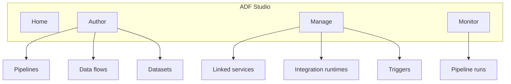

# 00-03 · ADF Studio tour

> Module 0 · Time budget: 30 min · Source: [UX overview in Azure Data Factory](https://learn.microsoft.com/en-us/azure/data-factory/concepts-ux-overview)
> Prereqs: [00-02 · Create Data Factory](00-02-create-data-factory.md)

## What you'll build in this lesson

You will tour **every major ADF Studio hub and pane** — Home, Author (pipelines, activities, datasets, data flows, templates), Manage (linked services, integration runtimes, triggers, global parameters), and Monitor (pipeline runs, triggers, annotations). You will not publish a pipeline yet. You will map each UI area to where FinLedger artefacts appear in later modules.

## Why this matters (the concept)

ADF Studio is a **separate web app** from the Azure portal. The portal creates the factory **resource**; Studio is where data engineers spend most of their time. If you know which icon holds linked services vs pipeline runs, you will not waste hours hunting menus when a copy activity fails at 2 a.m.

**Author** is design-time: canvas, wizards, JSON code view. **Manage** is shared connections and compute gateways. **Monitor** is run-time: success, duration, rows copied, errors. FinLedger Module 1 adds copy pipelines under Author; Module 3 adds triggers under Manage; every module ends in Monitor for verification.

## Key terms (first appearance)

| Term | Meaning in one line | Linked in GLOSSARY |
|---|---|---|
| Author hub | Design pipelines, data flows, datasets | [ADF Studio](../GLOSSARY.md#adf-studio) |
| Manage hub | Linked services, IRs, triggers (shared assets) | [ADF Studio](../GLOSSARY.md#adf-studio) |
| Monitor hub | Pipeline run history and diagnostics | [ADF Studio](../GLOSSARY.md#adf-studio) |
| Publish | Push draft changes from Studio to live ADF service | *(this lesson)* |
| Code view `{}` | JSON editor for any artefact | *(this lesson)* |

## Architecture at a glance



## Part A — Do it in the UI (click by click)

Open Studio from portal: factory → **Open Azure Data Factory Studio**.

### A1 — Home hub

1. Click **Home** (house icon, top-left rail).
   → **Welcome** page with tiles: **Ingest**, **Transform**, **Orchestrate**, **Monitor**, learning links.
2. Scroll **What's new** (optional).
   → Confirms you are on current Studio build.
3. Click tile **Ingest data** (if present).
   → May launch **Copy Data tool** wizard — click **X** to cancel; you use this in lesson 01-01.
   → Back on Home.

### A2 — Author hub — pipelines

4. Click **Author** (pencil icon).
   → **Factory Resources** tree on left: **Pipelines**, **Datasets**, **Data flows**, **Power Query**, **Templates**.
5. Expand **Pipelines** (click arrow).
   → Empty or list of pipelines. FinLedger `pl_*` pipelines appear from Module 1.
6. Click **+** next to **Pipelines** → **Pipeline**.
   → New tab **Pipeline1** with blank canvas, **Activities** palette at bottom.
7. In canvas toolbar, click **{}** (Code).
   → JSON editor shows pipeline skeleton (`properties.activities: []`).
8. Click **{}** again to return to canvas.
9. Close tab **Pipeline1** → **Don't save** when prompted.
   → Canvas closed without publishing.

### A3 — Author — activities palette

10. Create another **+ Pipeline** (temporary).
11. In **Activities** search box at bottom, type `copy`.
    → **Copy data** activity appears under **Move & transform**.
12. Drag **Copy data** onto canvas.
    → Activity box **Copy data1** on canvas.
13. Click **Copy data1** — **General**, **Source**, **Sink**, **Settings** tabs appear below.
    → These tabs map to JSON in Part B of copy lessons.
14. Close pipeline tab without saving.

### A4 — Author — datasets and data flows

15. In Factory Resources, click **+** next to **Datasets**.
    → **New dataset** blade: search connectors (SQL, ADLS, etc.).
16. Press **Esc** or **Cancel**.
17. Expand **Data flows** in tree.
    → Empty until Module 2 (`df_clean_transactions`, etc.).
18. Expand **Power Query** (optional) — Module 2 wrangling.
19. Expand **Templates** — Microsoft sample pipelines.

### A5 — Manage hub

20. Click **Manage** (toolbox icon).
    → **Manage** hub; default sub-pane often **Linked services**.
21. Confirm list is empty (or shows prior attempts). Click **+ New**.
    → **New linked service** blade with connector tiles.
22. In search box, type `data lake`.
    → **Azure Data Lake Storage Gen2** tile visible — used in 00-05.
23. Click **Cancel**.
24. Left menu under Manage → **Integration runtimes**.
    → **AutoResolveIntegrationRuntime** (default Azure IR) should exist.
25. Click **AutoResolveIntegrationRuntime**.
    → Detail pane: **Status Running**, Type **Azure**, Region **Auto**.
26. Left menu → **Triggers**.
    → Empty until Module 3 (`tr_daily_6am`).
27. Left menu → **Global parameters** (if shown).
    → Subscription-wide constants — optional advanced topic.

### A6 — Monitor hub

28. Click **Monitor** (chart icon).
    → **Pipeline runs** tab; list empty until first run.
29. Top tabs: **Pipeline runs**, **Trigger runs**, **Data flows**, **Annotations** (names may vary slightly).
30. Click **Trigger runs**.
    → Empty schedule history.
31. Click **Data flow debug sessions** (if listed).
    → Empty — Module 2 uses debug.

### A7 — Publish and Git (preview only)

32. Top toolbar → **Publish all** (cloud upload icon).
    → If nothing drafted, button may be disabled or reports "No changes".
33. Top toolbar → **Git configuration** or **Set up code repository** (if visible).
    → Module 6 configures Git — do not connect now unless instructed.

> 🧪 LAB CHECK: Without guide, locate **Linked services**, **Integration runtimes**, and **Pipeline runs** in under 30 seconds.

## Part B — The JSON behind it

Empty factory has no artefacts. This is the **default AutoResolve IR** JSON you will see after first publish (reference):

`integrationRuntime/AutoResolveIntegrationRuntime.json`

```json
{
  "name": "AutoResolveIntegrationRuntime",
  "properties": {
    "type": "Managed",
    "typeProperties": {
      "computeProperties": {
        "location": "AutoResolve"
      }
    },
    "description": "Default Azure integration runtime for cloud copy and data flow dispatch"
  }
}
```

Pipeline skeleton from Author **{}** view:

`pipeline/_skeleton.json`

```json
{
  "name": "pl_skeleton",
  "properties": {
    "activities": [],
    "parameters": {},
    "variables": {},
    "annotations": []
  }
}
```

## Part C — Do it in code (Python / REST / ARM)

**Chosen:** REST — list integration runtimes (proves Manage hub content via API).

```python
"""List integration runtimes — maps to Manage hub — lesson 00-03."""
import requests
from azure.identity import DefaultAzureCredential

SUBSCRIPTION_ID = "00000000-0000-0000-0000-000000000000"
RG = "rg-adf-course-jinesh"
FACTORY = "df-adf-course-jinesh"
API = "2018-06-01"

cred = DefaultAzureCredential()
token = cred.get_token("https://management.azure.com/.default").token
url = (
    f"https://management.azure.com/subscriptions/{SUBSCRIPTION_ID}"
    f"/resourceGroups/{RG}/providers/Microsoft.DataFactory/factories/{FACTORY}"
    f"/integrationRuntimes?api-version={API}"
)
resp = requests.get(url, headers={"Authorization": f"Bearer {token}"})
resp.raise_for_status()
for ir in resp.json().get("value", []):
    print(ir["name"], ir["properties"].get("type"))
```

Engineers use this for health checks and CI validation that AutoResolve IR exists.

## Part D — Run, validate, and read the output

| # | Check | Where in Studio | Expected |
|---|---|---|---|
| 1 | Home loads | Home icon | Welcome tiles visible |
| 2 | Author pipelines | Author → Pipelines | Can open blank canvas |
| 3 | Copy activity | Activities palette | Found via search |
| 4 | Code view | `{}` on pipeline | JSON with `activities` array |
| 5 | Linked services | Manage → Linked services | **+ New** opens connector blade |
| 6 | Default IR | Manage → Integration runtimes | **AutoResolveIntegrationRuntime** Running |
| 7 | Monitor | Monitor → Pipeline runs | Empty list (no error) |

Tick [VERIFICATION-CHECKLIST §00-03](../docs/VERIFICATION-CHECKLIST.md).

## Common errors & fixes

| Symptom | Likely cause | Fix |
|---|---|---|
| Studio shows wrong subscription | Multiple subs | Factory **Overview** → **Open Studio** from correct RG |
| Manage hub blank / error | RBAC | Need **Data Factory Contributor** minimum |
| No AutoResolve IR | New factory provisioning delay | Refresh; wait 2 min; reopen Studio |
| Cannot create pipeline | Read-only role | Upgrade to Contributor on factory or RG |
| **Publish all** fails | Network / policy | Check corporate proxy; try Edge |

## Cost & tear-down

**Cost:** £0 — tour only, no debug clusters or pipeline runs.

## Recap & self-check

- **Author** = build; **Manage** = connections & IR; **Monitor** = runs.
- **Copy data** lives in activities palette; datasets are separate artefacts.
- **AutoResolveIntegrationRuntime** handles cloud-to-cloud copy until self-hosted IR in 01-04.
- **{}** Code view is how Git/CI/CD stores the same definitions.

**Self-check:** Where do you create a linked service — Author or Manage?

<details><summary>Answer</summary>**Manage** hub → **Linked services** (Author references them from datasets and activities).</details>

## Next

[00-04 · Linked services & Integration Runtime concepts](00-04-linked-services-and-integration-runtime.md)
