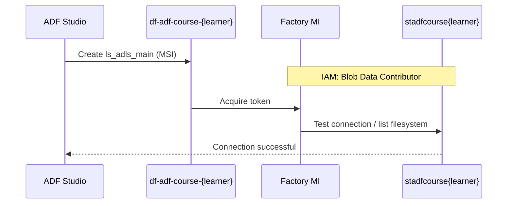

# 00-05 · Link ADF to storage

> Module 0 · Time budget: 30 min · Source: [Copy Data tool tutorial (connection setup)](https://learn.microsoft.com/en-us/azure/data-factory/tutorial-copy-data-tool)
> Prereqs: [00-04 · Linked services & IR](00-04-linked-services-and-integration-runtime.md), storage from [00-01](00-01-create-storage-adls-gen2.md), factory from [00-02](00-02-create-data-factory.md)

## What you'll build in this lesson

You will create linked service **`ls_adls_main`** from ADF to `stadfcourse{learner}` using **system-assigned managed identity**, assign **Storage Blob Data Contributor** to the factory MI, **test connection** (green), and **publish** the linked service. This unlocks Module 1 copy labs for FinLedger transactions and master data.

## Why this matters (the concept)

ADF copy activities must authenticate to ADLS Gen2. Storing account keys in linked services works in demos but fails security reviews — keys rotate, leak in logs, and appear in Git exports. **Managed identity** lets the factory authenticate as itself; you grant RBAC on the storage account to that identity.

The flow is always: (1) enable MI on factory — done in 00-02; (2) create linked service pointing at `https://<account>.dfs.core.windows.net` with MSI; (3) grant **Storage Blob Data Contributor** (or narrower) on the storage scope; (4) test connection; (5) publish. Skip step 3 and test connection fails with 403 — the most common Module 0 blocker.

## Key terms (first appearance)

| Term | Meaning in one line | Linked in GLOSSARY |
|---|---|---|
| Storage Blob Data Contributor | RBAC role allowing read/write blobs | *(this lesson)* |
| Test connection | ADF validates linked service auth | *(this lesson)* |
| Publish all | Activates draft artefacts in live factory | *(from 00-03)* |
| dfs.core.windows.net | ADLS Gen2 endpoint for linked service URL | *(this lesson)* |

## Architecture at a glance



## Part A — Do it in the UI (click by click)

### A1 — Grant RBAC on storage (portal) — do this first

1. Portal → search `stadfcourse{learner}` → open storage account.
   → Storage **Overview** blade.
2. Left menu → **Access control (IAM)**.
   → IAM blade for storage account.
3. Click **+ Add** → **Add role assignment**.
   → **Add role assignment** wizard opens.
4. **Role** tab → search `Storage Blob Data Contributor` → select it → **Next**.
5. **Members** tab → **Assign access to:** **Managed identity** → **+ Select members**.
   → **Select managed identities** pane opens.
6. **Managed identity** dropdown → **Data factory** (or **All system-assigned identities**).
7. Select `df-adf-course-{learner}` → **Select**.
   → Member appears in list.
8. Click **Review + assign** → **Review + assign** again.
   → Role assignment succeeded notification.
9. Wait **2–5 minutes** for RBAC propagation.
   → ℹ️ NOTE: Immediate test may still fail — retry test connection after coffee.

### A2 — Create linked service in ADF Studio

10. Open **ADF Studio** for `df-adf-course-{learner}`.
11. Click **Manage** (toolbox) → **Linked services**.
    → Linked services list.
12. Click **+ New**.
    → **New linked service** blade.
13. Search `data lake` → select **Azure Data Lake Storage Gen2** → **Continue**.
    → Configuration form.
14. **Name:** `ls_adls_main`.
15. **Connect via integration runtime:** leave **AutoResolveIntegrationRuntime**.
16. **Authentication type:** **System assigned managed identity**.
    → Account key fields disappear.
17. **Storage account name:** select `stadfcourse{learner}` from dropdown (or type name).
    → URL auto-fills `https://stadfcourse{learner}.dfs.core.windows.net`.
18. **Account kind:** leave default (Storage general purpose V2).
19. **Test connection:** click **Test connection** (bottom-right).
    → Green banner **Connection successful**. If red, see Common errors.
20. Click **Create**.
    → Blade closes; `ls_adls_main` in list with type **Azure Data Lake Storage Gen2**.

### A3 — Publish

21. Top toolbar → **Publish all**.
    → **Publish all** dialog lists `ls_adls_main`.
22. Click **Publish**.
    → Progress completes; notification **Publishing succeeded**.
    → Linked service is live for pipelines.

### A4 — Verify in Author (optional dataset smoke test)

23. **Author** → **Datasets** → **+** → **Delimited Text** → **Continue**.
24. **Linked service:** `ls_adls_main` → **Test connection** → success.
25. **File path:** browse or set file system `bronze`, directory `incoming/_seed`, file `upload_manifest.txt`.
26. **OK** through schema → name `ds_seed_manifest` → **OK**.
27. **Publish all** again (optional dataset for Module 1 practice).
    → Or delete draft dataset if you prefer only linked service from this lesson.

> 🧪 LAB CHECK: Manage → `ls_adls_main` → **Test connection** green after publish.

## Part B — The JSON behind it

`linkedService/ls_adls_main.json` (MSI — as exported from Code view after create)

```json
{
  "name": "ls_adls_main",
  "type": "Microsoft.DataFactory/factories/linkedservices",
  "properties": {
    "annotations": ["finledger"],
    "type": "AzureBlobFS",
    "typeProperties": {
      "url": "https://stadfcoursejinesh.dfs.core.windows.net"
    },
    "connectVia": {
      "referenceName": "AutoResolveIntegrationRuntime",
      "type": "IntegrationRuntimeReference"
    },
    "description": "FinLedger primary lake — MSI",
    "authentication": {
      "type": "ManagedServiceIdentity"
    }
  }
}
```

> ⚠️ VERIFY: Exported JSON may show `credential` instead of `authentication` depending on API version — both indicate MSI when no accountKey is present.

## Part C — Do it in code (Python / REST / ARM)

**Chosen:** Python SDK — same as Session 2 `adf_pipeline.py` pattern.

```python
"""Create ls_adls_main with MSI + grant RBAC — lesson 00-05."""
from azure.identity import DefaultAzureCredential
from azure.mgmt.datafactory import DataFactoryManagementClient
from azure.mgmt.datafactory.models import (
    AzureBlobFSLinkedService,
    LinkedServiceResource,
)
from azure.mgmt.authorization import AuthorizationManagementClient
from azure.mgmt.authorization.models import RoleAssignmentCreateParameters
import uuid

SUBSCRIPTION_ID = "00000000-0000-0000-0000-000000000000"
RG = "rg-adf-course-jinesh"
FACTORY = "df-adf-course-jinesh"
STORAGE = "stadfcoursejinesh"
LS_NAME = "ls_adls_main"
ROLE_BLOB_CONTRIBUTOR = "ba92f5ec-2eab-4e74-87b2-2ff9d4e4c8a0"

cred = DefaultAzureCredential()
adf = DataFactoryManagementClient(cred, SUBSCRIPTION_ID)

# Factory MI principal (from 00-02)
factory = adf.factories.get(RG, FACTORY)
principal_id = factory.identity.principal_id

# RBAC on storage account scope
auth_client = AuthorizationManagementClient(cred, SUBSCRIPTION_ID)
scope = (
    f"/subscriptions/{SUBSCRIPTION_ID}/resourceGroups/{RG}"
    f"/providers/Microsoft.Storage/storageAccounts/{STORAGE}"
)
auth_client.role_assignments.create(
    scope=scope,
    role_assignment_name=str(uuid.uuid4()),
    parameters=RoleAssignmentCreateParameters(
        role_definition_id=f"/subscriptions/{SUBSCRIPTION_ID}/providers/Microsoft.Authorization/roleDefinitions/{ROLE_BLOB_CONTRIBUTOR}",
        principal_id=principal_id,
        principal_type="ServicePrincipal",
    ),
)

dfs_url = f"https://{STORAGE}.dfs.core.windows.net"
ls = LinkedServiceResource(
    properties=AzureBlobFSLinkedService(
        url=dfs_url,
        description="FinLedger primary lake — MSI",
    )
)
adf.linked_services.create_or_update(RG, FACTORY, LS_NAME, ls)
print(f"Linked service {LS_NAME} created. Grant propagation may take a few minutes.")
```

```text
pip install azure-mgmt-datafactory azure-mgmt-authorization azure-identity
```

Idempotent tip: check existing role assignment before create (Session 2 `adf_rbac.py` pattern).

## Part D — Run, validate, and read the output

| # | Check | Where | Expected |
|---|---|---|---|
| 1 | RBAC | Storage → IAM → Role assignments | Factory MI has **Storage Blob Data Contributor** |
| 2 | Linked service | Manage → `ls_adls_main` | Type ADLS Gen2 |
| 3 | Test connection | Linked service blade | **Connection successful** |
| 4 | Published | After Publish all | No asterisk/draft on artefact |
| 5 | DFS URL | Linked service JSON | `https://stadfcourse{learner}.dfs.core.windows.net` |

Upload [`transactions_daily.csv`](../data/module-01-copy-ingest/transactions_daily.csv) to `bronze/incoming/transactions/daily/` before lesson **01-01**.

Tick [VERIFICATION-CHECKLIST §00-05](../docs/VERIFICATION-CHECKLIST.md).

**Verification:** Green test connection. **Validation:** Factory MI can list `bronze` container (test connection proves OAuth to DFS).

## Common errors & fixes

| Symptom | Likely cause | Fix |
|---|---|---|
| Test connection 403 | RBAC missing or not propagated | Confirm role on storage; wait 5 min; retry |
| Storage account not in dropdown | Wrong subscription or region | Confirm account in same sub as factory |
| MSI option missing | Factory identity Off | Portal → factory → Identity → On |
| Publish failed | Concurrent edit | Refresh Studio; Publish again |
| Linked service works in test but copy fails | Dataset path wrong | Module 1 — separate from connection |
| Used account key by mistake | Wrong auth type | Recreate with MSI; remove key from Git |

## Cost & tear-down

**Cost:** £0 — connection test only, no copy activity run.

**Tear-down:** Delete linked service: Manage → `ls_adls_main` → **Delete** → Publish. Or delete entire resource group at course end.

## Recap & self-check

- Order matters: **RBAC first**, then linked service, then test, then publish.
- `ls_adls_main` + MSI is FinLedger standard for all lake datasets.
- AutoResolve IR routes cloud copy — no self-hosted agent needed yet.
- Module 1 starts with files in `bronze/incoming/` and this linked service.

**Self-check:** Which role and which principal for MSI access?

<details><summary>Answer</summary>**Storage Blob Data Contributor** assigned to the **system-assigned managed identity** of `df-adf-course-{learner}` on scope `stadfcourse{learner}`.</details>

## Next

[01-01 · Copy Data tool (guided wizard, end to end)](../module-01-copy-ingest/01-01-copy-data-tool.md)

---

## Case study & trainer resources

- **Data for Module 1:** [data/module-01-copy-ingest/](../data/module-01-copy-ingest/)
- **Trainer:** [TRAINER-GUIDE.md](../TRAINER-GUIDE.md)
- **Checklist:** [VERIFICATION-CHECKLIST](../docs/VERIFICATION-CHECKLIST.md)
