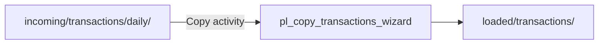

# 01-01 · Copy Data tool

> Module 1 · Time budget: 35 min · Source: [Copy data using the Copy Data tool](https://learn.microsoft.com/en-us/azure/data-factory/tutorial-copy-data-tool)
> Prereqs: [00-05 · Link ADF to storage](../module-00-foundations/00-05-link-adf-to-storage-step-by-step.md), [`transactions_daily.csv`](../data/module-01-copy-ingest/transactions_daily.csv) uploaded

## What you'll build in this lesson

You will use the **Copy Data tool** wizard to ingest FinLedger daily transactions from `bronze/incoming/transactions/daily/transactions_daily.csv` to `bronze/loaded/transactions/` — creating pipeline **`pl_copy_transactions_wizard`**, datasets, and reusing **`ls_adls_main`**. You will **trigger** the pipeline, verify **12 rows** in Monitor, and confirm the sink file in storage.

## Why this matters (the concept)

The Copy Data tool is ADF's **fastest on-ramp** for bulk movement: it generates linked services, datasets, and a copy pipeline from a guided UI. Production teams often outgrow the wizard (limited parameterisation, naming conventions) but every engineer should know it — it's the same **Copy activity** engine as hand-built pipelines, and it's ideal for proving connectivity on day one.

For FinLedger, nightly transaction files land in `incoming/`; the wizard copies them to `loaded/` so downstream silver jobs have a stable "promoted" path separate from raw drops.

## Key terms (first appearance)

| Term | Meaning in one line | Linked in GLOSSARY |
|---|---|---|
| Copy Data tool | Studio wizard that scaffolds copy pipelines | [Copy Data tool](../GLOSSARY.md#copy-data-tool) |
| Copy activity | Engine that moves data between datasets | [Copy activity](../GLOSSARY.md#copy-activity) |
| Sink | Destination dataset in a copy | *(this lesson)* |
| Source | Origin dataset in a copy | *(this lesson)* |

## Architecture at a glance



## Part A — Do it in the UI (click by click)

### A0 — Upload source file (if not done)

1. Portal → `stadfcourse{learner}` → **Containers** → **bronze** → **Upload**.
2. File: `adf-course\data\module-01-copy-ingest\transactions_daily.csv`.
3. **Upload to folder:** `incoming/transactions/daily`.
   → Blob at `incoming/transactions/daily/transactions_daily.csv`.

### A1 — Launch Copy Data tool

4. ADF Studio → **Home** → **Ingest data** (or **Author** → **+** → **Pipeline** → **Add trigger** → use **Copy Data tool** from Home).
   → **Copy Data** wizard page 1 **Properties**.
5. **Task type:** **Built-in copy task**.
6. **Task cadence:** **Run once now** (schedule in Module 3).
7. **Task name:** `Copy FinLedger transactions daily`.
8. Click **Next**.
   → **Source** page.

### A2 — Source configuration

9. **Source type:** **Azure** → **Azure Data Lake Storage Gen2**.
10. **Linked service:** select **`ls_adls_main`** → **Test connection** → success.
11. **File format type:** **DelimitedText**.
12. **File system:** `bronze`.
13. **Directory:** `incoming/transactions/daily`.
14. **File:** `transactions_daily.csv` (browse or type).
15. **Compression type:** **None**.
16. **First row as header:** **checked**.
17. Click **Next** → **Preview data** (optional) — see 12 data rows.
    → **Destination** page.

### A3 — Destination configuration

18. **Destination type:** **Azure Data Lake Storage Gen2**.
19. **Linked service:** **`ls_adls_main`**.
20. **File format:** **DelimitedText**.
21. **File system:** `bronze`.
22. **Directory:** `loaded/transactions`.
23. **File name:** `transactions_daily.csv` (or `copy_result.csv` — note your choice for verify).
24. **Copy behavior:** **Merge files** (default for single file).
25. Click **Next** through **Settings** — leave defaults (parallel copy, fault tolerance).
26. **Summary** → review mappings → **Next** → **Deployment**.
27. Click **Deploy** (or **Finish**).
    → Wizard creates pipeline + datasets. Note generated names (e.g. `Copy FinLedger transactions daily`).

### A4 — Rename pipeline (recommended)

28. **Author** → **Pipelines** → select wizard pipeline → rename to **`pl_copy_transactions_wizard`** (right-click **Rename** or properties).
29. **Publish all**.

### A5 — Run and monitor

30. Open pipeline → **Add trigger** → **Trigger now** → **OK**.
    → Run ID appears in notification.
31. **Monitor** → **Pipeline runs** → click latest run.
    → Status **In progress** then **Succeeded**.
32. Click run → **Copy data** activity → **Output** → note **data read** / **data written** (12 rows).
33. Portal → storage → `bronze/loaded/transactions/` → **Preview** sink CSV — 12 rows + header.

> 🧪 LAB CHECK: Monitor shows **12** rows copied; sink file matches source schema including `store_id`.

## Part B — The JSON behind it

`linkedService/ls_adls_main.json` — reuse from 00-05 (unchanged).

`dataset/ds_finledger_transactions_source.json`

```json
{
  "name": "ds_finledger_transactions_source",
  "properties": {
    "linkedServiceName": {
      "referenceName": "ls_adls_main",
      "type": "LinkedServiceReference"
    },
    "type": "DelimitedText",
    "typeProperties": {
      "location": {
        "type": "AzureBlobFSLocation",
        "fileSystem": "bronze",
        "folderPath": "incoming/transactions/daily",
        "fileName": "transactions_daily.csv"
      },
      "columnDelimiter": ",",
      "firstRowAsHeader": true
    }
  }
}
```

`dataset/ds_finledger_transactions_sink.json`

```json
{
  "name": "ds_finledger_transactions_sink",
  "properties": {
    "linkedServiceName": {
      "referenceName": "ls_adls_main",
      "type": "LinkedServiceReference"
    },
    "type": "DelimitedText",
    "typeProperties": {
      "location": {
        "type": "AzureBlobFSLocation",
        "fileSystem": "bronze",
        "folderPath": "loaded/transactions",
        "fileName": "transactions_daily.csv"
      },
      "columnDelimiter": ",",
      "firstRowAsHeader": true
    }
  }
}
```

`pipeline/pl_copy_transactions_wizard.json`

```json
{
  "name": "pl_copy_transactions_wizard",
  "properties": {
    "activities": [
      {
        "name": "Copy_transactions_daily",
        "type": "Copy",
        "dependsOn": [],
        "policy": {
          "timeout": "0.12:00:00",
          "retry": 0,
          "retryIntervalInSeconds": 30,
          "secureOutput": false,
          "secureInput": false
        },
        "userProperties": [],
        "typeProperties": {
          "source": {
            "type": "DelimitedTextSource",
            "storeSettings": {
              "type": "AzureBlobFSReadSettings",
              "recursive": false
            },
            "formatSettings": {
              "type": "DelimitedTextReadSettings"
            }
          },
          "sink": {
            "type": "DelimitedTextSink",
            "storeSettings": {
              "type": "AzureBlobFSWriteSettings",
              "copyBehavior": "MergeFiles"
            },
            "formatSettings": {
              "type": "DelimitedTextWriteSettings",
              "quoteAllText": true,
              "fileExtension": ".csv"
            }
          },
          "enableStaging": false,
          "dataIntegrationUnits": 4
        },
        "inputs": [
          {
            "referenceName": "ds_finledger_transactions_source",
            "type": "DatasetReference"
          }
        ],
        "outputs": [
          {
            "referenceName": "ds_finledger_transactions_sink",
            "type": "DatasetReference"
          }
        ]
      }
    ],
    "annotations": ["finledger", "module-01", "copy-wizard"]
  }
}
```

## Part C — Do it in code (Python / REST / ARM)

**Chosen:** Python SDK — idempotent deploy + trigger (matches `session-2/scripts/adf_pipeline.py`).

```python
"""Deploy FinLedger copy pipeline — lesson 01-01."""
from azure.identity import DefaultAzureCredential
from azure.mgmt.datafactory import DataFactoryManagementClient
from azure.mgmt.datafactory.models import (
    AzureBlobFSLocation, AzureBlobFSReadSettings, AzureBlobFSWriteSettings,
    CopyActivity, DatasetReference, DatasetResource, DelimitedTextDataset,
    DelimitedTextSink, DelimitedTextSource, LinkedServiceReference,
    PipelineResource, ActivityPolicy,
)

SUBSCRIPTION_ID = "00000000-0000-0000-0000-000000000000"
RG = "rg-adf-course-jinesh"
FACTORY = "df-adf-course-jinesh"
LS = "ls_adls_main"

adf = DataFactoryManagementClient(DefaultAzureCredential(), SUBSCRIPTION_ID)
ls_ref = LinkedServiceReference(reference_name=LS, type="LinkedServiceReference")

src = DatasetResource(properties=DelimitedTextDataset(
    linked_service_name=ls_ref,
    location=AzureBlobFSLocation(file_system="bronze", folder_path="incoming/transactions/daily", file_name="transactions_daily.csv"),
    column_delimiter=",", first_row_as_header=True,
))
snk = DatasetResource(properties=DelimitedTextDataset(
    linked_service_name=ls_ref,
    location=AzureBlobFSLocation(file_system="bronze", folder_path="loaded/transactions", file_name="transactions_daily.csv"),
    column_delimiter=",", first_row_as_header=True,
))
adf.datasets.create_or_update(RG, FACTORY, "ds_finledger_transactions_source", src)
adf.datasets.create_or_update(RG, FACTORY, "ds_finledger_transactions_sink", snk)

copy = CopyActivity(
    name="Copy_transactions_daily",
    inputs=[DatasetReference(reference_name="ds_finledger_transactions_source", type="DatasetReference")],
    outputs=[DatasetReference(reference_name="ds_finledger_transactions_sink", type="DatasetReference")],
    source=DelimitedTextSource(store_settings=AzureBlobFSReadSettings()),
    sink=DelimitedTextSink(store_settings=AzureBlobFSWriteSettings(copy_behavior="MergeFiles")),
    policy=ActivityPolicy(timeout="0.12:00:00"),
)
adf.pipelines.create_or_update(RG, FACTORY, "pl_copy_transactions_wizard", PipelineResource(activities=[copy]))
run = adf.pipelines.create_run(RG, FACTORY, "pl_copy_transactions_wizard")
print("Run ID:", run.run_id)
```

## Part D — Run, validate, and read the output

| # | Check | Where | Expected |
|---|---|---|---|
| 1 | Source blob | bronze/incoming/.../transactions_daily.csv | 12 data rows |
| 2 | Pipeline run | Monitor | **Succeeded** |
| 3 | Rows copied | Activity output | **12** read, **12** written |
| 4 | Sink blob | bronze/loaded/transactions/ | File exists, 12 rows |
| 5 | Schema | Preview both files | Columns include `store_id` |

**Verification:** Run succeeded. **Validation:** Row TXN-10012 `failed` status present — business data intact for later silver filtering.

## Common errors & fixes

| Symptom | Likely cause | Fix |
|---|---|---|
| Source file not found | Wrong path | Match `incoming/transactions/daily` exactly |
| 403 on copy | RBAC | Repeat 00-05 IAM on storage |
| 0 rows copied | Header-only or wrong file | Re-upload `transactions_daily.csv` |
| Wizard pipeline unnamed | Skipped rename | Rename + publish for FinLedger convention |
| Sink already exists old data | Prior run | Overwrite OK; check **Merge files** |

## Cost & tear-down

**Cost:** One copy activity — typically &lt; £0.01 (DIU-based meter). No IR VM.

**Tear-down:** Delete pipeline/datasets in Studio if experimenting; keep for course continuity.

## Recap & self-check

- Copy Data tool = wizard around **Copy** activity + datasets.
- FinLedger path: incoming → loaded under same `bronze` container.
- Always verify row counts in **Monitor** output, not only green status.
- Wizard JSON is editable in **{}** view and deployable via SDK.

**Self-check:** What did the wizard create besides the pipeline?

<details><summary>Answer</summary>Source dataset, sink dataset (linked service reused), and a copy activity wiring them together.</details>

## Next

[01-02 · Copy activity built manually in a pipeline](01-02-copy-activity-manual-pipeline.md)
