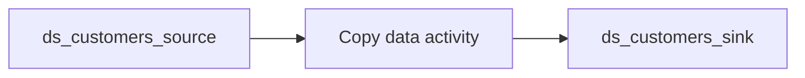

# 01-02 · Copy activity (manual pipeline)

> Module 1 · Time budget: 35 min · Source: [Copy data from Azure Blob Storage to Azure Blob Storage](https://learn.microsoft.com/en-us/azure/data-factory/tutorial-copy-data-portal)
> Prereqs: [01-01 · Copy Data tool](01-01-copy-data-tool.md), [`customers.csv`](../data/module-01-copy-ingest/customers.csv)

## What you'll build in this lesson

You will **manually** create datasets **`ds_customers_source`** and **`ds_customers_sink`**, pipeline **`pl_copy_customers_manual`** with a **Copy data** activity, and run it to copy FinLedger customers from `bronze/incoming/customers/` to `bronze/loaded/customers/`. You will verify **8 rows** in Monitor and storage — without using the Copy Data wizard.

## Why this matters (the concept)

The wizard hides complexity; production pipelines are built **activity by activity** on the canvas so you control naming, parameters, dependencies, and error branches. Manual authoring is how Git-backed factories look — every box on the canvas maps to JSON you can diff in a pull request.

FinLedger master data (customers, products, stores) benefits from explicit datasets engineers can reuse across multiple pipelines.

## Key terms (first appearance)

| Term | Meaning in one line | Linked in GLOSSARY |
|---|---|---|
| Canvas | Visual pipeline designer in Author hub | *(this lesson)* |
| Activity dependency | `dependsOn` — execution order | *(this lesson)* |
| DelimitedText dataset | CSV/text format in ADF | *(this lesson)* |

## Architecture at a glance



## Part A — Do it in the UI (click by click)

### A0 — Upload customers file

1. Portal → `stadfcourse{learner}` → **bronze** → **Upload**.
2. File: `data\module-01-copy-ingest\customers.csv`.
3. **Upload to folder:** `incoming/customers`.
   → Path `incoming/customers/customers.csv`.

### A1 — Create source dataset

4. ADF Studio → **Author** → **Datasets** → **+** → **Delimited Text**.
5. **Linked service:** `ls_adls_main` → **Test connection** → OK.
6. **File path:** file system `bronze`, directory `incoming/customers`, file `customers.csv`.
7. **First row as header:** checked. Delimiter `,`.
8. **OK** → **Schema** tab → **Import schema** (from connection/store).
   → Columns: `customer_id`, `full_name`, `email`, `signup_date`, `segment`.
9. **Name:** `ds_customers_source` → **OK**.

### A2 — Create sink dataset

10. **Datasets** → **+** → **Delimited Text** → `ls_adls_main`.
11. Directory `loaded/customers`, file `customers.csv`, same format options.
12. **Name:** `ds_customers_sink` → **OK**.

### A3 — Create pipeline and copy activity

13. **Pipelines** → **+** → name tab **`pl_copy_customers_manual`**.
14. **Activities** palette → search `Copy` → drag **Copy data** to canvas.
15. Click **Copy data** activity → rename to **`Copy_customers`**.
16. **Source** tab → **Source dataset:** `ds_customers_source`.
17. **Sink** tab → **Sink dataset:** `ds_customers_sink`.
18. **Settings** tab → leave defaults (DIU auto, parallel off for small file).
19. **Validate** (toolbar) → no errors.
20. **Publish all**.

### A4 — Run and verify

21. **Add trigger** → **Trigger now** → **OK**.
22. **Monitor** → pipeline run **Succeeded**.
23. Activity **Output** → **8** rows read/written.
24. Storage → `bronze/loaded/customers/customers.csv` → **Preview** → 8 customers.

> 🧪 LAB CHECK: Compare **{}** Code view JSON to Part B below.

## Part B — The JSON behind it

`dataset/ds_customers_source.json`

```json
{
  "name": "ds_customers_source",
  "properties": {
    "linkedServiceName": {
      "referenceName": "ls_adls_main",
      "type": "LinkedServiceReference"
    },
    "type": "DelimitedText",
    "typeProperties": {
      "location": {
        "type": "AzureBlobFSLocation",
        "fileSystem": "bronze",
        "folderPath": "incoming/customers",
        "fileName": "customers.csv"
      },
      "columnDelimiter": ",",
      "firstRowAsHeader": true
    },
    "schema": [
      { "name": "customer_id", "type": "String" },
      { "name": "full_name", "type": "String" },
      { "name": "email", "type": "String" },
      { "name": "signup_date", "type": "String" },
      { "name": "segment", "type": "String" }
    ]
  }
}
```

`dataset/ds_customers_sink.json`

```json
{
  "name": "ds_customers_sink",
  "properties": {
    "linkedServiceName": {
      "referenceName": "ls_adls_main",
      "type": "LinkedServiceReference"
    },
    "type": "DelimitedText",
    "typeProperties": {
      "location": {
        "type": "AzureBlobFSLocation",
        "fileSystem": "bronze",
        "folderPath": "loaded/customers",
        "fileName": "customers.csv"
      },
      "columnDelimiter": ",",
      "firstRowAsHeader": true
    }
  }
}
```

`pipeline/pl_copy_customers_manual.json`

```json
{
  "name": "pl_copy_customers_manual",
  "properties": {
    "activities": [
      {
        "name": "Copy_customers",
        "type": "Copy",
        "dependsOn": [],
        "policy": {
          "timeout": "0.12:00:00",
          "retry": 0,
          "retryIntervalInSeconds": 30
        },
        "typeProperties": {
          "source": {
            "type": "DelimitedTextSource",
            "storeSettings": { "type": "AzureBlobFSReadSettings" }
          },
          "sink": {
            "type": "DelimitedTextSink",
            "storeSettings": {
              "type": "AzureBlobFSWriteSettings",
              "copyBehavior": "MergeFiles"
            }
          }
        },
        "inputs": [
          { "referenceName": "ds_customers_source", "type": "DatasetReference" }
        ],
        "outputs": [
          { "referenceName": "ds_customers_sink", "type": "DatasetReference" }
        ]
      }
    ],
    "annotations": ["finledger", "manual-copy"]
  }
}
```

## Part C — Do it in code (Python)

```python
from azure.identity import DefaultAzureCredential
from azure.mgmt.datafactory import DataFactoryManagementClient
from azure.mgmt.datafactory.models import (
    AzureBlobFSLocation, CopyActivity, DatasetReference, DatasetResource,
    DelimitedTextDataset, DelimitedTextSink, DelimitedTextSource,
    LinkedServiceReference, PipelineResource, ActivityPolicy,
    AzureBlobFSReadSettings, AzureBlobFSWriteSettings,
)

RG, FACTORY, LS = "rg-adf-course-jinesh", "df-adf-course-jinesh", "ls_adls_main"
adf = DataFactoryManagementClient(DefaultAzureCredential(), "<subscription-id>")
ls_ref = LinkedServiceReference(reference_name=LS, type="LinkedServiceReference")

def ds(name, folder, file):
    return DatasetResource(properties=DelimitedTextDataset(
        linked_service_name=ls_ref,
        location=AzureBlobFSLocation(file_system="bronze", folder_path=folder, file_name=file),
        column_delimiter=",", first_row_as_header=True,
    ))

adf.datasets.create_or_update(RG, FACTORY, "ds_customers_source", ds("x", "incoming/customers", "customers.csv"))
adf.datasets.create_or_update(RG, FACTORY, "ds_customers_sink", ds("x", "loaded/customers", "customers.csv"))
copy = CopyActivity(
    name="Copy_customers",
    inputs=[DatasetReference(reference_name="ds_customers_source", type="DatasetReference")],
    outputs=[DatasetReference(reference_name="ds_customers_sink", type="DatasetReference")],
    source=DelimitedTextSource(store_settings=AzureBlobFSReadSettings()),
    sink=DelimitedTextSink(store_settings=AzureBlobFSWriteSettings(copy_behavior="MergeFiles")),
    policy=ActivityPolicy(timeout="0.12:00:00"),
)
adf.pipelines.create_or_update(RG, FACTORY, "pl_copy_customers_manual", PipelineResource(activities=[copy]))
```

## Part D — Run, validate, and read the output

| # | Check | Expected |
|---|---|---|
| 1 | Source blob | 8 data rows |
| 2 | Pipeline | **Succeeded** |
| 3 | Monitor rows | 8 / 8 |
| 4 | Sink preview | `CUS-001` … `CUS-008` |
| 5 | JSON | Part B matches **{}** view |

## Common errors & fixes

| Symptom | Cause | Fix |
|---|---|---|
| Dataset validation error | Schema mismatch | Re-import schema from store |
| Sink path typo | Manual entry | Match `loaded/customers` |
| Activity not wired | Missing dataset on tab | Set Source and Sink tabs |
| 0 bytes written | Empty source | Re-upload `customers.csv` |

## Cost & tear-down

One copy run — negligible cost.

## Recap & self-check

Manual pipeline = datasets + Copy activity + publish. Wizard vs manual: same engine, different authoring path.

## Next

[01-03 · Datasets, linked services, parameters deep dive](01-03-datasets-linked-services-parameters.md)
