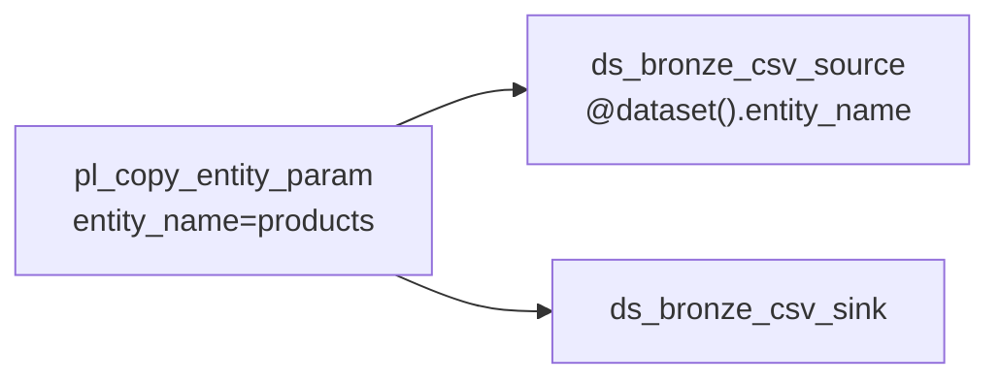

# 01-03 · Datasets, parameters & linked services

> Module 1 · Time budget: 30 min · Source: [Datasets and linked services](https://learn.microsoft.com/en-us/azure/data-factory/concepts-datasets-linked-services)
> Prereqs: [01-02 · Manual copy](01-02-copy-activity-manual-pipeline.md), [`products.csv`](../data/module-01-copy-ingest/products.csv)

## What you'll build in this lesson

You will create **parametrised datasets** `ds_bronze_csv_source` and `ds_bronze_csv_sink` with parameters `entity_name` and `folder_leaf`, plus pipeline **`pl_copy_entity_param`** with pipeline parameters so **one pipeline** copies any FinLedger entity folder — demonstrated with **`products.csv`** (10 rows) to `bronze/loaded/products/`.

## Why this matters (the concept)

Hard-coding paths in ten copy pipelines means ten edits when FinLedger adds a new feed. **Parameters** push variability to the edge: datasets expose `folder_path` expressions; pipelines pass `entity_name` at trigger time. This is how Session 2's `pl_bronze_copy` serves many run folders with one definition.

**Dataset parameters** are strongly typed. **Pipeline parameters** flow into dataset parameters via `@pipeline().parameters` and `@dataset().parameter`.

## Key terms (first appearance)

| Term | Meaning in one line | Linked in GLOSSARY |
|---|---|---|
| Dataset parameter | Placeholder in dataset definition | [Parameter](../GLOSSARY.md#parameter-pipeline--dataset) |
| Pipeline parameter | Value supplied at trigger time | [Parameter](../GLOSSARY.md#parameter-pipeline--dataset) |
| Dynamic content | `@expression` evaluated at runtime | *(this lesson)* |

## Architecture at a glance



## Part A — Do it in the UI (click by click)

### A0 — Upload products

1. Upload `products.csv` to `bronze/incoming/products/`.

### A1 — Parametrised source dataset

2. **Author** → **Datasets** → **+** → **Delimited Text** → `ls_adls_main`.
3. **File path:** file system `bronze`.
4. Click **Browse** — cancel; use dynamic paths instead.
5. Switch to **Parameters** tab (dataset wizard) → **+ New**:
   - `entity_name` (String)
   - `file_name` (String)
6. **Connection/File path** → folder directory field → click **Add dynamic content**:
   - Expression: `@concat('incoming/', dataset().entity_name)`
7. **File name** dynamic: `@dataset().file_name`
8. Name: `ds_bronze_csv_source` → **OK**.

### A2 — Parametrised sink dataset

9. New Delimited Text dataset → parameters `entity_name`, `file_name`.
10. Folder expression: `@concat('loaded/', dataset().entity_name)`
11. Name: `ds_bronze_csv_sink` → **OK**.

### A3 — Pipeline with parameters

12. **+ Pipeline** → `pl_copy_entity_param`.
13. **Parameters** tab (pipeline) → add:
    - `entity_name` (String, default `products`)
    - `file_name` (String, default `products.csv`)
14. Drag **Copy data** → **Source:** `ds_bronze_csv_source`.
15. **Source dataset parameters:** `entity_name` = `@pipeline().parameters.entity_name`, `file_name` = `@pipeline().parameters.file_name`.
16. **Sink:** `ds_bronze_csv_sink` — same parameter mapping.
17. **Publish all**.

### A4 — Trigger with parameters

18. **Trigger now** → expand **Parameters** → `entity_name`=`products`, `file_name`=`products.csv`.
19. Monitor → **10** rows copied.
20. Verify `bronze/loaded/products/products.csv`.

## Part B — The JSON behind it

`dataset/ds_bronze_csv_source.json`

```json
{
  "name": "ds_bronze_csv_source",
  "properties": {
    "linkedServiceName": {
      "referenceName": "ls_adls_main",
      "type": "LinkedServiceReference"
    },
    "parameters": {
      "entity_name": { "type": "String" },
      "file_name": { "type": "String" }
    },
    "type": "DelimitedText",
    "typeProperties": {
      "location": {
        "type": "AzureBlobFSLocation",
        "fileSystem": "bronze",
        "folderPath": {
          "value": "@concat('incoming/', dataset().entity_name)",
          "type": "Expression"
        },
        "fileName": {
          "value": "@dataset().file_name",
          "type": "Expression"
        }
      },
      "columnDelimiter": ",",
      "firstRowAsHeader": true
    }
  }
}
```

`pipeline/pl_copy_entity_param.json`

```json
{
  "name": "pl_copy_entity_param",
  "properties": {
    "parameters": {
      "entity_name": { "type": "String", "defaultValue": "products" },
      "file_name": { "type": "String", "defaultValue": "products.csv" }
    },
    "activities": [
      {
        "name": "Copy_entity",
        "type": "Copy",
        "typeProperties": {
          "source": { "type": "DelimitedTextSource" },
          "sink": { "type": "DelimitedTextSink" }
        },
        "inputs": [
          {
            "referenceName": "ds_bronze_csv_source",
            "type": "DatasetReference",
            "parameters": {
              "entity_name": { "value": "@pipeline().parameters.entity_name", "type": "Expression" },
              "file_name": { "value": "@pipeline().parameters.file_name", "type": "Expression" }
            }
          }
        ],
        "outputs": [
          {
            "referenceName": "ds_bronze_csv_sink",
            "type": "DatasetReference",
            "parameters": {
              "entity_name": { "value": "@pipeline().parameters.entity_name", "type": "Expression" },
              "file_name": { "value": "@pipeline().parameters.file_name", "type": "Expression" }
            }
          }
        ]
      }
    ]
  }
}
```

## Part C — Do it in code (Python)

Use `parameters` dict on `DatasetResource` and `PipelineResource` with expression strings — same pattern as `session-2/scripts/adf_pipeline.py` `incoming_folder` / `loaded_folder`.

## Part D — Run, validate, and read the output

| # | Check | Expected |
|---|---|---|
| 1 | products copy | 10 rows |
| 2 | Re-trigger with `entity_name=stores` after uploading `store_locations.csv` | 5 rows (optional extension) |
| 3 | Single pipeline | No duplicate pipeline per entity |

**Validation:** One pipeline definition serves FinLedger master-data entities.

## Common errors & fixes

| Symptom | Cause | Fix |
|---|---|---|
| Parameter null | Not passed at trigger | Set in Trigger now dialog |
| Path `incoming/` only | Concat typo | Include `dataset().entity_name` |
| Expression literal | Quotes wrong | Use dynamic content picker |

## Cost & tear-down

Negligible per run.

## Recap & self-check

Parameters at pipeline and dataset layers reduce duplication. Expressions bind them at runtime.

## Next

[01-04 · On-prem to cloud with self-hosted IR](01-04-on-prem-to-cloud-self-hosted-ir.md)
