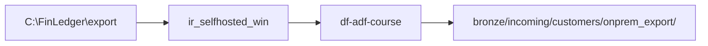

# 01-04 · On-prem to cloud (self-hosted IR)

> Module 1 · Time budget: 35 min · Source: [Hybrid copy with self-hosted IR](https://learn.microsoft.com/en-us/azure/data-factory/tutorial-hybrid-copy-data-tool)
> Prereqs: [01-03 · Parameters](01-03-datasets-linked-services-parameters.md)

## What you'll build in this lesson

You will register a **self-hosted integration runtime** `ir_selfhosted_win`, install the agent on a **Windows VM or your laptop**, create a **File Server** linked service to a local FinLedger export folder, and copy `customers.csv` to `bronze/incoming/customers/onprem_export/`. If you have no on-prem VM, you complete the **documented simulation path** using a local folder — same IR mechanics.

## Why this matters (the concept)

**Azure IR** cannot reach servers inside your corporate network. **Self-hosted IR** is a Windows agent that makes outbound HTTPS calls to ADF — no inbound firewall holes. FinLedger's legacy ERP exports CSV to an on-prem share; self-hosted IR is the bridge to `stadfcourse{learner}`.

> ⚠️ WARNING: Self-hosted IR requires a machine that stays on during pipeline runs. For training without a VM, use your lab laptop and stop the IR service after class to avoid confusion.

## Key terms (first appearance)

| Term | Meaning in one line | Linked in GLOSSARY |
|---|---|---|
| Self-hosted IR | Customer-managed agent for private network access | [IR](../GLOSSARY.md#integration-runtime-ir) |
| File Server linked service | Connection to local/SMB folder | *(this lesson)* |

## Architecture at a glance



## Part A — Do it in the UI (click by click)

### A1 — Create self-hosted IR

1. ADF Studio → **Manage** → **Integration runtimes** → **+ New**.
2. Select **Azure, Self-Hosted** → **Self-Hosted** → **Continue**.
3. **Name:** `ir_selfhosted_win` → **Create**.
   → **Set up node** dialog shows **Download and install integration runtime** link and **Authentication key**.
4. Click **Copy** on key **Key1** — save to notepad.

### A2 — Install IR on Windows

5. On your Windows machine, download **Integration Runtime** MSI from the dialog link.
6. Run installer → paste **Key1** when prompted.
7. Finish installer → open **Microsoft Integration Runtime Configuration Manager**.
   → Status **Running**; registered to your factory.
8. Back in ADF Studio → **Refresh** on `ir_selfhosted_win`.
   → Status **Running**.

### A3 — Local export folder (simulated on-prem)

9. Create folder `C:\FinLedger\export` on the IR machine.
10. Copy `customers.csv` from repo into that folder.

### A4 — File Server linked service

11. **Manage** → **Linked services** → **+ New** → search **File System** → **Continue**.
12. **Name:** `ls_onprem_file_export`.
13. **Connect via integration runtime:** `ir_selfhosted_win`.
14. **Host:** leave blank or `localhost` for local folder.
15. **Folder path:** `C:\FinLedger\export`.
16. **User name** / **Password:** leave empty for local access (or use domain creds for real SMB).
17. **Test connection** → success on IR machine.
18. **Create** → **Publish all**.

### A5 — Copy pipeline to ADLS

19. Create datasets: source **Delimited Text** on `ls_onprem_file_export` file `customers.csv`; sink on `ls_adls_main` → `bronze/incoming/customers/onprem_export/customers.csv`.
20. Pipeline `pl_onprem_customers_to_lake` with **Copy data** activity.
21. **Trigger now** → Monitor **Succeeded** → verify blob in storage.

### A6 — Stop IR after lab

22. Configuration Manager → **Stop** service (or leave running only during class).

> ℹ️ NOTE: **MPN / no VM skip:** Document IR registration steps from portal screenshots only; copy cloud-to-cloud in 01-02 as equivalent row movement. Trainer signs off checklist item "conceptual."

## Part B — The JSON behind it

`integrationRuntime/ir_selfhosted_win.json`

```json
{
  "name": "ir_selfhosted_win",
  "properties": {
    "type": "SelfHosted"
  }
}
```

`linkedService/ls_onprem_file_export.json`

```json
{
  "name": "ls_onprem_file_export",
  "properties": {
    "type": "FileServer",
    "typeProperties": {
      "host": "",
      "userId": "",
      "password": null,
      "encryptedCredential": null
    },
    "connectVia": {
      "referenceName": "ir_selfhosted_win",
      "type": "IntegrationRuntimeReference"
    }
  }
}
```

## Part C — Do it in code (REST)

Self-hosted IR registration is portal/MSI-first. REST: `PUT .../integrationRuntimes/ir_selfhosted_win` with `type: SelfHosted`, then poll until `nodes` report online. Prefer portal for first registration.

## Part D — Run, validate, and read the output

| # | Check | Expected |
|---|---|---|
| 1 | IR status | **Running** |
| 2 | Test connection | Green on file linked service |
| 3 | Copy run | 8 rows to `onprem_export/` |
| 4 | IR stopped | After lab (cost: IR software free; VM costs if Azure VM) |

## Common errors & fixes

| Symptom | Cause | Fix |
|---|---|---|
| IR offline | Service stopped | Start Configuration Manager service |
| Test fails | Wrong path | IR runs as service account — grant folder ACL |
| Copy timeout | IR machine asleep | Wake machine; extend activity timeout |
| Cannot install IR | Admin required | Run MSI as administrator |

## Cost & tear-down

**Cost:** IR software is free; Azure VM (if used) bills compute. **Tear-down:** Delete IR in Studio; uninstall MSI; delete VM if created for lab only.

## Recap & self-check

Self-hosted IR = outbound agent; use for on-prem files/SQL not reachable by Azure IR.

## Next

[01-05 · Conditional execution, retries & error handling](01-05-conditional-execution-error-handling.md)
