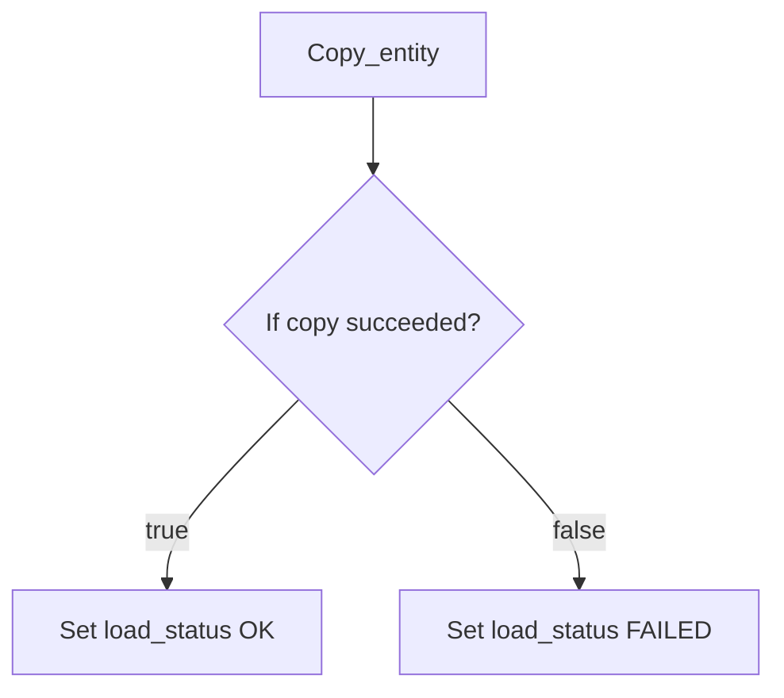

# 01-05 · Error handling & conditional execution

> Module 1 · Time budget: 30 min · Source: [Pipeline failure and error handling](https://learn.microsoft.com/en-us/azure/data-factory/tutorial-pipeline-failure-error-handling)
> Prereqs: [01-04 · Self-hosted IR](01-04-on-prem-to-cloud-self-hosted-ir.md)

## What you'll build in this lesson

You will extend **`pl_copy_entity_param`** with an **If Condition** activity: when copy succeeds, **Set variable** `load_status=OK`; when copy fails (bad path trigger), a second branch runs **Set variable** `load_status=FAILED`. You will configure **retry** on the copy activity and intentionally fail a run to verify Monitor and branching.

## Why this matters (the concept)

Production FinLedger loads cannot silently fail. **Control activities** orchestrate behaviour around data movement: retry transient errors, route failures to alerting pipelines (Module 3), skip downstream silver jobs when bronze copy fails.

ADF evaluates activity **status** (`Succeeded`, `Failed`, `Skipped`) in dependencies and If expressions like `@activity('Copy_entity').status`.

## Key terms (first appearance)

| Term | Meaning in one line | Linked in GLOSSARY |
|---|---|---|
| If Condition | Branch pipeline based on expression | *(this lesson)* |
| Retry policy | Automatic re-attempt on failure | *(this lesson)* |
| Dependency condition | Run after previous success/failure | *(this lesson)* |

## Architecture at a glance



## Part A — Do it in the UI (click by click)

### A1 — Add pipeline variables

1. Open `pl_copy_entity_param` (or duplicate as `pl_copy_entity_with_error_handling`).
2. **Variables** tab → **+** → `load_status` (String).

### A2 — Configure copy retry

3. Click **Copy_entity** → **Settings** (activity) → **Retry** = `2`, **Retry interval** = `30` seconds.

### A3 — Add If Condition

4. Drag **If Condition** onto canvas below copy.
5. **Activity name:** `If_copy_succeeded`.
6. **Depends on:** `Copy_entity` — dependency condition **Completed** (any completion).
7. **Expression:** `@equals(activity('Copy_entity').status, 'Succeeded')`
   → True/false activity boxes appear inside If.

### A4 — True branch

8. **If true** → drag **Set variable** → name `Set_status_ok`.
9. **Variable name:** `load_status`, **Value:** `OK`.

### A5 — False branch

10. **If false** → **Set variable** `Set_status_failed` → `load_status` = `FAILED`.

### A6 — Fail on purpose

11. **Publish all**.
12. **Trigger now** with bad parameter: `entity_name`=`does_not_exist`, `file_name`=`nope.csv`.
    → Copy fails after retries; If false branch runs.
13. Monitor → open run → **If_copy_succeeded** → false branch **Succeeded**.
14. Trigger again with valid `products` parameters → true branch runs.

## Part B — The JSON behind it

`pipeline/pl_copy_entity_with_error_handling.json`

```json
{
  "name": "pl_copy_entity_with_error_handling",
  "properties": {
    "parameters": {
      "entity_name": { "type": "String" },
      "file_name": { "type": "String" }
    },
    "variables": {
      "load_status": { "type": "String" }
    },
    "activities": [
      {
        "name": "Copy_entity",
        "type": "Copy",
        "policy": { "retry": 2, "retryIntervalInSeconds": 30, "timeout": "0.12:00:00" },
        "typeProperties": {
          "source": { "type": "DelimitedTextSource" },
          "sink": { "type": "DelimitedTextSink" }
        },
        "inputs": [
          {
            "referenceName": "ds_bronze_csv_source",
            "type": "DatasetReference",
            "parameters": {
              "entity_name": { "value": "@pipeline().parameters.entity_name", "type": "Expression" },
              "file_name": { "value": "@pipeline().parameters.file_name", "type": "Expression" }
            }
          }
        ],
        "outputs": [
          {
            "referenceName": "ds_bronze_csv_sink",
            "type": "DatasetReference",
            "parameters": {
              "entity_name": { "value": "@pipeline().parameters.entity_name", "type": "Expression" },
              "file_name": { "value": "@pipeline().parameters.file_name", "type": "Expression" }
            }
          }
        ]
      },
      {
        "name": "If_copy_succeeded",
        "type": "IfCondition",
        "dependsOn": [
          { "activity": "Copy_entity", "dependencyConditions": ["Completed"] }
        ],
        "typeProperties": {
          "expression": {
            "value": "@equals(activity('Copy_entity').status, 'Succeeded')",
            "type": "Expression"
          },
          "ifTrueActivities": [
            {
              "name": "Set_status_ok",
              "type": "SetVariable",
              "typeProperties": {
                "variableName": "load_status",
                "value": "OK"
              }
            }
          ],
          "ifFalseActivities": [
            {
              "name": "Set_status_failed",
              "type": "SetVariable",
              "typeProperties": {
                "variableName": "load_status",
                "value": "FAILED"
              }
            }
          ]
        }
      }
    ]
  }
}
```

## Part C — Do it in code (Python)

Deploy via SDK with nested activities in `IfConditionActivity` — use `azure.mgmt.datafactory.models.IfConditionActivity`, `SetVariableActivity`. Engineers prefer ARM/Git for branching logic visibility.

## Part D — Run, validate, and read the output

| # | Check | Expected |
|---|---|---|
| 1 | Bad path run | Copy **Failed**, If false branch green |
| 2 | Good path run | Copy **Succeeded**, `load_status` path OK |
| 3 | Retry | Copy shows 2 retries in Monitor on transient errors |
| 4 | Variables | Output tab shows `load_status` after If |

**Verification vs validation:** Green If branch on failure path means orchestration works; business validation still requires fixing source path.

## Common errors & fixes

| Symptom | Cause | Fix |
|---|---|---|
| If never runs | Wrong dependency | Use **Completed** not only **Succeeded** on copy |
| Expression error | Activity name typo | Match `Copy_entity` exactly |
| Both branches skip | If inside wrong scope | Activities inside true/false boxes only |
| Retry exhausted | Permanent 404 | Fix path; retries won't help |

## Cost & tear-down

Failed runs still meter minimal activity cost.

## Recap & self-check

Retry handles transients; If Condition handles business response to failure.

## Next

[01-06 · Amazon S3 to ADLS Gen2](01-06-amazon-s3-to-adls-gen2.md)
