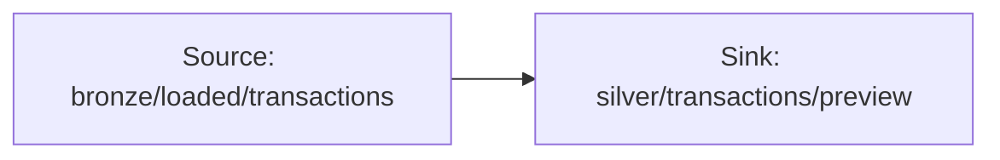

# 02-01 · Data flow fundamentals

> Module 2 · Time budget: 30 min · Source: [Mapping data flows overview](https://learn.microsoft.com/en-us/azure/data-factory/concepts-data-flow-overview)
> Prereqs: Module 1 complete, [`transactions_daily.csv`](../data/module-01-copy-ingest/transactions_daily.csv) in `bronze/loaded/transactions/`

## What you'll build

Mapping data flow **`df_finledger_explore`** with **Source → Sink** only, **Debug** session to preview **12 rows**, then **Stop debug**. Pipeline **`pl_debug_dataflow`** with **Execute Data Flow** activity (optional first run).

## Why this matters

**Mapping data flows** compile to Spark jobs ADF runs on ephemeral clusters. The canvas is where FinLedger silver-layer cleansing happens — visually, without PySpark notebooks. **Debug mode** spins a small cluster so you preview transformations before scheduling costly full runs.

Unlike copy activities (movement only), data flows **transform** — filter, join, aggregate, derive columns.

## Key terms

| Term | Meaning |
|---|---|
| Mapping data flow | Visual Spark transformation graph |
| Debug session | Interactive preview cluster |
| Execute Data Flow | Pipeline activity that runs a data flow |
| Transformation | Filter, Derived Column, Aggregate, etc. |

## Architecture



## Part A — UI (click by click)

1. ADF Studio → **Author** → **Data flows** → **+** → **Data flow**.
2. Name **`df_finledger_explore`**.
3. **Add Source** → **Source settings** → **Source type:** **Delimited text**.
4. **Linked service:** `ls_adls_main` → file system `bronze` → wildcard `loaded/transactions/*` or path `loaded/transactions/transactions_daily.csv`.
5. **Allow schema drift:** checked. **Infer column types:** checked.
6. **Give alias:** `RawTransactions`.
7. **Add Sink** → connect **RawTransactions** output arrow to sink.
8. Sink **Settings** → **Sink type:** **Delimited text** → `silver/transactions/preview/` → file `debug_out.csv`.
9. **Mapping** tab → auto-map columns.
10. Click **Debug** (top toolbar) → select **General** debug cluster (default **8 vCores** — smallest for lab).
    → **Debug turn on** notification; wait **2–5 min** cluster start.
11. **Data preview** tab on Source → see 12 rows.
12. Click **Stop debug** when done.
    → Cluster shuts down — **mandatory** to avoid vCore charges.

> ⚠️ WARNING: Leaving debug running bills per vCore-hour.

## Part B — JSON

`dataflow/df_finledger_explore.json` (abbreviated graph):

```json
{
  "name": "df_finledger_explore",
  "properties": {
    "type": "MappingDataFlow",
    "typeProperties": {
      "sources": [
        {
          "name": "RawTransactions",
          "dataset": {
            "referenceName": "ds_transactions_loaded",
            "type": "DatasetReference"
          }
        }
      ],
      "sinks": [
        {
          "name": "PreviewSink",
          "dataset": {
            "referenceName": "ds_silver_preview",
            "type": "DatasetReference"
          }
        }
      ],
      "transformations": []
    }
  }
}
```

## Part C — Python

Data flows deploy via `DataFlowResource` / `MappingDataFlow` in SDK — teams usually author in Studio then export ARM. REST: `PUT .../dataflows/df_finledger_explore`.

## Part D — Verify

| Check | Expected |
|---|---|
| Debug started | Cluster active in Monitor → Data flow debug |
| Preview rows | 12 |
| Debug stopped | No active debug session |
| Sink optional | File in `silver/transactions/preview/` if full debug run |

## Common errors

Debug timeout — increase TTL in **Manage** → **Integration runtime** settings or retry. 403 — MSI RBAC on silver path.

## Cost & tear-down

**Stop debug** after every Module 2 lesson. vCore ~£0.20+/hour depending on region.

## Next

[02-02 · Code-free transformation at scale](02-02-code-free-transformation-at-scale.md)
