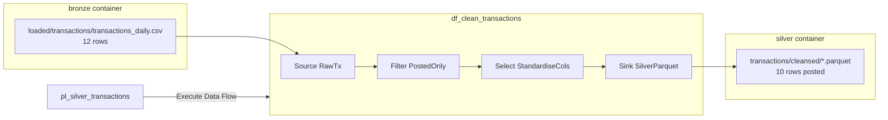

# 02-02 · Code-free transformation at scale

> Module 2 · Time budget: 40 min · Source: [Transformation with mapping data flow](https://learn.microsoft.com/en-us/azure/data-factory/tutorial-data-flow)
> Prereqs: [02-01 · Data flow fundamentals](02-01-data-flow-fundamentals-debug-canvas.md), [01-01 · Copy Data tool](../module-01-copy-ingest/01-01-copy-data-tool.md) (`transactions_daily.csv` in `bronze/loaded/transactions/`)

## What you'll build in this lesson

You will author mapping data flow **`df_clean_transactions`**: **Source** (bronze loaded CSV) → **Filter** (posted payments only) → **Select** (type casting and column order) → **Sink** (Parquet in `silver/transactions/cleansed/`). You will wire pipeline **`pl_silver_transactions`** with an **Execute Data Flow** activity, run it once in production mode, and verify **10 posted rows** land in silver (excluding **1 pending** and **1 failed** from the 12-row source file).

## Why this matters (the concept)

Module 1 **copied** FinLedger transactions into bronze — same schema, same bad rows. Silver exists to enforce **business rules**: only `posted` transactions feed revenue reports; `pending` wire transfers and `failed` card authorisations must not inflate daily sales.

**Mapping data flows** express those rules on a canvas; ADF compiles them to Spark. You get visual debugging, schema preview, and Git-exportable JSON without maintaining a Databricks notebook for every cleanse step. The MS Learn data flow tutorial uses a similar movie-dataset transform; we apply the identical pattern to FinLedger payments.

**Execute Data Flow** (pipeline activity) is how scheduled jobs run the graph overnight — separate from **Debug**, which is for interactive preview only. Confusing the two is a common cost mistake: Debug left on burns vCores; Execute runs once and stops.

## Key terms (first appearance)

| Term | Meaning in one line | Linked in GLOSSARY |
|---|---|---|
| Filter transformation | Keeps rows matching a condition | *(this lesson)* |
| Select transformation | Renames, drops, or reorders columns | *(this lesson)* |
| Execute Data Flow | Pipeline activity that runs a mapping data flow on a cluster | *(this lesson)* |
| Parquet sink | Columnar output format in the lake | *(this lesson)* |
| Trace level | Verbosity of data flow run logs (`Fine` for labs) | *(this lesson)* |

## Architecture at a glance



Diagram source: [assets/diagrams/02-02-silver-cleanse-flow.md](../assets/diagrams/02-02-silver-cleanse-flow.md)

## Part A — Do it in the UI (click by click)

Replace `{learner}` with your ID. Confirm `bronze/loaded/transactions/transactions_daily.csv` exists (from lesson 01-01) before starting.

### A0 — Confirm source data in storage

1. Open `https://portal.azure.com` → storage account **`stadfcourse{learner}`**.
   → Storage **Overview** blade.
2. Left menu → **Data storage** → **Containers** → click **`bronze`**.
   → Blob list blade.
3. Navigate **`loaded`** → **`transactions`** → click **`transactions_daily.csv`**.
   → Blob detail blade.
4. Click **Preview** (or **Edit**).
   → **12** data rows visible; note `TXN-10003` = `pending`, `TXN-10012` = `failed`; all others `posted`.
5. Close preview.

### A1 — Create the mapping data flow

6. Open **ADF Studio** for **`df-adf-course-{learner}`**.
   → Studio home loads.
7. Click **Author** (pencil icon, left rail).
   → **Factory Resources** tree visible.
8. Hover **Data flows** → click **+** (plus) → **Data flow**.
   → New data flow canvas tab opens; default name like `dataflow1`.
9. Click the tab title → rename to **`df_clean_transactions`**.
   → Tab shows `df_clean_transactions`.

### A2 — Add and configure Source

10. On the canvas, click **Add Source** (or right-click canvas → **New source**).
    → **Source settings** panel opens on the right; a **Source1** box appears on canvas.
11. Click the source box label → rename to **`RawTx`**.
    → Name updates on canvas.
12. **Source settings** tab (right panel):
    - **Source type:** **Delimited text**
    - **Linked service:** select **`ls_adls_main`**
13. Click **Open** (or **Browse**) next to file path.
    → **File browser** blade.
14. Expand **`bronze`** → navigate to **`loaded/transactions/`** → select **`transactions_daily.csv`** → **OK**.
    → Path shows `bronze/loaded/transactions/transactions_daily.csv` (wording may vary).
15. **File format** section:
    - **Column delimiter:** `,` (comma)
    - **First row as header:** **checked**
    - **Quote character:** `"` (default)
16. **Output columns** section:
    - **Allow schema drift:** **checked**
    - **Infer drifted column types:** **checked**
    - **Validate schema:** leave **unchecked** for this lab
17. Click **Projection** tab → **Import projection** (or **Refresh**).
    → Columns listed: `transaction_id`, `account_id`, `amount_gbp`, `value_date`, `channel`, `status`, `store_id`.
18. Click **Data preview** tab → **Refresh** (requires Debug on — skip until A5 if greyed out).

### A3 — Add Filter transformation

19. Click the **+** icon to the right of **`RawTx`** on canvas (or click **RawTx** → **+** below box).
    → Transformation picker list.
20. Select **Filter**.
    → **Filter1** box appears; not yet connected if you used menu — drag **RawTx** output arrow to **Filter1** input.
21. Click **Filter1** → rename to **`PostedOnly`**.
22. **Filter settings** tab → **Filter on** → click **Open expression builder** (or type in expression box).
23. Enter expression:

    ```
    status=='posted'
    ```

    → Expression validates (green check) when syntax correct.
24. **Split rows** option: leave default (single output stream for matching rows).

### A4 — Add Select transformation

25. Click **+** to the right of **`PostedOnly`** → **Select**.
    → **Select1** box appears; connect **PostedOnly** → **Select1**.
26. Rename **Select1** to **`StandardiseCols`**.
27. **Select settings** tab → **Mapping** → **Recreate** or **Add mapping**:
    - Include all columns OR drop none for this lab.
28. Click column **`amount_gbp`** → set **Type** to **decimal(18,2)** (click type dropdown per column).
    → Amounts stored as numeric for downstream aggregates.
29. Ensure **`store_id`** remains **string** type.

### A5 — Add Parquet Sink

30. Click **+** after **`StandardiseCols`** → **Sink**.
    → **Sink1** box appears; connect **StandardiseCols** → **Sink1**.
31. Rename sink to **`SilverParquet`**.
32. **Sink settings** tab:
    - **Sink type:** **Delimited text** first for debug — then change to **Parquet** (or choose **Parquet** directly if available under **Dataset** / **Format**).
    - **Linked service:** **`ls_adls_main`**
33. **Dataset** / path:
    - **File system:** `silver`
    - **Folder path:** `transactions/cleansed`
    - **File name:** `part` or leave default `part-#####.parquet` pattern
34. **Settings** tab (sink):
    - **Partition option:** **None** (partitioning is lesson 02-06)
    - **Clear the folder:** **checked** for lab reruns (overwrite cleansed folder)
35. **Mapping** tab → **Auto mapping** → all columns mapped input → output.

### A6 — Debug session (preview before production run)

36. Toolbar → click **Data flow debug** (or **Debug** toggle).
    → **Debug settings** dialog may appear.
37. **Core count:** **8** (minimum practical). **Compute type:** **General**. **Time to live:** **60** minutes (lower if offered).
38. Click **OK** / **Turn on debug**.
    → Notification: debug cluster starting; wait **2–5 minutes** until **Debug active** banner appears.
39. Click **`PostedOnly`** → **Data preview** tab → **Refresh**.
    → **10 rows** displayed; `TXN-10003` and `TXN-10012` absent.
40. Click **`SilverParquet`** → **Data preview** → **Refresh** (optional) → Parquet schema preview.
41. Toolbar → **Stop debug** (critical).
    → Debug cluster shuts down; banner clears.

> 🧪 LAB CHECK: Filter preview shows exactly **10** rows before you publish.

### A7 — Publish data flow

42. Toolbar → **Publish all**.
    → Dialog lists `df_clean_transactions`.
43. Click **Publish**.
    → **Publishing succeeded** notification.

### A8 — Create pipeline with Execute Data Flow

44. **Factory Resources** → **Pipelines** → **+** → **Pipeline**.
    → Blank pipeline canvas.
45. Rename tab to **`pl_silver_transactions`**.
46. **Activities** palette → search `data flow` → drag **Execute Data Flow** onto canvas.
    → Activity box **Execute Data Flow1**.
47. Click activity → rename **`Execute_df_clean_transactions`**.
48. **Settings** tab (activity):
    - **Data flow:** **`df_clean_transactions`** (dropdown)
    - **Compute type:** **General**
    - **Core count:** **8**
    - **Time to live (min):** **60**
    - **Trace level:** **Fine**
49. **Validate** (toolbar) → confirm no errors.
50. **Publish all** → include new pipeline.

### A9 — Run pipeline and monitor

51. Open pipeline **`pl_silver_transactions`** → **Add trigger** → **Trigger now** → **OK**.
    → Pipeline run ID in toast.
52. **Monitor** (left rail) → **Pipeline runs** → click latest run for `pl_silver_transactions`.
    → Status progresses **In progress** → **Succeeded** (cluster spin-up may take several minutes first time).
53. Click run → click activity **`Execute_df_clean_transactions`**.
    → **Output** tab shows rows written (~**10**); **Monitoring** links to Spark logs if enabled.
54. Portal → storage → container **`silver`** → **`transactions/cleansed/`**.
    → One or more `.parquet` files (or `part-*.parquet`).
55. Optional: Azure Storage Explorer or Synapse serverless `OPENROWSET` to read Parquet — confirm **10** rows.

> ⚠️ VERIFY: If your Studio labels **Execute Wrangling Data Flow** separately, pick **Execute Data Flow** (mapping), not Power Query.

## Part B — The JSON behind it

### Datasets (referenced by data flow)

`dataset/ds_transactions_loaded_csv.json`

```json
{
  "name": "ds_transactions_loaded_csv",
  "properties": {
    "linkedServiceName": {
      "referenceName": "ls_adls_main",
      "type": "LinkedServiceReference"
    },
    "type": "DelimitedText",
    "typeProperties": {
      "location": {
        "type": "AzureBlobFSLocation",
        "fileSystem": "bronze",
        "folderPath": "loaded/transactions",
        "fileName": "transactions_daily.csv"
      },
      "columnDelimiter": ",",
      "firstRowAsHeader": true
    }
  }
}
```

`dataset/ds_silver_transactions_cleansed_parquet.json`

```json
{
  "name": "ds_silver_transactions_cleansed_parquet",
  "properties": {
    "linkedServiceName": {
      "referenceName": "ls_adls_main",
      "type": "LinkedServiceReference"
    },
    "type": "Parquet",
    "typeProperties": {
      "location": {
        "type": "AzureBlobFSLocation",
        "fileSystem": "silver",
        "folderPath": "transactions/cleansed"
      },
      "compressionCodec": "snappy"
    }
  }
}
```

### Data flow (export from **{}** Code view — structure reference)

`dataflow/df_clean_transactions.json`

```json
{
  "name": "df_clean_transactions",
  "properties": {
    "type": "MappingDataFlow",
    "typeProperties": {
      "sources": [
        {
          "dataset": {
            "referenceName": "ds_transactions_loaded_csv",
            "type": "DatasetReference"
          },
          "name": "RawTx"
        }
      ],
      "sinks": [
        {
          "dataset": {
            "referenceName": "ds_silver_transactions_cleansed_parquet",
            "type": "DatasetReference"
          },
          "name": "SilverParquet"
        }
      ],
      "transformations": [
        {
          "name": "PostedOnly",
          "description": "FinLedger: revenue only from posted transactions"
        },
        {
          "name": "StandardiseCols",
          "description": "Cast amount_gbp to decimal"
        }
      ],
      "scriptLines": [
        "source(output(",
        "          transaction_id as string,",
        "          account_id as string,",
        "          amount_gbp as string,",
        "          value_date as string,",
        "          channel as string,",
        "          status as string,",
        "          store_id as string",
        "     ),",
        "     allowSchemaDrift: true,",
        "     validateSchema: false,",
        "     ignoreNoFilesFound: false) ~> RawTx",
        "RawTx filter(status=='posted') ~> PostedOnly",
        "PostedOnly select(mapColumn(",
        "          transaction_id,",
        "          account_id,",
        "          amount_gbp,",
        "          value_date,",
        "          channel,",
        "          status,",
        "          store_id",
        "     ),",
        "     skipDuplicateMapInputs: true,",
        "     skipIncompatibleColumnTypes: false) ~> StandardiseCols",
        "StandardiseCols sink(allowSchemaDrift: true,",
        "     validateSchema: false,",
        "     truncate: true,",
        "     format: 'parquet',",
        "     umask: 0022,",
        "     preCommands: [],",
        "     postCommands: [],",
        "     skipDuplicateMapInputs: true,",
        "     skipIncompatibleColumnTypes: true) ~> SilverParquet"
      ]
    }
  }
}
```

> ℹ️ NOTE: `scriptLines` is auto-generated when you save in Studio — paste from your factory's **{}** view after building; do not hand-edit unless using CI/CD diff workflows.

### Pipeline

`pipeline/pl_silver_transactions.json`

```json
{
  "name": "pl_silver_transactions",
  "properties": {
    "description": "FinLedger silver cleanse — posted transactions to Parquet",
    "activities": [
      {
        "name": "Execute_df_clean_transactions",
        "type": "ExecuteDataFlow",
        "dependsOn": [],
        "policy": {
          "timeout": "0.12:00:00",
          "retry": 1,
          "retryIntervalInSeconds": 60,
          "secureOutput": false,
          "secureInput": false
        },
        "userProperties": [],
        "typeProperties": {
          "dataflow": {
            "referenceName": "df_clean_transactions",
            "type": "DataFlowReference",
            "parameters": {},
            "datasetParameters": {
              "RawTx": {},
              "SilverParquet": {}
            }
          },
          "compute": {
            "coreCount": 8,
            "computeType": "General"
          },
          "traceLevel": "Fine",
          "runConcurrently": false,
          "continueOnError": false
        }
      }
    ],
    "annotations": ["finledger", "module-02", "silver-cleanse"]
  }
}
```

## Part C — Do it in code (Python / REST / ARM)

**Chosen approach:** Python SDK — deploy Execute Data Flow pipeline after authoring data flow in Studio (data flow JSON is large; Studio-first is standard).

**When engineers prefer code:** Nightly automation that triggers silver pipeline after bronze copy succeeds (chained from `pl_finledger_nightly_foreach`).

```python
"""
Trigger FinLedger silver pipeline — lesson 02-02.
Prerequisite: df_clean_transactions published in Studio.
"""
from azure.identity import DefaultAzureCredential
from azure.mgmt.datafactory import DataFactoryManagementClient
from azure.mgmt.datafactory.models import (
    DataFlowReference,
    ExecuteDataFlowActivity,
    PipelineResource,
    ActivityPolicy,
)

SUBSCRIPTION_ID = "00000000-0000-0000-0000-000000000000"
RG = "rg-adf-course-jinesh"
FACTORY = "df-adf-course-jinesh"
PIPELINE = "pl_silver_transactions"
DATA_FLOW = "df_clean_transactions"

client = DataFactoryManagementClient(DefaultAzureCredential(), SUBSCRIPTION_ID)

activity = ExecuteDataFlowActivity(
    name="Execute_df_clean_transactions",
    policy=ActivityPolicy(timeout="0.12:00:00", retry=1, retry_interval_in_seconds=60),
    data_flow=DataFlowReference(reference_name=DATA_FLOW, type="DataFlowReference"),
    compute={"coreCount": 8, "computeType": "General"},
    trace_level="Fine",
)

client.pipelines.create_or_update(
    RG,
    FACTORY,
    PIPELINE,
    PipelineResource(activities=[activity], description="FinLedger silver cleanse"),
)

run = client.pipelines.create_run(RG, FACTORY, PIPELINE)
print(f"Pipeline run started: {run.run_id}")
print("Monitor in ADF Studio -> Monitor -> Pipeline runs")
```

```text
pip install azure-identity azure-mgmt-datafactory
python run_silver_pipeline.py
```

**REST:** `POST .../pipelines/pl_silver_transactions/createRun?api-version=2018-06-01`

## Part D — Run, validate, and read the output

### Trigger path (production execute)

| Step | Action |
|---|---|
| 1 | **Author** → `pl_silver_transactions` → **Add trigger** → **Trigger now** |
| 2 | **Monitor** → **Pipeline runs** → select run |
| 3 | Drill into **Execute_df_clean_transactions** → **Output** / **Spark logs** |

### Verify table (tick each)

| # | Check | Where | Expected |
|---|---|---|---|
| 1 | Source row count | `bronze/loaded/transactions/transactions_daily.csv` Preview | **12** data rows |
| 2 | Filter logic | Debug preview on `PostedOnly` | **10** rows (`posted` only) |
| 3 | Excluded IDs | Preview / output | No `TXN-10003` (pending), no `TXN-10012` (failed) |
| 4 | Pipeline status | Monitor | **Succeeded** |
| 5 | Silver files | `silver/transactions/cleansed/` | Parquet file(s) exist |
| 6 | `amount_gbp` type | Parquet schema | Decimal/numeric type |

Tick [VERIFICATION-CHECKLIST §02-02](../docs/VERIFICATION-CHECKLIST.md) (Module 2 section).

**Verification:** Pipeline and data flow runs complete without error; file lands in silver path.

**Validation:** Row count and business rule correct — only **posted** FinLedger transactions in silver; failed/pending excluded from revenue path.

## Common errors & fixes

| Symptom | Likely cause | Fix |
|---|---|---|
| Debug will not start | Factory region capacity / quota | Retry; reduce core count to 8; try off-peak |
| Data preview 0 rows | Wrong file path or empty loaded folder | Re-run 01-01 copy; confirm `loaded/transactions/transactions_daily.csv` |
| Filter returns 12 rows | Expression typo — `status='posted'` wrong quotes | Use `status=='posted'` in expression builder |
| Execute fails "data flow not found" | Not published | **Publish all** after saving data flow |
| 403 writing to silver | MSI lacks RBAC on `silver` path | Storage **IAM** → factory MI **Storage Blob Data Contributor** (already on account scope from 00-05) |
| Parquet sink validation error | Schema mapping incomplete | Sink **Mapping** → **Auto map** all columns |
| High unexpected cost | Debug left on overnight | **Stop debug** immediately after preview |

## Cost & tear-down

**While debugging:** ~8 vCores billed per hour the debug cluster is active — **always Stop debug** when preview completes.

**Execute Data Flow run:** Billed for cluster duration of that run (typically minutes). Cheaper than leaving debug on.

**Tear-down after lab:**

1. **Stop debug** if active (Studio toolbar).
2. Optional: delete `silver/transactions/cleansed/` blobs to reclaim pennies of storage.
3. Do **not** delete data flow if continuing to lessons 02-03–02-06 — you will extend this graph.

## Recap & self-check

- Silver cleanse = **Source → Filter → Select → Sink** on mapping data flow canvas.
- FinLedger rule: `status=='posted'` → **10** of **12** rows proceed to `silver/transactions/cleansed/`.
- **Debug** previews logic; **Execute Data Flow** runs scheduled production path via `pl_silver_transactions`.
- Parquet in silver is input for Delta (02-04) and partitioning (02-06).
- Export `scriptLines` JSON from Studio for Git — do not type from memory.

**Self-check questions**

1. Why filter in a data flow instead of during bronze copy?
2. What is the difference between Debug and Execute Data Flow?
3. Which two transaction IDs are excluded and why?

<details>
<summary>Answers</summary>

1. Bronze stays immutable raw/loaded history; silver applies business rules so you can reprocess without re-ingesting from source systems.
2. **Debug** keeps an interactive cluster for previews in Studio; **Execute Data Flow** runs the published graph once as part of a pipeline (scheduled or manual Trigger now).
3. **TXN-10003** (`pending`) and **TXN-10012** (`failed`) — not `posted`, so excluded from revenue-ready silver.

</details>

## Next

[02-03 · Expressions, schema drift, derived columns](02-03-expressions-schema-drift-derived-columns.md)

---

## Case study & trainer resources

- **Source file:** [transactions_daily.csv](../data/module-01-copy-ingest/transactions_daily.csv)
- **Trainer:** [TRAINER-GUIDE.md](../TRAINER-GUIDE.md) — Module 2 tear-down mandatory
- **Checklist:** [VERIFICATION-CHECKLIST](../docs/VERIFICATION-CHECKLIST.md)
