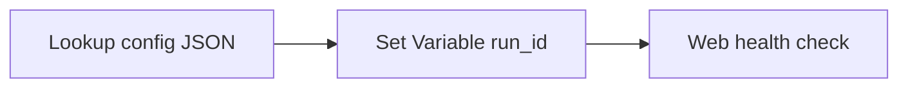

# 03-01 · Pipeline activities catalogue

> Module 3 · Time budget: 30 min · Source: [Pipelines and activities](https://learn.microsoft.com/en-us/azure/data-factory/concepts-pipelines-activities)
> Prereqs: Module 2 complete, [`pipeline_parameters.json`](../data/module-03-control-flow/pipeline_parameters.json) uploaded to `bronze/incoming/config/`

## What you'll build

Pipeline **`pl_catalogue_demo`** demonstrating **Lookup** (read JSON config), **Set Variable**, **Web** (HTTP GET), and **Wait** — FinLedger nightly orchestration building blocks before ForEach in 03-02.

## Why this matters

Copy and data flows move data; **control activities** coordinate logic. **Lookup** loads small reference data (manifests, watermarks, config). **Set Variable** stores runtime state. **Web** calls REST APIs (Logic Apps, custom ops). FinLedger `pipeline_parameters.json` drives `max_parallel_copies` and `notify_on_failure`.

## Key terms

| Term | Meaning |
|---|---|
| Lookup | Read small dataset/JSON into pipeline memory |
| Set Variable | Write pipeline variable at runtime |
| Web activity | HTTP call from pipeline |
| Control activity | Orchestration step (not data movement) |

## Architecture



## Part A — UI (click by click)

### A0 — Upload config

1. Upload `pipeline_parameters.json` → `bronze/incoming/config/pipeline_parameters.json`.

### A1 — Config dataset

2. **Datasets** → **+** → **Json** → `ls_adls_main` → `bronze/incoming/config/pipeline_parameters.json` → name **`ds_pipeline_config_json`**.

### A2 — Pipeline

3. **Pipelines** → **+** → **`pl_catalogue_demo`**.
4. **Variables:** `owner_email` (String), `max_parallel` (Integer).
5. **Lookup** `Lookup_config`:
   - **Source dataset:** `ds_pipeline_config_json`
   - **First row only:** checked
6. **Set Variable** `Set_owner` depends on Lookup **Succeeded**:
   - Variable `owner_email` = `@activity('Lookup_config').output.firstRow.owner_email`
7. **Web** `Web_health` depends on Set_owner:
   - **URL:** `https://httpbin.org/get` (training endpoint) or FinLedger status API
   - **Method:** GET
8. **Validate** → **Publish** → **Trigger now** → Monitor all green.
9. Open **Lookup** output → see `owner_email`, `max_parallel_copies: 2`.

## Part B — JSON

`pipeline/pl_catalogue_demo.json`

```json
{
  "name": "pl_catalogue_demo",
  "properties": {
    "variables": {
      "owner_email": { "type": "String" },
      "max_parallel": { "type": "Integer" }
    },
    "activities": [
      {
        "name": "Lookup_config",
        "type": "Lookup",
        "policy": { "timeout": "0.12:00:00", "retry": 0 },
        "typeProperties": {
          "source": { "type": "JsonSource", "storeSettings": { "type": "AzureBlobFSReadSettings" }, "formatSettings": { "type": "JsonReadSettings" } },
          "dataset": { "referenceName": "ds_pipeline_config_json", "type": "DatasetReference" },
          "firstRowOnly": true
        }
      },
      {
        "name": "Set_owner",
        "type": "SetVariable",
        "dependsOn": [{ "activity": "Lookup_config", "dependencyConditions": ["Succeeded"] }],
        "typeProperties": {
          "variableName": "owner_email",
          "value": { "value": "@activity('Lookup_config').output.firstRow.owner_email", "type": "Expression" }
        }
      },
      {
        "name": "Web_health",
        "type": "WebActivity",
        "dependsOn": [{ "activity": "Set_owner", "dependencyConditions": ["Succeeded"] }],
        "policy": { "timeout": "0.00:01:00" },
        "typeProperties": {
          "method": "GET",
          "url": "https://httpbin.org/get"
        }
      }
    ]
  }
}
```

## Part C — Python

Deploy `LookupActivity`, `SetVariableActivity`, `WebActivity` via SDK activity list on `PipelineResource`.

## Part D — Verify

| Check | Expected |
|---|---|
| Lookup output | `data-eng@example.finledger.uk` |
| Web | HTTP 200 |
| Variables | `owner_email` set |

## Common errors

Lookup empty file — path wrong. Web blocked — use allowed URL or managed VNet later.

## Next

[03-02 · ForEach, If, Until, Switch](03-02-control-flow-foreach-if-until-switch.md)
