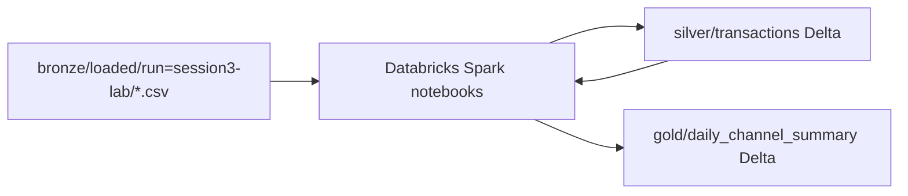

# Session 3 — Manual lab (Databricks UI + Azure Portal)

> **Classroom:** [SESSION3-STUDENT-GUIDE.md](SESSION3-STUDENT-GUIDE.md) · **Theory + graphs:** [UI-OVERVIEW.md](UI-OVERVIEW.md) · **All links:** [LINK-MAP.md](LINK-MAP.md)

Follow these steps in the **Azure Portal** and **Databricks workspace**.

**Normal classroom:** trainer ran `orchestrate.cmd` — you **verify bronze**, then **run notebooks** in Databricks.

Replace `<learner>` with your `.env` value (e.g. `santosh`).

**Portal:** [https://portal.azure.com](https://portal.azure.com)

---

## How this fits the 2-hour session

### Section map

| Section | What | Block |
|---------|------|-------|
| **A** | Find RG, storage, Databricks workspace | 1 |
| **B** | Open workspace + UI tour | 1 |
| **C** | Create cluster (smallest SKU) | 2 |
| **D** | Import notebooks + set storage account | 2 |
| **E** | Run nb_01 — read bronze | 2 |
| **F** | Run nb_02 — silver Delta | 3 |
| **G** | Run nb_03 — gold Delta | 4 |
| **H** | Verify in Azure Storage | 5 |
| **I** | End-to-end checklist + cost | 5 |

**Typical flow:** [lab-a](#lab-a) → [lab-b](#lab-b) → [lab-c](#lab-c) → [lab-d](#lab-d) → [lab-e](#lab-e) → [lab-f](#lab-f) → [lab-g](#lab-g) → [lab-h](#lab-h) → [lab-i](#lab-i)

---

<a id="lab-a"></a>

## A. Find your resources (5 min)

### Do

1. Sign in to [portal.azure.com](https://portal.azure.com).
2. Search `rg-<learner>-class1` → open the resource group.
3. Note these names:

| Resource type | Name pattern | You need this |
|---------------|--------------|---------------|
| Storage account | `st<learner><hash>` | Yes — for `abfss://` paths |
| Databricks workspace | `dbw-<learner>-<hash>` | Yes |
| Data factory | `adf-<learner>-<hash>` | Optional (Session 4 ADF trigger) |

### Verify

- [ ] Location = **UK South** or **UK West**
- [ ] Databricks workspace status = **Succeeded**

---

<a id="lab-b"></a>

## B. Databricks workspace UI tour (15 min)

### Why you need to learn this UI

ADF **moves** files. Databricks **transforms** them with Spark. Every FinLedger silver/gold table is built here.

### B1. Launch the workspace

1. Resource group → click **Azure Databricks** (`dbw-...`).
2. Click **Launch workspace** (opens new tab — `adb-....azuredatabricks.net`).
3. Sign in with the same Microsoft account as the portal.

### B2. Left sidebar — know these panes

| Pane | Icon | What it is | Why FinLedger cares |
|------|------|------------|---------------------|
| **Workspace** | Folder | Notebooks, libraries, repos | Where `nb_01`…`nb_04` live |
| **Compute** | Cluster | Clusters and job compute | Spark runs here — **cost meter** |
| **Workflows** | Clock | Jobs & pipelines | Production scheduling (Day 3 Hour 30) |
| **Data** | Table | Catalog / tables (Unity Catalog) | Governed table browser |
| **Catalog** | Grid | Unity Catalog hierarchy | `catalog.schema.table` (advanced) |

### B3. Workspace root

4. Click **Workspace** in the left nav.
5. Expand **Users** → your email → **Workspace** (or team folder if trainer created one).
6. This is where you will create/import notebooks.

### Verify

- [ ] Databricks home loads without error
- [ ] You can see **Workspace** and **Compute** in the left sidebar
- [ ] You understand: **no cluster = notebooks cannot run Spark**

---

<a id="lab-c"></a>

## C. Create a cluster (10 min) — cost guardrails

> ⚠️ **Cost:** Clusters charge DBUs while running. Use the **smallest** node and **auto-terminate**.

> **Important:** If you use a **Shared** cluster (Unity Catalog user isolation), you must run **`nb_00_unity_catalog_storage`** before `nb_01`. **Single-user** cluster is the recommended lab default.

### Do
2. Click **Create compute** (or **Create cluster**).
3. Settings:

| Setting | Lab value | Why |
|---------|-----------|-----|
| **Cluster name** | `finledger-lab` | Easy to find |
| **Policy** | Smallest / Personal Compute if available | Cost guardrail |
| **Access mode** | **Single user** — assign to **your** email | Your Azure AD identity reads ADLS; avoids USER_ISOLATION errors |
| **Databricks runtime** | Latest LTS (e.g. 15.4.x) | Delta built-in |
| **Node type** | Smallest (e.g. `Standard_DS3_v2` or policy minimum) | Cheapest viable |
| **Terminate after** | **30** minutes idle | Mandatory cost control |
| **Workers** | **1** (or 0 for single-node if offered) | Minimum scale |

4. Click **Create**.
5. Wait until status = **Running** (green) — first start may take 3–8 min.

### Verify

- [ ] Cluster status **Running**
- [ ] Auto-termination shows 30 minutes
- [ ] Only one cluster running for this lab

---

<a id="lab-d"></a>

## D. Import notebooks (10 min)

### D1. Import notebooks (same folder)

Import into **one folder** in Workspace:

| File | Required |
|------|----------|
| `_storage_auth.py` | **Yes** — shared by `%run` |
| `nb_00_setup_credentials.py` | **Yes** — run **once** |
| `nb_01_read_bronze.py` … `nb_04_end_to_end.py` | Yes |
| `nb_00_unity_catalog_storage.py` | Only if access connector exists |

### D2. One-time credential setup (5 min) — **do this once**

**Full step-by-step:** [SECRET-SCOPE-SETUP.md](SECRET-SCOPE-SETUP.md)

**Recommended (Windows)** — many workspaces block `dbutils.secrets.put` in notebooks:

1. Add to repo-root `.env` (never commit):
   - `STORAGE_ACCOUNT_KEY` = Portal → Storage → Access keys → key1
   - `DATABRICKS_TOKEN` = Databricks → User settings → Developer → Access token
   - `DATABRICKS_HOST` = optional (orchestrate auto-detects)
2. On your PC:
   ```text
   cd session-3
   orchestrate.cmd --setup-secrets
   ```
3. Expected log: `Databricks secrets ready — notebooks can use auth_mode=auto`

**Alternative (notebook)** — only if `dbutils.secrets.put` works in your workspace:

1. Trainer creates secret scope (once per workspace):
   ```text
   databricks secrets create-scope finledger
   ```
2. Open **`nb_00_setup_credentials`**.
3. Widgets: `storage_account` = your `st…` name, `storage_account_key` = Portal key1.
4. **Run all** → see `SETUP COMPLETE`.

After this, **nb_01–nb_04** use `auth_mode=auto` and load credentials from secrets — **no key to paste again** (even after cluster restart).

### D3. Daily widgets (nb_01–nb_04)

| Widget | Value |
|--------|--------|
| `auth_mode` | `auto` (default) |
| `storage_account` | leave **empty** if setup saved it |
| `run_id` | `session3-lab` |

**Single-user cluster only:** set `auth_mode` = `none` — skip setup notebook.

### D3. Attach cluster

1. Open `nb_01_read_bronze`.
2. Top bar → cluster dropdown → select `finledger-lab`.
3. Wait for **Attached** indicator.

### Verify

- [ ] Four notebooks visible in Workspace (five if you imported `nb_00`)
- [ ] `storage_account` updated OR widgets filled from `orchestrate.cmd` output
- [ ] Notebook attached to running cluster

---

<a id="lab-e"></a>

## E. Run notebook 01 — Read bronze (15 min)

> Each notebook configures storage in **cell 2** (`%run ./_storage_auth`). You do **not** need to run nb_00 first unless testing Unity Catalog.

### Concepts before you click Run

| Concept | Meaning |
|---------|---------|
| **Cell** | One block of code or markdown |
| **Run all** | Executes cells top to bottom |
| **DataFrame** | Distributed table in memory |
| **Action** | `count()`, `show()`, `display()` — triggers Spark to read storage |
| **abfss://** | Path to ADLS Gen2 — Spark reads directly from your lake |

### Do

1. Open `nb_01_read_bronze`.
2. Optional: **Widgets** at top → set `bronze_path` from `orchestrate.cmd` output.
3. **Run all** (or Shift+Enter through each cell).

### Expected output

| Check | Expected |
|-------|----------|
| `Bronze rows` | **5** (from `sample_transactions.csv`) |
| Schema | Columns: transaction_id, account_id, amount_gbp, … |
| TXN-10003 filter | One row, amount **50000**, status **pending** |

### Verify

- [ ] No `Permission denied` on abfss path
- [ ] `display()` table shows 5 transactions
- [ ] TXN-10003 row visible

### Troubleshooting

| Error | Fix |
|-------|-----|
| **USER_ISOLATION** / external location / storage credential | **A)** **Single user** cluster. **B)** Run `nb_00` with `auth_mode=storage_key` + storage key in secret or widget. **C)** `auth_mode=access_connector` only if orchestrate prints connector ID |
| `java.io.IOException` / auth | Portal → Storage → **Access control** → confirm you have **Storage Blob Data Contributor** |
| Path not found | Re-run `session-3\orchestrate.cmd`; check `bronze/loaded/run=session3-lab/` in Storage |
| Cluster not attached | Select `finledger-lab` from cluster dropdown |

---

<a id="lab-f"></a>

## F. Run notebook 02 — Bronze → Silver Delta (20 min)

### Concepts

| Concept | Why |
|---------|-----|
| **Transformations** | `withColumn`, `cast`, `filter` — lazy until write |
| **Quarantine** | Bad rows (non-numeric amount) separated before silver |
| **Delta write** | `format("delta")` creates `_delta_log` — ACID table on ADLS |
| **overwrite mode** | Lab idempotency — safe re-run |

### Do

1. Open `nb_02_bronze_to_silver`.
2. Confirm `silver_path` points to `abfss://silver@<account>.dfs.core.windows.net/transactions`.
3. **Run all**.

### Expected output

| Check | Expected |
|-------|----------|
| Valid rows | 5+ (includes messy feed if uploaded) |
| Quarantined | **1** if messy feed present (TXN-20003 `INVALID` amount) |
| Silver write | `Silver Delta written.` |
| Channel counts | wire, card, fps groups |

### Verify in notebook

- [ ] `silver_df.groupBy("channel").count()` shows channels
- [ ] `is_high_value` column = true for amounts ≥ 1000

---

<a id="lab-g"></a>

## G. Run notebook 03 — Silver → Gold (15 min)

### Concepts

| Concept | Why |
|---------|-----|
| **aggregation** | `groupBy` + `sum` / `count` — business metrics |
| **Gold layer** | One row per (date, channel) for dashboards |
| **pending_count** | Surfaces fraud-queue workload (TXN-10003) |

### Do

1. Open `nb_03_silver_to_gold`.
2. **Run all**.

### Expected output

| Check | Expected |
|-------|----------|
| Gold rows | Multiple (one per date × channel) |
| Fraud filter cell | TXN-10003 in pending high-value list |
| Write message | `Gold Delta written to abfss://gold@...` |

### Verify

- [ ] Gold table displays daily totals
- [ ] Pending high-value section shows TXN-10003

---

<a id="lab-h"></a>

## H. Verify in Azure Storage (10 min)

### Do

1. Portal → storage account → **Containers**.
2. Open **silver** → folder `transactions` → confirm **`_delta_log`** folder exists.
3. Open **gold** → folder `daily_channel_summary` → confirm **`_delta_log`** exists.

### Optional — script verify

```text
cd session-3
orchestrate.cmd --verify-storage
```

| Check | Expected |
|-------|----------|
| silver_transactions | OK |
| gold_channel_summary | OK |

### Verify

- [ ] Delta log folders present (not plain CSV only)
- [ ] Containers remain **UK** region storage from Class-1

---

<a id="lab-i"></a>

## I. End-to-end checklist (5 min)

### Architecture you built



### Final ticks

- [ ] `orchestrate.cmd` ran successfully (trainer or you)
- [ ] Notebook 01 read bronze (5+ rows)
- [ ] Notebook 02 wrote silver Delta
- [ ] Notebook 03 wrote gold Delta
- [ ] Storage shows `_delta_log` in silver and gold
- [ ] TXN-10003 identified as pending high-value
- [ ] Cluster **terminated** (Compute → terminate — do not leave running)

### Cost check

1. Portal → **Cost Management** → filter `rg-<learner>-class1`.
2. Confirm Databricks spend is acceptable; cluster is **not** still running.

---

<a id="lab-j"></a>

## J. Optional — ADF triggers Databricks (15 min extra)

See [databricks-course/module-04-adf-orchestration/04-01-adf-notebook-activity.md](databricks-course/module-04-adf-orchestration/04-01-adf-notebook-activity.md).

1. ADF Studio → **Manage** → **Linked services** → **Azure Databricks**.
2. Pipeline → **Databricks Notebook** activity → notebook `nb_04_end_to_end`.
3. Base parameters: `bronze_path`, `silver_path`, `gold_path`, `run_id`.
4. **Trigger now** → verify in ADF Monitor + Storage gold.

---

<a id="lab-k"></a>

## K. Troubleshooting

| Symptom | Fix |
|---------|-----|
| Cluster pending forever | Quota — try smaller node or different UK region policy |
| `AnalysisException: path does not exist` | Run `orchestrate.cmd`; verify bronze path in Storage |
| Delta already exists schema conflict | Re-run with `.option("overwriteSchema", "true")` (already in lab notebooks) |
| MPN Databricks quota 0 | Code walkthrough only; trainer demo on shared workspace |
| Notebook import shows `.py` not notebook | Re-import with type **Databricks notebook** |

---

*Next session: Purview governance across ADF + Databricks (Session 4).*
