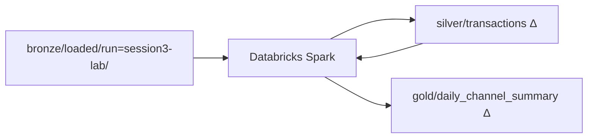
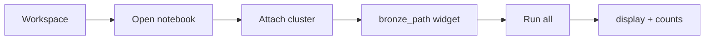

# Session 3 — Student lab guide

**You are a FinLedger UK data engineer.** Session 2 landed raw transactions in bronze. Today you **transform** them into silver and gold using **Azure Databricks** — mostly in the **Databricks workspace UI**, not the terminal.

| | |
|---|---|
| **Duration** | 2 hours practical |
| **Theory + graphs** | [UI-OVERVIEW.md](UI-OVERVIEW.md) — read first |
| **Portal** | [portal.azure.com](https://portal.azure.com) |
| **All links** | [LINK-MAP.md](LINK-MAP.md) |
| **Replace** | `<learner>` = your id from `.env` |

---

## START HERE — normal classroom (script already ran)

> **Most learners:** trainer ran `session-3\orchestrate.cmd` **before class**. You **verify bronze in Storage**, then **run notebooks** in Databricks.

### Why Databricks? (one paragraph)

**ADF (Session 2)** is the timetable — it moves files on schedule. **Databricks (Session 3)** is the factory — it cleans types, rejects bad rows, and writes **Delta tables** that dashboards trust. FinLedger cannot report from raw CSV forever; regulators need typed, aggregated gold tables with a clear lineage from bronze.

### FinLedger afternoon — your job today

| # | Business question | Where you prove it |
|---|---|---|
| 1 | Can Spark read our bronze file? | Notebook `nb_01` → row count = 5 |
| 2 | Are amounts typed and bad rows quarantined? | Notebook `nb_02` → silver Delta |
| 3 | Do we have daily channel totals? | Notebook `nb_03` → gold Delta |
| 4 | Is the £50k pending wire visible? | TXN-10003 in fraud filter cell |

**Your one-sentence goal:** *"I read bronze from ADLS, wrote silver and gold Delta tables, and TXN-10003 is flagged for fraud review."*

---

### What the script already did

| Phase | Script | What appeared in Azure |
|---|---|---|
| 1 | `databricks_rbac.py` | Storage access for Databricks connector (if present) |
| 2 | `bronze_prep.py` | CSV in `bronze/loaded/run=session3-lab/` + messy feed |

**You do not re-run the script unless the trainer asks.**

---

### What YOU do in class (Databricks UI — 2 hours)

| Block | Time | Your job | Guide |
|---|---|---|---|
| **1** | 20 min | Open workspace; UI tour; create cluster | [Block 1](#block-1) · [lab-a](./MANUAL-LAB.md#lab-a) · [lab-b](./MANUAL-LAB.md#lab-b) |
| **2** | 30 min | Import notebooks; run **read bronze** | [Block 2](#block-2) · [lab-d](./MANUAL-LAB.md#lab-d) · [lab-e](./MANUAL-LAB.md#lab-e) |
| **3** | 30 min | **Silver** cleanse + Delta | [Block 3](#block-3) · [lab-f](./MANUAL-LAB.md#lab-f) |
| **4** | 25 min | **Gold** aggregates | [Block 4](#block-4) · [lab-g](./MANUAL-LAB.md#lab-g) |
| **5** | 15 min | Storage verify + cost + checklist | [Block 5](#block-5) · [lab-h](./MANUAL-LAB.md#lab-h) · [lab-i](./MANUAL-LAB.md#lab-i) |

---

## What “done” looks like



| # | Artefact | Path | Proof |
|---|---|---|---|
| 1 | Bronze input | `bronze/loaded/run=session3-lab/sample_transactions.csv` | 5 rows |
| 2 | Silver Delta | `silver/transactions/_delta_log/` | Notebook 02 success |
| 3 | Gold Delta | `gold/daily_channel_summary/_delta_log/` | Notebook 03 success |
| 4 | Fraud row | TXN-10003 | pending + £50,000 |

---

## Databricks in 5 minutes (mental model)

| Concept | One line | Today's example |
|---|---|---|
| **Workspace** | Folder tree for notebooks | Import `nb_01`…`nb_04` |
| **Cluster** | Spark compute — **cost while running** | `finledger-lab` |
| **Notebook cell** | One code or markdown block | Shift+Enter to run |
| **Attach cluster** | Top bar dropdown | Must attach before Spark runs |
| **Widget** | Parameter at notebook top | `bronze_path` from `orchestrate.cmd` |
| **abfss://** | Path to ADLS Gen2 | Read bronze without DBFS mount |
| **DataFrame** | Distributed table in Spark | `bronze_df` after `spark.read` |
| **Action** | `count()`, `write`, `display()` | Actually hits storage |
| **Delta** | ACID table on the lake | `_delta_log` in silver/gold |

> **Graphs + full theory:** [UI-OVERVIEW.md](UI-OVERVIEW.md)

---

## Databricks workspace — complete UI map

Open: RG → **Azure Databricks** → **Launch workspace**.

| Icon | Pane | Use today? |
|---|---|:---:|
| **Workspace** | Notebooks, files | **Yes** |
| **Compute** | Clusters | **Yes** |
| **Workflows** | Jobs | Mention |
| **Catalog / Data** | Unity Catalog | Optional |



> **Clicks:** [MANUAL-LAB §B–C](MANUAL-LAB.md#lab-b) · **Module:** [01-01 workspace tour](databricks-course/module-01-workspace/01-01-workspace-tour.md)

---

## Your resources (fill in once)

| Item | Your value |
|---|---|
| Resource group | `rg-<learner>-class1` |
| Storage account | `st<learner>…` |
| Databricks workspace | `dbw-<learner>-…` |
| Cluster name | `finledger-lab` |
| Bronze abfss | *(from orchestrate.cmd output)* |
| Run id | `session3-lab` |

---

<a id="block-1"></a>

## Block 1 — Why Databricks + workspace tour (20 min)

### Read first (concepts)

| UI element | What | Why |
|---|---|---|
| **Workspace** | Notebook folder tree | Version-controlled lab code lives here |
| **Compute** | Clusters / jobs | Spark executors — **you pay while running** |
| **Notebook cell** | Code or markdown block | Run one step at a time or **Run all** |
| **Cluster attach** | Top-right dropdown | Without cluster, Spark cannot execute |
| **Widget** | Parameter at top of notebook | ADF passes `bronze_path` in production |
| **display()** | Rich table output | See DataFrame rows without `show()` limits |

### Do in UI

1. [lab-a](./MANUAL-LAB.md#lab-a) — find storage + Databricks in RG.
2. [lab-b](./MANUAL-LAB.md#lab-b) — launch workspace; tour sidebar.
3. [lab-c](./MANUAL-LAB.md#lab-c) — create `finledger-lab` cluster (smallest node, 30 min auto-terminate).

### Checkpoint

- [ ] Workspace opens
- [ ] Cluster **Running**
- [ ] You can explain ADF vs Databricks in one sentence

---

<a id="block-2"></a>

## Block 2 — Read bronze from storage (30 min)

### Key code (notebook 01)

```python
bronze_df = (
    spark.read.option("header", True)
    .option("inferSchema", True)
    .csv(bronze_path)  # abfss://bronze@account.dfs.core.windows.net/...
)
bronze_df.count()  # ACTION — hits storage
```

**Why `abfss://`?** Direct read from ADLS Gen2 — no copy into DBFS. Same files Session 2 ADF promoted.

### Do

1. [lab-d](./MANUAL-LAB.md#lab-d) — import `nb_01_read_bronze.py`; set `storage_account`.
2. [lab-e](./MANUAL-LAB.md#lab-e) — **Run all**; confirm 5 rows and TXN-10003.

### Checkpoint

- [ ] `Bronze rows: 5`
- [ ] No permission error on abfss

---

<a id="block-3"></a>

## Block 3 — Silver Delta (30 min)

### Key code (notebook 02)

```python
valid = cleaned.filter(F.col("amount_gbp").isNotNull())
valid.write.format("delta").mode("overwrite").save(silver_path)
```

**Why Delta?** ACID — re-run notebook without corrupting files. `_delta_log` is the audit trail.

### Do

1. [lab-f](./MANUAL-LAB.md#lab-f) — run `nb_02_bronze_to_silver`.

### Checkpoint

- [ ] Silver write succeeded
- [ ] `is_high_value` column present
- [ ] Quarantine ≥ 0 rows (1 if messy feed loaded)

---

<a id="block-4"></a>

## Block 4 — Gold aggregates (25 min)

### Key code (notebook 03)

```python
gold_df = silver_df.groupBy("value_date", "channel").agg(
    F.count("*").alias("transaction_count"),
    F.sum("amount_gbp").alias("total_amount_gbp"),
)
gold_df.write.format("delta").mode("overwrite").save(gold_path)
```

**Why gold?** Business users need summaries — not 10,000 transaction lines.

### Do

1. [lab-g](./MANUAL-LAB.md#lab-g) — run `nb_03_silver_to_gold`.
2. Check fraud filter for TXN-10003.

### Checkpoint

- [ ] Gold table shows per-channel daily totals
- [ ] TXN-10003 in pending high-value section

---

<a id="block-5"></a>

## Block 5 — Verify + cost (15 min)

### Do

1. [lab-h](./MANUAL-LAB.md#lab-h) — portal: `_delta_log` in silver and gold.
2. **Terminate cluster** — Compute → `finledger-lab` → Terminate.
3. [lab-i](./MANUAL-LAB.md#lab-i) — final checklist.

### Optional script

```text
cd session-3
orchestrate.cmd --verify-storage
```

---

## Notebook reference (all code in repo)

| Notebook | File | Purpose |
|---|---|---|
| 01 Read bronze | `notebooks/nb_01_read_bronze.py` | `spark.read.csv(abfss://...)` |
| 02 Silver | `notebooks/nb_02_bronze_to_silver.py` | Cleanse + Delta write |
| 03 Gold | `notebooks/nb_03_silver_to_gold.py` | Aggregations |
| 04 End-to-end | `notebooks/nb_04_end_to_end.py` | ADF capstone (optional) |

Full UI detail: [MANUAL-LAB.md](MANUAL-LAB.md) · Theory graphs: [UI-OVERVIEW.md](UI-OVERVIEW.md)

Extended modules: [databricks-course/README.md](databricks-course/README.md)

---

## Only if script did NOT run

```text
cd session-3
orchestrate.cmd
```

Then continue from Block 2.

---

*Case study continues from Session 2: [../session-2/adf-course/CASE-STUDY.md](../session-2/adf-course/CASE-STUDY.md)*
