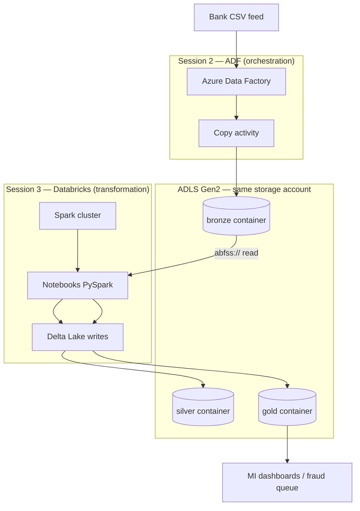
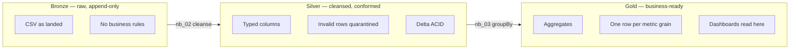
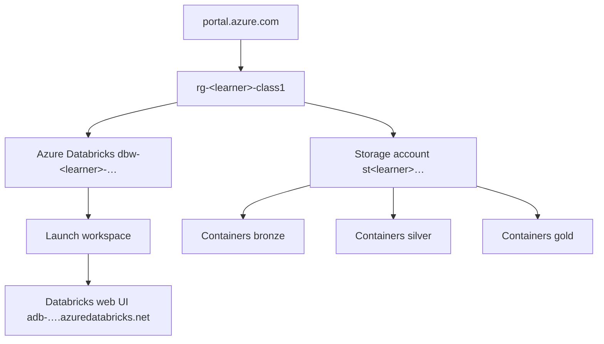
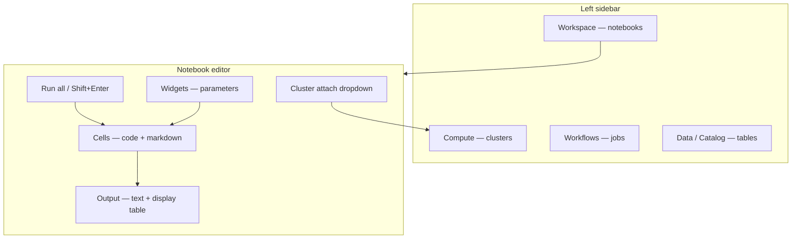
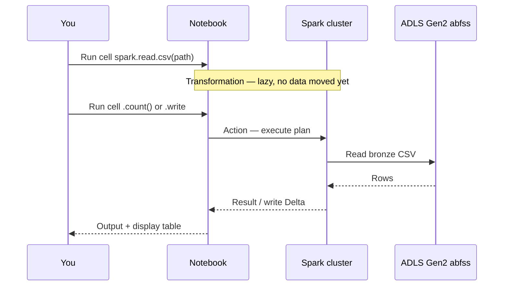
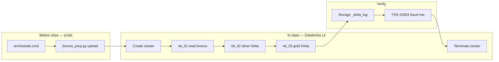

# Session 3 — UI & concepts overview (graphs)

> **Start here for theory.** Classroom steps: [SESSION3-STUDENT-GUIDE.md](SESSION3-STUDENT-GUIDE.md) · Portal clicks: [MANUAL-LAB.md](MANUAL-LAB.md) · All links: [LINK-MAP.md](LINK-MAP.md)

Replace `<learner>` with your `.env` value (e.g. `jinesh`).

---

## 1. Why Databricks exists (after ADF)

| Question | Tool | FinLedger example |
|----------|------|-------------------|
| Did the file land on schedule? | **ADF** | `pl_bronze_copy` → `bronze/loaded/` |
| Are amounts numeric and bad rows quarantined? | **Databricks** | `nb_02` → silver Delta |
| Daily totals by channel for ops? | **Databricks** | `nb_03` → gold Delta |
| Who ran what when? | ADF Monitor + Databricks job history | Audit trail |

**One sentence:** ADF is the **timetable**; Databricks is the **factory** that turns raw bronze files into trusted silver/gold tables.

---

## 2. Medallion architecture (what each layer means)

| Layer | Path in your lake | Format | FinLedger rule |
|-------|-------------------|--------|----------------|
| Bronze | `bronze/loaded/run=session3-lab/sample_transactions.csv` | CSV | Never edit — evidence |
| Silver | `silver/transactions/` | Delta (`_delta_log`) | Typed `amount_gbp`, quarantine bad |
| Gold | `gold/daily_channel_summary/` | Delta | Sum/count by date + channel |

---

## 3. Azure Portal → Databricks (navigation graph)

| Step | Portal blade | You need |
|------|--------------|----------|
| 1 | Resource group | Names for storage + Databricks |
| 2 | Databricks → **Launch workspace** | Opens notebook UI |
| 3 | Storage → Containers | Verify `_delta_log` after notebooks |

Doc: [MANUAL-LAB §A](MANUAL-LAB.md#lab-a)

---

## 4. Databricks workspace — complete UI map

| UI element | Where | What it does | Why today |
|------------|-------|--------------|-----------|
| **Workspace** | Folder icon | Notebook tree | Import `nb_01`…`nb_04` |
| **Compute** | Cluster icon | Spark workers | Create `finledger-lab` — **cost while running** |
| **Attach cluster** | Top bar | Binds Spark session | Without it, cells cannot run |
| **Cell** | Editor | One code/markdown block | Run step-by-step |
| **Run all** | Run menu | Full notebook | Bronze → silver → gold chain |
| **Widget** | Top of notebook | `bronze_path`, `run_id` | ADF passes paths in production |
| **display()** | Python | Interactive table | See rows without `show()` limit |
| **Spark UI** | Cluster page | Jobs/stages | Performance (advanced) |

Doc: [MANUAL-LAB §B](MANUAL-LAB.md#lab-b) · Course: [databricks-course/module-01-workspace/01-01-workspace-tour.md](databricks-course/module-01-workspace/01-01-workspace-tour.md)

---

## 5. How a notebook run executes (lazy evaluation)

| Term | Meaning |
|------|---------|
| **Transformation** | `filter`, `withColumn`, `groupBy` — builds plan only |
| **Action** | `count()`, `show()`, `display()`, `write` — hits storage |
| **abfss://** | URI to ADLS Gen2 — `abfss://bronze@st….dfs.core.windows.net/path` |
| **Delta** | `format("delta")` + `_delta_log` folder = ACID table on the lake |

Code: [notebooks/nb_01_read_bronze.py](notebooks/nb_01_read_bronze.py)

---

## 6. End-to-end lab flow (your 2 hours)

| Block | Time | Doc section |
|-------|------|-------------|
| 1 — UI tour + cluster | 20 min | [SESSION3-STUDENT-GUIDE Block 1](SESSION3-STUDENT-GUIDE.md#block-1) |
| 2 — Read bronze | 30 min | [Block 2](SESSION3-STUDENT-GUIDE.md#block-2) |
| 3 — Silver | 30 min | [Block 3](SESSION3-STUDENT-GUIDE.md#block-3) |
| 4 — Gold | 25 min | [Block 4](SESSION3-STUDENT-GUIDE.md#block-4) |
| 5 — Checklist | 15 min | [Block 5](SESSION3-STUDENT-GUIDE.md#block-5) |

---

## 7. Your paths (fill after `orchestrate.cmd`)

| Item | Example for jinesh |
|------|-------------------|
| Resource group | `rg-jinesh-class1` |
| Storage account | `stjineshfqdcgg` |
| Databricks workspace | `dbw-jinesh-wgepcx` |
| Bronze read | `abfss://bronze@stjineshfqdcgg.dfs.core.windows.net/loaded/run=session3-lab/sample_transactions.csv` |
| Silver Delta | `abfss://silver@stjineshfqdcgg.dfs.core.windows.net/transactions` |
| Gold Delta | `abfss://gold@stjineshfqdcgg.dfs.core.windows.net/daily_channel_summary` |

Paste **Bronze read** into the `bronze_path` widget in notebook 01 — no code edit needed.

---

## 8. Related docs (correct links)

| Doc | Purpose |
|-----|---------|
| [SESSION3-STUDENT-GUIDE.md](SESSION3-STUDENT-GUIDE.md) | Classroom handout — blocks 1–5 |
| [MANUAL-LAB.md](MANUAL-LAB.md) | Click-by-click portal + Databricks |
| [README.md](README.md) | Theory + commands |
| [LINK-MAP.md](LINK-MAP.md) | Master link index |
| [databricks-course/README.md](databricks-course/README.md) | Extended Day 3 modules |
| [../session-2/SESSION2-STUDENT-GUIDE.md](../session-2/SESSION2-STUDENT-GUIDE.md) | Prior session — ADF bronze |
| [../COVERAGE-MAP.md](../COVERAGE-MAP.md) | Whole programme steps 13–16 |
