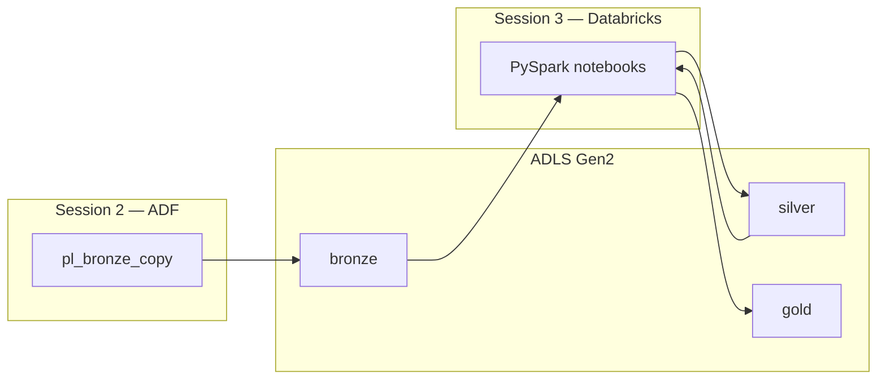

# 00-00 · Overview — why Databricks after ADF

> Module 0 · Time budget: 15 min · Source: [azure.html](../../../azure.html) Day 3 Hour 25

## What you'll understand

By the end you can explain **why FinLedger needs Databricks** in addition to ADF, and name the five UI areas you will use in every lab notebook.

## Why this matters

Session 2 proved files **arrived** in bronze. Banks cannot report from raw CSV:

- Amounts may be strings (`"INVALID"`)
- Duplicates and late-arriving rows need MERGE
- Aggregations for MI require distributed compute
- Auditors need ACID tables with version history

**Azure Databricks** provides managed Apache Spark, notebooks, and Delta Lake on top of the same ADLS Gen2 account Class-1 deployed.

## ADF vs Databricks — decision rule

| Question | Use ADF | Use Databricks |
|----------|---------|----------------|
| Move file A → B on schedule? | ✅ | ❌ |
| Cast types, filter, join 50 tables? | Limited | ✅ |
| Train ML model on lake data? | Orchestrate only | ✅ |
| MERGE upsert into curated table? | ❌ | ✅ Delta |

**Together:** ADF triggers Databricks notebooks with parameters (`run_id`, paths). Databricks writes silver/gold. Purview (Session 4) catalogs both.

## Architecture

## Key terms

| Term | One-line meaning |
|------|------------------|
| Workspace | Databricks web app hosting notebooks and compute |
| Cluster | Spark workers — **cost while running** |
| Notebook | Interactive cells of Python/SQL |
| DataFrame | Distributed table API in PySpark |
| Delta | ACID table format on parquet files |
| abfss:// | URI to read/write ADLS Gen2 directly |
| Widget | Notebook parameter (ADF passes values) |
| Action | Spark operation that executes the plan (`count`, `write`) |

## Next

[01-01 · Workspace UI tour](../module-01-workspace/01-01-workspace-tour.md) · [UI graphs](../../UI-OVERVIEW.md)
