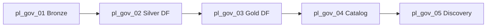

# Medallion + Microsoft Purview governance — ADF folder `13-governance-purview`

**Goal:** One **master pipeline** runs the full **bronze → silver → gold** data engineering path **and** teaches every Purview concept the lab can cover from ADF: **Data Map**, **assets**, **lineage**, **glossary**, **classifications**, **ownership**, **scan/discovery**, and the **ADF ↔ Purview factory link**.

**Code:** `scripts/adf_governance.py`, `scripts/purview_link.py`  
**Catalog seed:** `audit/governance/purview_catalog_template.json` on ADLS (uploaded at deploy)  
**Re-run master pipeline:**

```cmd
cd shared-adf-lab
.\orchestrate.cmd --run-pipeline pl_gov_06_master_medallion_governance
```

---

## A. WHAT & WHY — Purview concepts (plain language)

### Microsoft Purview (Data Governance)

**What:** A **catalog** for your data estate — it knows *what* data you have, *where* it lives, *who* owns it, and *how* it flows between systems.

**Why:** Without a catalog, “where did this KPI come from?” takes days of Slack threads. Purview answers lineage and glossary questions in one portal.

**Analogy:** Purview is the **library index card system** for data; ADF pipelines are **librarians** shelving books and Purview records which shelf each book came from.

### Data Map

**What:** The **inventory layer** — registered data sources (ADLS, SQL, ADF) and the paths/tables discovered by **scans** or pushed by integrations.

**In this lab:** ADF **Get Metadata** activities simulate discovery; linking Purview to the factory lets **Copy** and **Mapping Data Flow** activities publish **automatic lineage** to Purview.

### Data assets

**What:** A **thing in the catalog** — e.g. `abfss://bronze@.../incoming/run=session3-lab`.

**In this lab:** `pl_gov_01` Copy tags user properties (`medallion_layer=bronze`); the governance JSON lists three canonical assets (bronze incoming, silver cleaned, gold aggregates).

### Lineage

**What:** A **directed graph** — “this gold report column came from silver, which came from bronze file X”.

**In this lab:**
- **Automatic:** Factory linked to Purview → Copy/Data Flow runs appear in Purview **Lineage** after sync (minutes).
- **Teaching:** User properties on activities name upstream/downstream layers; `pl_gov_05` runs an extra bronze Copy to reinforce the edge.

### Glossary

**What:** **Business terms** with definitions — e.g. `Medallion.Silver` = cleansed conforming layer.

**In this lab:** `purview_catalog_template.json` holds glossary terms; `pl_gov_04` reads the file and builds an audit string (simulates catalog registration workflow).

### Classifications

**What:** **Sensitivity labels** — e.g. `MICROSOFT.PERSONAL.NAME`, `FinLedger.Internal`.

**In this lab:** Classifications are listed in the catalog JSON and attached as Copy **user properties** for Monitor search.

### Ownership

**What:** **Steward / owner** contact on an asset or term.

**In this lab:** Documented in catalog JSON; in production you assign owners in Purview Studio or via REST API (not duplicated here to avoid subscription-specific IDs).

### Scan / discovery

**What:** Purview **crawls** a source (ADLS, SQL) on a schedule and registers new paths/tables.

**In this lab:** `pl_gov_05` uses ADF **Get Metadata** (`childItems`) on bronze, silver, and gold logical folders — same *idea* as a scan listing files without deploying a Purview scan rule (cheaper for class).

### ADF factory ↔ Purview link

**What:** On the Data Factory resource, `purviewConfiguration.purviewResourceId` points at your Purview account.

**Why:** Enables **automatic lineage** from ADF activities to Purview Data Map.

**Code:** `purview_link.py` → `link_purview_to_adf()` (idempotent `create_or_update` on factory).  
**Configure:** `.env` → `PURVIEW_ACCOUNT_NAME`, `PURVIEW_RESOURCE_GROUP` (optional — else first account in subscription).

---

## B. Medallion architecture in this lab

```text
  bronze/incoming/run=session3-lab     bronze/loaded/run=session3-lab
           │                                    ▲
           │  pl_gov_01 Copy (land)              │
           └────────────────────────────────────┘

  bronze/incoming  ──df_01──►  silver/cleaned/run=session3-lab
                                      │
                               df_02  │
                                      ▼
                        silver/aggregates/run=session3-lab   ← logical GOLD layer
```

**Note:** The shared lab keeps **gold** aggregates in the **silver** container (`aggregates/...`) to avoid an extra storage container cost. Glossary term `Medallion.Gold` still applies — the *layer* is gold; the *path* is documented in the catalog JSON.

---

## C. Pipelines (folder `13-governance-purview`)

| Pipeline | Layer | Activities | Purview concepts |
|----------|-------|------------|------------------|
| `pl_gov_01_medallion_bronze_land` | Bronze | Copy incoming → loaded | data asset, classification, user properties |
| `pl_gov_02_medallion_silver_cleanse` | Silver | Execute `df_01_bronze_cleanse` | lineage, data flow |
| `pl_gov_03_medallion_gold_aggregate` | Gold | Execute `df_02_channel_aggregate` | lineage, data flow |
| `pl_gov_04_governance_catalog_metadata` | Governance | Lookup JSON → SetVariable → AppendVariable | glossary, classifications, catalog |
| `pl_gov_05_purview_discovery_lineage` | Discovery | GetMetadata ×3 → Copy | scan/discovery, lineage edge |
| `pl_gov_06_master_medallion_governance` | **All** | Execute Pipeline chain (01→05) | end-to-end medallion + governance |

### Master pipeline flow



---

## D. Now go to the code

| File | Responsibility |
|------|----------------|
| `adf_governance.py` | Datasets, six pipelines, catalog upload |
| `purview_link.py` | Discover Purview account, link ADF factory |
| `run_shared_adf.py` | Calls `deploy_governance()` after data flows |
| `adf_advanced.py` | `df_01_bronze_cleanse`, `df_02_channel_aggregate` (reused) |

### User properties (Monitor tags)

Every governance Copy/Data Flow activity sets expressions like:

- `purview_concept` — e.g. `lineage`, `data_asset`, `scan_discovery`
- `medallion_layer` — `bronze` / `silver` / `gold`
- `glossary_term` — e.g. `Medallion.Bronze`

Search in **Monitor** → pipeline run → activity → **User properties**.

### Catalog JSON (`CATALOG_TEMPLATE`)

Deployed to:

```text
abfss://audit@{storage}.dfs.core.windows.net/governance/purview_catalog_template.json
```

Contains: `purview_concepts[]`, `glossary_terms[]`, `classifications[]`, `data_assets[]`, `lineage_edges[]`.

---

## E. Trainer demo script

1. **Deploy** (includes governance + Purview link attempt):

   ```cmd
   cd shared-adf-lab
   .\orchestrate.cmd
   ```

2. **Set Purview** in repo `.env` (if not auto-discovered):

   ```env
   PURVIEW_ACCOUNT_NAME=pviewrohan4hnv7s
   PURVIEW_RESOURCE_GROUP=rg-rohan-class1
   ```

3. **Run master pipeline:**

   ```cmd
   .\orchestrate.cmd --run-pipeline pl_gov_06_master_medallion_governance
   ```

4. **ADF Studio** → folder `13-governance-purview` → open `pl_gov_06` → **Monitor** → expand each child run.

5. **Purview Studio** → Data catalog → search `finledger` or storage account → **Lineage** (allow 5–15 min after run for ADF sync).

6. **Optional:** Run children individually to teach one concept at a time (`pl_gov_04` only for glossary, etc.).

---

## F. Parameters (Trigger now)

| Pipeline | Parameters |
|----------|------------|
| `pl_gov_01`, `pl_gov_05`, `pl_gov_06` | `incoming_folder`, `loaded_folder`, `run_id` |
| `pl_gov_02`, `pl_gov_04` | `run_id` |
| `pl_gov_03` | *(none — data flow uses fixed paths)* |

Defaults match session lab: `incoming/run=session3-lab`, `loaded/run=session3-lab`, `run_id=session3-lab`.

---

## G. Idempotency

| Action | Safe re-run? |
|--------|----------------|
| `orchestrate.cmd` | Yes — pipelines/datasets upsert; catalog JSON overwritten |
| `pl_gov_06` | Yes — Copy merge; data flows overwrite silver outputs |
| Purview link | Yes — factory `purviewConfiguration` updated in place |

---

## H. Limitations (teaching scope)

- **No Purview REST calls from ADF** — glossary *registration* is simulated via JSON + Lookup; real terms are created in Purview Studio or automation outside ADF.
- **No Purview scan resource in Bicep** — discovery is taught via Get Metadata.
- **Purview account may be in another RG** — documented exception; set `.env` explicitly.
- **Region:** Shared class uses **eastus** ADF + storage; Purview account region may differ — link still works at API level.

---

*Last aligned with code: `adf_governance.py`, `purview_link.py` — folder `13-governance-purview`.*
